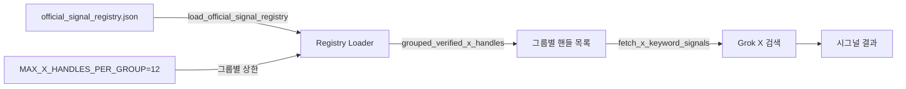

# 설계 문서: X 레지스트리 확장

## 개요

X 시그널 레지스트리(`official_signal_registry.json`)에 9개의 신규 엔티티를 추가하고, `macro_and_equity` 그룹의 한도 초과를 해결하기 위해 `MAX_X_HANDLES_PER_GROUP` 상수를 10에서 12로 변경한다.

이 변경은 데이터 전용(JSON + 상수 1개)이며, 새로운 모듈이나 아키텍처 변경은 필요하지 않다. 기존 파이프라인(`grouped_verified_x_handles()` → `fetch_x_keyword_signals()` → Grok X 검색)은 레지스트리 데이터를 자동으로 반영하므로 코드 로직 수정 없이 커버리지가 확장된다.

### 변경 범위

| 변경 대상 | 파일 | 변경 내용 |
|---|---|---|
| 레지스트리 JSON | `src/morning_brief/data/registry/official_signal_registry.json` | 9개 엔티티 추가 |
| 상수 변경 | `src/morning_brief/data/official_signal_registry.py` | `MAX_X_HANDLES_PER_GROUP`: 10 → 12 |

### 그룹별 변경 요약

| 그룹 | 변경 전 | 변경 후 | 추가 엔티티 |
|---|---|---|---|
| ai_bigtech_primary | 5 | 9 | Google, Amazon, Tesla, Broadcom |
| crypto_and_etf | 7 | 10 | VanEck, Franklin Templeton, Invesco (※ 요구사항 2.4에서 9로 기재되어 있으나, 실제 JSON 기준 현재 7건이므로 추가 후 10건) |
| macro_and_equity | 9 | 11 | WhiteHouse, POTUS |
| btc_etf_primary | 2 | 2 | (변경 없음) |

## 아키텍처

이 변경은 기존 아키텍처를 수정하지 않는다. 데이터 흐름은 다음과 같다:



신규 엔티티는 JSON에 추가되면 `load_official_signal_registry()` → `list_verified_x_entities()` → `grouped_verified_x_entities()` → `grouped_verified_x_handles()` 체인을 통해 자동으로 X 검색 대상에 포함된다.

### 설계 결정

1. **MAX_X_HANDLES_PER_GROUP를 12로 설정**: 현재 필요한 최대값은 11(macro_and_equity)이지만, 향후 1건 추가 여유를 두어 12로 설정한다. 이는 계획 문서의 옵션 A에 해당한다.
2. **btc_etf_primary 그룹 유지**: VanEck, Franklin Templeton, Invesco는 BTC ETF 운용사이지만, 기존 분류 체계에 따라 `crypto_and_etf` 그룹에 배치한다. `btc_etf_primary`는 Fidelity, BlackRock 등 대형 운용사 전용으로 유지한다.

## 컴포넌트 및 인터페이스

### 변경되는 컴포넌트

#### 1. `official_signal_registry.json`

신규 엔티티 9개를 `entities` 배열에 추가한다. 각 엔티티는 기존 `OfficialSignalEntity` TypedDict 스키마를 따른다.

#### 2. `official_signal_registry.py`

```python
# 변경 전
MAX_X_HANDLES_PER_GROUP = 10

# 변경 후
MAX_X_HANDLES_PER_GROUP = 12
```

### 변경되지 않는 인터페이스

다음 함수들의 시그니처와 동작 로직은 변경되지 않는다:
- `load_official_signal_registry() → dict`
- `list_official_signal_entities(*, enabled_only: bool) → list[OfficialSignalEntity]`
- `list_verified_x_entities() → list[OfficialSignalEntity]`
- `grouped_verified_x_entities() → dict[str, list[OfficialSignalEntity]]`
- `grouped_verified_x_handles() → dict[str, list[str]]`
- `registry_validation_errors() → list[str]`

## 데이터 모델

### 신규 엔티티 상세

#### ai_bigtech_primary 그룹 (+4)

| entity_id | entity_name | ticker | x_handle | x_search_priority | verification_method |
|---|---|---|---|---|---|
| google | Google | GOOGL | Google | 2 | official_site_social_link |
| amazon | Amazon | AMZN | AmazonNews | 2 | official_site_social_link |
| tesla | Tesla | TSLA | Tesla | 2 | official_site_social_link |
| broadcom | Broadcom | AVGO | Broadcom | 2 | official_site_social_link |

#### crypto_and_etf 그룹 (+3)

| entity_id | entity_name | ticker | x_handle | x_search_priority | verification_method |
|---|---|---|---|---|---|
| vaneck | VanEck | HODL | vaneck_us | 2 | official_social_directory |
| franklin_templeton | Franklin Templeton | EZBC | FTI_US | 2 | official_profile_description |
| invesco | Invesco | BTCO | InvescoUS | 2 | official_profile_description |

#### macro_and_equity 그룹 (+2)

| entity_id | entity_name | category | x_handle | x_search_priority | verification_method |
|---|---|---|---|---|---|
| white_house | White House | macro_regulator | WhiteHouse | 1 | government_official |
| potus | President of the United States | macro_regulator | POTUS | 1 | government_official |

### 엔티티 스키마 (변경 없음)

기존 `OfficialSignalEntity` TypedDict를 그대로 사용한다:

```python
class OfficialSignalEntity(TypedDict):
    entity_id: str
    entity_name: str
    ticker: str
    category: str
    primary_domain: str
    newsroom_or_ir_url: str
    x_handle: str
    x_verified: bool
    verification_source_url: str
    verification_method: str
    verified_at: str
    x_search_group: str
    x_search_priority: int
    enabled: bool
    notes: str
```


## 정확성 속성 (Correctness Properties)

*속성(property)이란 시스템의 모든 유효한 실행에서 참이어야 하는 특성 또는 동작이다. 속성은 사람이 읽을 수 있는 명세와 기계가 검증할 수 있는 정확성 보장 사이의 다리 역할을 한다.*

### Property 1: 레지스트리 엔티티 스키마 완전성

*For any* 레지스트리의 엔티티에 대해, 해당 엔티티는 `entity_id`, `entity_name`, `ticker`, `category`, `primary_domain`, `newsroom_or_ir_url`, `x_handle`, `x_verified`, `verification_source_url`, `verification_method`, `verified_at`, `x_search_group`, `x_search_priority`, `enabled`, `notes` 필드를 모두 포함해야 한다.

**Validates: Requirements 5.1**

### Property 2: entity_id 고유성

*For any* 레지스트리의 두 엔티티에 대해, 두 엔티티의 `entity_id` 값은 서로 달라야 한다.

**Validates: Requirements 5.2**

### Property 3: JSON 라운드트립

*For any* 유효한 레지스트리 JSON에 대해, 파싱 후 재직렬화하면 동일한 구조를 유지해야 한다 (즉, `json.loads(json.dumps(registry))` == `registry`).

**Validates: Requirements 6.3**

## 오류 처리

이 변경은 데이터 전용이므로 새로운 오류 처리 로직은 필요하지 않다. 기존 `registry_validation_errors()` 함수가 다음을 검증한다:

| 검증 항목 | 기존 동작 | 변경 영향 |
|---|---|---|
| `entity_id` 비어 있음 | 오류 보고 | 변경 없음 |
| `entity_id` 중복 | 오류 보고 | 신규 9개 ID가 기존과 중복되지 않아야 함 |
| `x_verified=true`인데 `x_handle` 비어 있음 | 오류 보고 | 신규 엔티티 모두 핸들 있음 |
| `x_verified=true`인데 `verification_source_url` 없음 | 오류 보고 | 신규 엔티티 모두 URL 있음 |
| `x_verified=true`인데 `x_search_group` 없음 | 오류 보고 | 신규 엔티티 모두 그룹 있음 |
| 그룹 핸들 수 > MAX_X_HANDLES_PER_GROUP | 오류 보고 | 상수를 12로 올려서 해결 |

`MAX_X_HANDLES_PER_GROUP`를 12로 변경하면 `macro_and_equity` 그룹(11건)이 한도 내에 들어오므로 검증 오류가 발생하지 않는다.

## 테스트 전략

### 이중 테스트 접근법

단위 테스트와 속성 기반 테스트를 병행한다.

### 단위 테스트 (pytest)

기존 테스트 패턴(`tests/test_official_signal_registry.py`)을 따른다.

1. **실제 레지스트리 검증 통과**: `registry_validation_errors()` == `[]` (기존 `test_checked_in_registry_is_valid` 확장)
2. **신규 엔티티 존재 확인**: 9개 신규 `entity_id`가 모두 레지스트리에 존재하는지 확인
3. **그룹별 핸들 수 확인**: `grouped_verified_x_handles()`에서 `ai_bigtech_primary`=9, `crypto_and_etf`=10, `macro_and_equity`=11 확인
4. **MAX_X_HANDLES_PER_GROUP 값 확인**: 상수가 12 이상인지 확인
5. **기존 핸들 보존 확인**: 기존 25개 엔티티의 핸들이 모두 그대로 포함되는지 확인
6. **신규 엔티티 필드값 확인**: 각 신규 엔티티의 `x_verified=true`, `enabled=true`, 올바른 `x_search_group` 및 `x_search_priority` 확인

### 속성 기반 테스트 (Hypothesis)

프로젝트에 이미 `.hypothesis/` 디렉토리가 존재하므로 Hypothesis 라이브러리를 사용한다.

- 각 속성 테스트는 최소 100회 반복 실행
- 각 테스트에 설계 문서의 속성 번호를 태그로 포함

| 속성 | 테스트 설명 | 태그 |
|---|---|---|
| Property 1 | 랜덤 엔티티를 생성하여 레지스트리에 추가한 후, 모든 엔티티가 15개 필수 필드를 포함하는지 검증 | Feature: x-registry-expansion, Property 1: 레지스트리 엔티티 스키마 완전성 |
| Property 2 | 랜덤 entity_id를 가진 엔티티들을 생성하여 레지스트리에 추가한 후, 모든 entity_id가 고유한지 검증 | Feature: x-registry-expansion, Property 2: entity_id 고유성 |
| Property 3 | 랜덤 엔티티 데이터로 레지스트리 JSON을 구성한 후, `json.loads(json.dumps(data))`가 원본과 동일한지 검증 | Feature: x-registry-expansion, Property 3: JSON 라운드트립 |

### 테스트 구성

- 단위 테스트: `tests/test_official_signal_registry.py`에 추가
- 속성 테스트: `tests/test_official_signal_registry.py` 또는 별도 `tests/test_registry_properties.py`에 작성
- 속성 기반 테스트 라이브러리: **Hypothesis** (기존 프로젝트에서 사용 중)
- 각 속성 테스트는 `@settings(max_examples=100)` 이상으로 설정
