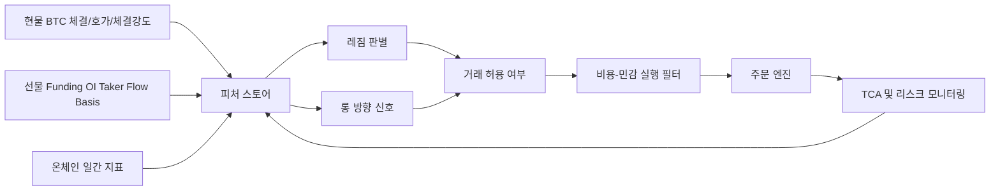

# BTC 현물 전용 알고리즘 트레이딩 심층 리서치 보고서

작성일: 2026-06-21

## Executive summary

운영자 조건을 기준으로 하면, 2026년 시점의 최선안은 **현물 BTC 롱 전용 추세추종을 코어로 두고, 비용-민감 실행 필터와 미체결·슬리피지 통제를 별도 레이어로 붙이는 구조**입니다. 최근 근거를 종합하면, BTC 예측 자체보다 **예측을 어떻게 거래로 변환하느냐**가 실거래 성과를 더 크게 좌우합니다. 2026년 arXiv 실증은 시간당 BTC/USDT 예측에서 단순 sign 매매가 10bp 비용을 넣으면 붕괴하고, **예측 크기 기반의 cost-aware 필터**를 넣어야 일부 설정에서 수익성이 복원된다고 보고했습니다. 2026년 다중 타임프레임 BTC 연구도 2025년 OOS에서 **gross 수익이 비용 반영 후 사실상 소멸**할 수 있다고 결론냈습니다. 반면 2024~2025년 연구와 산업 리서치는 **변동성 조절이 들어간 추세추종**이 상대적으로 실전 이전성이 높고, 거래비용의 파괴력이 매우 크다는 점에서 같은 방향을 가리킵니다.

운영자가 **현물만 실거래**한다는 제약 때문에, 선물에서 통하는 “숏 전용” 전략을 별도 실전 봇으로 분리하는 것보다, **하나의 롱-현금 레짐 전환형 프레임워크**가 더 맞습니다. 즉, 상승 레짐에서는 롱 추세추종, 애매한 구간에서는 현금 대기, 강한 횡보가 확인될 때만 제한적 평균회귀·동적 grid를 보조적으로 쓰는 구조가 합리적입니다. 현물 계정에서 “하락 뷰”는 **숏 진입이 아니라 비진입 또는 축소**로 표현하는 편이 설계·리스크·세금·실행 복잡도 측면에서 유리합니다. 특히 최근 fill/latency 연구와 microstructure 연구는 maker 주문이 fill만 잘 되는 방향으로 최적화되면 **체결 후 역선택**을 당하기 쉽고, taker 주문은 **수수료·스프레드·지연** 때문에 기대 성과가 깎인다는 점을 보여줍니다.

실행 우선순위는 아래와 같습니다.

| 권장 우선순위 | 결론 | 이유 | 근거 |
|---|---|---|---|
| 최우선 | **롱 추세추종 + 변동성 스케일링 + 현금 필터** | 현물 제약에 가장 자연스럽고, 최근 연구에서 비용 반영 후에도 가장 설명력이 높음 |
| 높음 | **비용-민감 ML 실행 필터** | 예측 신호보다 거래 전환 규칙이 중요하다는 2026 근거가 강함 |
| 중간 | **온체인 + 선물 데이터 기반 레짐 오버레이** | 현물 실행은 아니지만 레짐 판별과 진입 필터에 유용 |
| 제한적 | **동적 grid / 평균회귀** | 정적 grid는 기대값이 약하고, 비용에 매우 민감함 |
| 비권장 | **순수 고빈도·비용 무시형 hourly sign-flip** | 최근 실증에서 비용 반영 시 쉽게 붕괴 |

핵심 KPI는 “예측 정확도”가 아니라 **네트 수익성·체결 품질·비용 통제**여야 합니다. 실무에서는 gross PnL보다 **net PnL after fee/slippage**, maker 비중, arrival slippage, partial fill 비율, post-fill adverse selection, fill-to-cancel 비율, 최대 손실구간, OOS walk-forward 안정성이 더 중요합니다. 2025 Talos TCA 자료와 2024~2025 실행 연구는 **arrival price 기준 슬리피지**, benchmark 비교, latency 영향을 핵심 관리 항목으로 제시합니다.

## 근거 기반 결론

현물 BTC에서 최근 근거가 가장 일관되게 지지하는 것은 **“추세를 타되, 자주 뒤집지 말고, 비용을 먼저 통제하라”**는 설계입니다. 2025 SSRN 연구는 Donchian 채널 앙상블과 변동성 기반 포지션 사이징을 사용한 추세추종이 **수수료 반영 후에도 Sharpe 1.5 이상, BTC 대비 연율 alpha 10.8%**를 기록했다고 보고했습니다. 2024 SSRN도 암호화폐 추세추종이 전반적으로 잘 작동하지만 **거래비용 영향이 매우 크다**고 정리했습니다. Man AHL의 2024 산업 리서치 역시 크립토는 유동성·변동성·가치앵커 부재 때문에 추세추종에 적합하지만, **변동성 스케일링과 유동성 제약 반영**이 필수라고 설명합니다.

반대로, **“예측만 잘하면 된다”**는 접근은 최신 근거와 맞지 않습니다. 2026년 시간당 BTC/USDT 연구는 XGBoost·LSTM·iTransformer 모두 일부 gross 성과는 만들지만, **거래비용 10bp를 넣으면 단순 sign 전략이 무너진다**고 보고했습니다. 같은 논문은 예측치가 비용 임계값을 충분히 넘을 때만 거래하는 **cost-aware execution filter**를 넣어야 turnover를 줄이고 수익성을 복원할 수 있다고 결론냈습니다. 2026년 다중 타임프레임 연구도 Random Forest ROC-AUC가 0.6086 수준이고, 2025 OOS gross +35.97%가 **실제 비용 후에는 의미가 거의 사라질 수 있다**고 적시했습니다.

따라서 운영자 전략의 시작점은 **전략을 쪼개는 것**이 아니라 **레이어를 분리하는 것**이 맞습니다. 추천 구조는 `레짐 판별 → 방향 신호 → 실행 필터 → 주문 라우팅 → TCA 피드백`입니다. 여기서 방향 신호는 롱만 생성하고, 하락 레짐은 “숏”이 아니라 “현금”으로 처리합니다. 선물 데이터는 실거래가 아니라 **외생 레짐 변수**로만 씁니다. Binance 공식 문서 기준으로 funding rate, open interest, long/short ratio, taker buy/sell volume, mark/index price를 API로 수집할 수 있으므로, 현물 BTC 포지션의 진입 강도·회피 판단에 붙이기 좋습니다.

이 구조를 뒷받침하는 또 다른 근거는 **microstructure가 실행성과를 직접 좌우**한다는 점입니다. 2025~2026 연구는 order flow imbalance, spread, liquidity shock이 단기 수익률과 실행비용에 예측력을 가지며, maker 주문은 fill probability와 post-fill return 사이의 trade-off가 존재한다고 설명합니다. 또 Bybit·Binance 실거래 실험은 최신 LOB 스냅샷으로 기대한 체결결과와 실제 체결결과 사이의 차이가 **latency·volatility·LOB liquidity**와 강하게 연결되고, trader에게 일관되게 불리한 방향으로 나타난다고 보고했습니다. 즉, 실전에서는 신호보다 **체결 품질**이 수익률을 깎아먹는 경우가 반복됩니다.

## 실증 논문 요약 비교

아래 표는 2022~2026 사이에서 운영자 목적에 직접 관련된 논문·리서치만 추려 비교한 것입니다. 성과 숫자는 **논문 설정 내부 결과**이며, 실전 재현 가능성과는 구분해야 합니다. 비용·슬리피지·세금·호가 우선순위가 충분히 반영되지 않은 경우 별도로 한계를 표시했습니다.

| 소스 구분 | 논문 | 목적 | 데이터 | 방법 | 핵심 결과 | 실무 해석 | 한계 | 근거 |
|---|---|---|---|---|---|---|---|---|
| Peer-reviewed | **Li et al. 2022, Financial Innovation** | BTC 일간 예측과 알고리즘 트레이딩 | 2013-04-29~2021-01-01 일간 BTC | VMD-LMH-BiLSTM 분해형 DL | 방향성 예측 \(DA\) 81.7%, buy-and-hold 대비 우수한 알고리즘 성과를 보고 | 장기·저빈도 예측의 가능성은 보였지만, 현재 실거래 엔진보다는 **레짐/방향 연구의 출발점**에 가깝습니다. | 구간이 2021까지이고, 최신 시장구조·실행비용 현실과 거리 있음 |
| Peer-reviewed | **Cohen 2023, Review of Quantitative Finance and Accounting** | 인트라데이 크립토 알고리즘 비교 | 5~180분 인트라데이, BTC 포함 다수 자산 | RSI, MACD, Keltner 기반 ML 시스템 | RSI 시스템이 인트라데이에서 가장 우수, BTC 포함 여러 자산에서 B&H 초과 보고 | 짧은 주기 기술지표의 유효성은 있으나, **실행비용 민감도**를 반드시 함께 봐야 합니다. | 비용·실거래 이전성 정보를 본문 요약만으로 충분히 확인하기 어려움 |
| Peer-reviewed | **Omole & Enke 2024, Financial Innovation** | 온체인 데이터로 BTC 방향 예측과 백테스트 | 2013-02-06~2023-02-18, 87개 온체인 지표 + 가격 | CNN-LSTM, LSTNet, TCN, ARIMA + Boruta/GA/LightGBM feature selection | Boruta+CNN-LSTM 정확도 82.44% 보고, 공격적 long-short 백테스트는 매우 높은 연환산 성과 제시 | **온체인 특징과 feature selection이 방향 예측에 기여**한다는 증거는 유용합니다. | 논문도 한계로 sentiment·TA 미포함을 적시했고, 보고된 거래성과는 비용·실행 현실을 과대평가했을 가능성이 큼
| Peer-reviewed | **Omole & Enke 2025, Engineering Applications of AI** | 방향·크기 동시 예측, 온체인+TA+가격 통합 | 가격, 온체인, TA | SVM, RF, GBM, LSTM, CNN-LSTM, GRU, TCN, LSTNet + Boruta | 방향 예측은 SVM 정확도 83%, F1 82%; 온체인이 특히 classification에 유의미, Boruta-SVM이 가장 수익성 높음 | **온체인+기술지표 혼합은 가치가 있고, 단순 DL보다 전통 ML이 더 강할 수 있음**을 보여줍니다. | 요약 공개 범위에서는 비용·체결 세부가 제한적 |
| Peer-reviewed | **Angerer et al. 2025, Journal of Risk and Financial Management** | 크립토 거래소 유동성과 비용 패턴 분석 | 다수 크립토·다수 거래소 인트라데이 | 유동성·order book variation 분석 | 유동성 패턴을 타이밍에 활용하면 수익 개선 가능, order book variation이 직접 손익에 영향 | **거래는 언제 하느냐**가 알파 못지않게 중요하다는 근거입니다. | 직접적인 BTC 현물 전략 논문은 아님 |
| Preprint | **Zarattini et al. 2025, SSRN** | BTC 및 알트 추세추종 실증 | 2015년 이후 전 코인, 상위 유동성 코인 중심 | Donchian 앙상블 + 변동성 사이징 + rotational portfolio | top 20 유동성 코인 포트폴리오에서 **Sharpe 1.5 이상, BTC 대비 연율 alpha 10.8%**, 비용 반영 | 최근 증거 중 **실전 이전성이 가장 높은 쪽**입니다. | SSRN preprint, 현물 BTC 단일자산과 동일하지 않음 |
| Peer-reviewed | **Parente & Rizzuti 2026, Soft Computing** | 범용 패턴을 학습한 buy-only 크립토 전략 검증 | 400개 이상 코인 학습, BTC/ETH 6년 시뮬레이션, 2024 forward test 포함 | MLP 분류 + stop-loss + 0.1% fee | buy-only + stop-loss 구조가 bear/flat에서 drawdown을 제한 | **현물 전용 조건에 가장 가까운 최근 peer-reviewed 사례**입니다. | OHLCV 중심이며 실행 미시구조는 약함 |
| Preprint | **Bysik & Ślepaczuk 2026, arXiv** | 시간당 BTC/USDT ML 예측의 비용 후 생존 여부 | 약 70,000개 시간봉, 2018~2026 | XGBoost, LSTM, iTransformer + 27-fold walk-forward | 10bp 비용에서 naive sign 전략 붕괴, **cost-aware 필터**에서만 일부 수익 복원, XGBoost long-only 연환산 65% 이상 사례 보고 | 최신 기준으로 **신호보다 거래 변환 규칙이 중요**하다는 가장 강한 근거입니다. | peer review 전, 성과는 특정 설정 의존 |
| Peer-reviewed | **Multi-Timeframe Feature Engineering 2026, MDPI** | 가격 비의존 multi-timeframe BTC 진입 신호 평가 | 2020-01~2025-11, 15m/4h/1d/3d BTC/USDT spot | RF, XGBoost, LightGBM 등 5개 분류기 + expanding-window CV | ROC-AUC 0.57~0.61, 4시간 BB·RSI 중요, gross +35.97% OOS도 비용 후 거의 무의미 가능 | **4시간 중심 다중 타임프레임 피처는 유효하지만, 비용이 알파를 지운다**는 최신 peer-reviewed 결론입니다. | 순수 진입 신호 연구로, 실행계층 분리가 별도 필요 |
| Peer-reviewed | **Kang et al. 2025 survey, Financial Innovation** | 금융 관점의 Bitcoin 연구 총괄 | 2014~2024 WoS 2,349편 | bibliometric + 직접 검토 | BTC는 투기성과 헤지 특성이 공존하고, 변동성·고빈도·비대칭 tail dependence가 핵심 키워드 | 전략 설계에서 BTC를 주식과 동일하게 다루면 안 된다는 배경 근거 | 직접 전략 성과를 제시하진 않음 |
| Review / Meta | **Bitcoin Price Prediction: Peer-Reviewed Evidence 2026, arXiv** | 문헌의 평가 오류와 예측 가능성 점검 | peer-reviewed 연구 전반 | survey | 단기 예측은 일부 존재하지만 **강건한 다중 레짐 우월성은 희박**, walk-forward·naive baseline·DM test가 필요 | 백테스트 설계 기준서로 사용하기 좋습니다. | survey 성격, 직접 전략 제안 아님 |

## 현물 전용 전략 후보 비교

아래 비교표의 “예상 빈도·보유시간”은 논문 데이터 주기와 실행 규칙을 실무적으로 환산한 **추정값**입니다. 명시된 원문 수치가 없는 경우 `미지정`으로 두었습니다. 현물 전용이라는 제약 때문에 “하락 시 숏” 전략은 후보에서 제외하고, **하락 레짐 대응은 현금화**로 정리했습니다.

| 전략 | 설명 | 기대 빈도 | 기대 보유시간 | 예상 비용 민감도 | 선물 데이터 활용 방식 | 우선순위 | 판단 |
|---|---|---|---|---|---|---|---|
| **롱 추세추종** | 4h~1d 신호, 1d~3d 컨텍스트, Donchian/EMA/ADX/BB/RSI와 변동성 타기팅 결합 | 낮음~중간 | 수일~수주 | 중간 | funding/OI/taker flow로 레짐 강화 또는 회피 필터 | **최우선** | 최근 문헌상 가장 실전 이전성이 높고, 현물 제약과 정합적입니다.
| **비용-민감 ML 롱 엔트리 필터** | XGBoost/RF/SVM 확률값이 비용 임계치를 넘을 때만 진입 | 중간 | 수시간~수일 | 높음 | funding, mark-index basis, OI를 특징으로 추가 | **높음** | 최신 2026 실증이 가장 강하게 지지합니다. 단, 독립 전략보다 **추세 코어 위 필터**로 쓰는 편이 낫습니다.
| **온체인·펀더멘털 레짐 오버레이** | SOPR 유사 계열, 공급/활동/실현가치 지표로 장·중기 risk-on/off 판별 | 낮음 | 수일~수주 | 낮음~중간 | 필요 없음. 선물 데이터는 보조 확인용 | **중간** | 온체인은 방향 예측 보조로 유효하지만, 단독 고빈도 알파로 쓰기보다 **포지션 허용 스위치**가 적합합니다.
| **동적 grid / 평균회귀** | 강한 횡보가 명시적으로 확인될 때만 제한적으로 사용 | 중간~높음 | 수시간~수일 | **매우 높음** | funding·OI 급변 시 비활성화 | **제한적** | 정적 grid는 기대값이 약하고, 동적 reset이 있어야 의미가 생깁니다. 현물에서는 비용·재고 리스크가 큽니다.
| **순수 인트라데이 oscillator** | 5~180분 RSI/MACD/Keltner 기반 | 중간~높음 | 수시간 이내 | **매우 높음** | 미시구조 가드 없으면 비권장 | 낮음 | 연구상 신호력은 있으나, 2026 비용 연구와 합치면 단독 실전 적용은 불리합니다.
| **순수 현물 buy-only + stop-loss** | MLP/기술신호가 buy만 생성, 하락은 stop 또는 현금 | 낮음~중간 | 수일 이상 | 중간 | 선물 데이터로 진입 억제만 추가 | 중간~높음 | 현물 제약에 가장 직관적이며 최근 2026 peer-reviewed 사례가 존재합니다. 다만 stop-loss가 주전략이 되면 whipsaw 비용이 커질 수 있습니다.

요약하면, 운영자 전략 포트폴리오의 시작은 **하나의 BTC 현물 전략 엔진**으로 충분합니다. 내부 상태만 `trend-on`, `neutral`, `range-on`으로 나누고, 각각의 실행 규칙을 다르게 가져가는 편이 좋습니다. 먼저 separate bot 세 개를 만드는 방식은 설계복잡도와 OOS 불안정성을 키우기 쉽습니다. 최신 문헌이 요구하는 핵심은 **전략 분리**보다 **비용·검증·실행 레이어 분리**입니다.

## 구현 권장사항

운영자가 이미 가상거래 대시보드까지 구성했다면, 다음 단계는 “알고리즘 추가”가 아니라 **데이터·실행·검증 품질을 production-grade로 끌어올리는 것**입니다. Binance Spot 공식 문서 기준으로 실시간 WebSocket 스트림과 REST market-data endpoint를 쓸 수 있고, `/api/v3/depth`, `/api/v3/ticker/bookTicker`, trade/depth stream으로 현물 호가와 체결 정보를 수집할 수 있습니다. Futures 측은 funding, OI, long/short ratio, taker buy/sell volume, mark/index price를 공식 API로 받을 수 있어 **현물 BTC의 레짐/과열/충돌 회피 피처**로 붙이기 좋습니다.

가장 추천하는 구현 방안은 **코어 의사결정 주기를 4시간으로 두고**, 1시간 데이터는 방향 신호가 아니라 **실행 창(window) 판단**에 쓰는 것입니다. 이유는 최근 peer-reviewed BTC 연구에서 4시간 피처가 중요하고, 가격 비의존 multi-timeframe 구조가 2020~2025 여러 레짐에 대해 일반화됐기 때문입니다. 동시에 2026 시간당 예측 연구는 거래가 잦아질수록 비용이 치명적임을 보여줬고, 10시간 horizon 기반 confidence-threshold 연구도 **낮은 coverage와 높은 conviction**이 더 낫다고 제시했습니다. 따라서 1시간마다 무조건 판단하기보다, **4시간 레짐 결정 + 1시간/분봉 실행 필터**가 더 적절합니다.

주문 타입은 기본적으로 **LIMIT_MAKER 또는 post-only**를 우선 사용해야 합니다. Binance Spot은 `LIMIT_MAKER`를 즉시 체결되면 거절되는 **POST-ONLY** 주문으로 정의하고 있고, Coinbase도 post-only가 taker 체결을 유발하면 주문 전체를 거절한다고 명시합니다. IOC/FOK는 현물에서도 유용하지만, IOC는 “부분체결 허용·잔량 즉시 취소”, FOK는 “전량 즉시 체결 아니면 취소”이므로, **부분체결이 포지션 꼬임을 만들 전략이면 FOK**, 일부 체결만으로도 의미 있는 축소·진입이면 IOC가 맞습니다. 시장가 주문은 즉시성은 좋지만 taker fee와 spread crossing을 강제로 부담합니다.

다만 maker 우선이 항상 정답은 아닙니다. 2025 fill-probability 연구는 fill 확률이 높을수록 체결 후 불리한 가격이 따라오는 **adverse selection** 위험이 존재한다고 지적합니다. 따라서 “maker 비중 100%”가 KPI가 되어서는 안 되고, **signal confidence × queue position × expected adverse selection**에 따라 post-only와 marketable IOC를 분기해야 합니다. 특히 최신 live trading 연구는 LOB 스냅샷에서 기대한 가격보다 실제 체결가격이 불리해지는 현상이 latency, volatility, shallow liquidity 구간에서 강하다고 보고했습니다.

### 구현 체크리스트와 KPI

| 영역 | 권장 구현 | 핵심 KPI | 이유 | 근거 |
|---|---|---|---|---|
| 데이터 레이어 | Spot trade/depth/bookTicker 실시간 수집, Futures funding/OI/mark/taker flow 병행 적재 | 데이터 결손률, 재연결 횟수, clock drift | 레짐·실행 모두 데이터 품질이 선행 조건 |
| 피처 레이어 | 15m/4h/1d/3d price-agnostic 피처 + 온체인 일간 피처 | feature freshness, leakage audit, 중요도 안정성 | 최근 BTC 연구에서 4h BB·RSI와 multi-timeframe 정합성이 중요 |
| 모델 레이어 | baseline은 RF/XGBoost/SVM, DL은 벤치마크 용도 | ROC-AUC, MCC, calibration error | 최신 근거상 tree/SVM 계열이 충분히 경쟁력 있고 검증이 쉬움 |
| 실행 레이어 | 기본 post-only, 고확신 시 marketable IOC 허용, FOK는 exact-size 필요 시만 | maker ratio, arrival slippage, fill rate, partial fill rate | maker/taker 비용 차이와 부분체결 리스크가 직접 손익에 영향 |
| TCA | arrival price, realized slippage, spread crossing, post-fill 1m/5m reversion, reject/cancel ratio 기록 | net bps/trade, implementation shortfall, adverse selection bps | 예측 정확도보다 실거래 손실 원인 파악에 유효 |
| 포지션 사이징 | realized vol 또는 ATR 기반 스케일링, 하락 레짐은 현금화 | target volatility 달성률, max drawdown, exposure time | 변동성 스케일링이 추세추종 실전성의 핵심 |
| 리스크 제어 | soft exit는 레짐 이탈, hard stop은 비정상 급변·API 장애 대응용 | stop-trigger frequency, gap loss, kill-switch 횟수 | stop-loss를 전략 대신 안전장치로 써야 whipsaw 감소 |
| 운영 | walk-forward 재학습, 모델 freeze window, production shadow mode | OOS decay, retrain stability, shadow-live divergence | 최신 문헌이 single split과 leakage를 반복 경고 |

실무 오픈소스는 **CCXT + 자체 이벤트 엔진**을 권장합니다. CCXT는 다수 거래소를 하나의 API로 연결해 시장데이터·주문·잔고를 동일 인터페이스로 다룰 수 있습니다. 다만 execution/TCA까지 포함된 정밀한 현물 BTC 연구 엔진으로는 CCXT만으로 부족하므로, 체결·부분체결·cancel-replace·주문상태 스트림은 거래소 native event를 직접 적재하는 것이 좋습니다. Hummingbot은 spot에서 순수 market making 전략 예시와 order refresh 루프를 제공하고, Freqtrade는 백테스트 편의성이 높지만 캔들 기반 fill 가정을 사용하므로 **실행 정확도 검증 엔진**과는 분리해서 써야 합니다.

## 백테스트와 검증 방법론

최신 문헌 기준으로 가장 중요한 검증 원칙은 **single split 금지, walk-forward 필수, 비용·슬리피지·보유기간 제약 필수**입니다. 2026 survey는 다수 Bitcoin 예측 연구가 naive baseline조차 제대로 넘지 못한 이유로 **부실한 평가 프로토콜**을 지적했고, 다중 레짐 holdout, walk-forward, naive benchmark 비교, Diebold-Mariano 테스트를 최소 기준으로 제안했습니다. 2026 confidence-threshold 연구도 symbol-wise temporal split과 cost-aware 평가를 사용했고, 2026 multi-timeframe BTC 논문은 look-ahead bias가 성능을 약 **0.20 ROC-AUC 포인트**까지 부풀릴 수 있다고 보고했습니다.

운영자 상황에서는 백테스트를 아래 수준까지 끌어올려야 합니다.

| 항목 | 권장 방식 | 이유 | 근거 |
|---|---|---|---|
| 학습/검증 분할 | expanding-window walk-forward | BTC는 레짐 의존성이 강해 랜덤 split이 왜곡 |
| 기준모형 | buy-and-hold, cash, naive trend filter, 단순 MA/RSI baseline | “ML이 진짜 필요한지” 검증 |
| 비용 모델 | 실거래소 maker/taker 수수료 + spread crossing + volume-based slippage | gross 성과는 실전 의미가 약함 |
| 슬리피지 모델 | order size / top-of-book depth / volatility bucket별 차등 적용 | 시장가·급변 구간 비용이 비선형 |
| 체결 모델 | partial fill, cancel-replace, timeout, reject 반영 | 백테스트-실거래 괴리의 핵심 ||
| bar 기반 한계 인지 | candle high/low 접촉 fill 가정은 보조용으로만 사용 | 캔들 백테스트는 체결 품질을 과대평가하기 쉬움 |
| 주문장 재현 | depth snapshot + diff stream으로 로컬 LOB 유지 | execution research/TCA 정확도 향상 |

주문장 기반 TCA는 아래 지표를 필수로 두는 편이 좋습니다.

| TCA 지표 | 정의 | 실무 의미 | 근거 |
|---|---|---|---|
| Arrival slippage | 주문 제출 시점 price 대비 실제 체결 괴리 | 전략이 원하는 가격에 체결됐는지 판단하는 기본 지표 |
| Spread capture / crossing cost | maker로 spread 일부를 먹었는지, taker로 spread를 넘겼는지 | 짧은 보유일수록 결정적 |
| Fill rate | 제출 주문 중 완전 체결 비율 | maker 정책의 현실성 평가
| Partial fill rate | 부분체결 비율 | 포지션 꼬임·추가 비용 여부 확인
| Post-fill adverse selection | 체결 후 1분/5분 mid-price 이동 | maker 체결이 “좋은 fill”이었는지 판정 | 관련 maker fill probability 연구 |
| Reject / cancel ratio | post-only 거절, IOC/FOK 미체결, cancel-replace 빈도 | 주문 정책이 과도하게 공격적인지 점검 |
| Latency-adjusted slippage | 예상 LOB 체결과 실제 체결 차이 | 대시보드와 실거래 엔진 간 괴리 측정 | 관련 live execution latency 연구 |

결론적으로, 백테스트는 “수익률 계산기”가 아니라 **실거래 리허설**이어야 합니다. 최신 근거는 거의 예외 없이 “비용·실행·검증을 단순화한 연구는 실제로 약하다”는 쪽으로 수렴합니다. 운영자 전략이 이미 paper trading 대시보드 단계라면, 다음 투자 대비 효율이 가장 높은 작업은 **신호 추가**보다 **체결모사와 TCA 파이프라인 정교화**입니다.

## 오픈 질문과 한계

이번 조사에서 가장 강한 결론은 분명하지만, 몇 가지 한계도 남습니다. 우선 2025~2026의 가장 직접적인 실증 중 일부는 **arXiv/SSRN preprint**라 peer-reviewed 최종판이 아닙니다. 또 매우 높은 연환산 수익률을 제시한 연구들은 대체로 **실행비용·세금·queue position·실거래 지연**이 충분히 반영되지 않았거나, 특정 파라미터 설정에 민감할 수 있습니다. 그래서 본 보고서는 극단적인 수익률 숫자보다 **전략 구조와 검증 기준**을 더 중시했습니다.

또한 peer-reviewed 문헌을 넓게 보면, BTC 예측 연구의 다수는 여전히 **naive benchmark, multi-regime OOS, DM test**를 충분히 통과하지 못합니다. 2026 survey가 지적했듯, “어떤 모델이 가장 좋으냐”보다 “어떤 모델이 여러 레짐에서 비용 후에도 계속 유효하냐”가 아직 완전히 해결되지 않았습니다. 따라서 운영자가 바로 실전에 가져갈 핵심은 새로운 모델 탐색보다 **하나의 단순한 코어 전략을 엄격하게 실전화**하는 것입니다.

정리하면, 운영자에게 가장 적합한 방향은 다음 한 줄입니다. **BTC 현물에서는 롱 추세추종을 코어로 두고, 선물·온체인 데이터는 레짐 필터로만 사용하며, 수익률 개선의 주 전장은 신호 발굴보다 체결 품질·비용 통제·walk-forward 검증에 둔다.** 이 결론이 현재 2022~2026 근거와 가장 잘 맞습니다.
