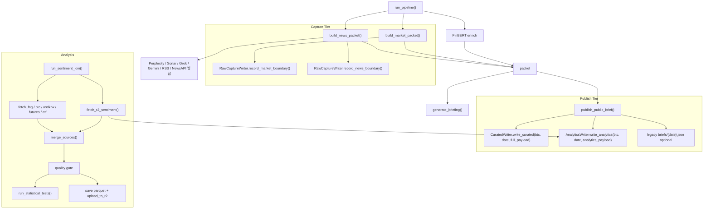

# Design Document: Analytics Storage Contract V2

## Overview

현재 브리핑 파이프라인은 전시용 full JSON과 분석용 최소 수치 데이터를 같은 공개 브리프 객체에 결합해 두고 있으며, 분석 파이프라인은 그 객체를 다시 읽어 감성 수치를 추출한다. 이번 설계는 현재 수집 중인 시장/뉴스/시그널/ETF/분석 산출물을 코드 기준으로 분류해 `raw/`, `curated/`, `analytics/` 저장 레이어로 나누고, 분석 입력 계약을 `analytics/btc/{date}.json` 전용 최소 JSON으로 고정하여 전시 로직과 통계 로직을 분리한다.

**변경 범위**

- 수정: `src/morning_brief/public_site.py`
- 수정: `src/morning_brief/pipeline.py`
- 수정: `src/morning_brief/analysis/sentiment_join/sources/r2_sentiment.py`
- 수정: `src/morning_brief/analysis/sentiment_join/join.py`
- 수정: `src/morning_brief/analysis/sentiment_join/statistical_tests.py`
- 수정: `src/morning_brief/analysis/sentiment_join/pipeline.py`
- 신규: `src/morning_brief/data/storage/news_data_paths.py`
- 신규: `src/morning_brief/data/storage/news_data_writer.py`
- 신규: `src/morning_brief/data/storage/analytics_contract.py`
- 수정: 관련 테스트 (`tests/analysis/test_sentiment_join/*`, `tests/test_public_site.py`, 신규 storage tests)

**1차 구현 범위**

- `symbol = "btc"`만 지원
- `analytics/`는 일일 overwrite 스냅샷
- `raw/`는 실행 단위 append-only 증적
- 기존 `briefs/{date}.json`는 migration 기간 동안 유지 가능

## Architecture



**설계 결정 1: raw/curated/analytics를 동일 계층으로 보지 않고 capture tier와 publish tier로 분리한다**

왜:
- 현재 코드에서 raw는 수집 경계에 가깝고 curated/analytics는 최종 publish 경계에 가깝다
- `publish_public_brief()`에 raw 책임까지 몰아주면 함수 책임이 과도해진다
- source별 raw 저장 실패가 전시 publish를 실패시키지 않도록 경계를 명확히 할 수 있다

**설계 결정 2: analytics payload는 `build_public_brief()`가 확정한 aggregate에서 파생한다**

왜:
- 현재 분석이 실제로 쓰는 값은 `meta.newsSentiment`와 `meta.sentimentStatus`다: `src/morning_brief/public_site.py:251`
- 집계를 별도 경로에서 재계산하면 전시와 분석이 어긋날 수 있다
- single source of truth를 유지할 수 있다
- curated의 `newsSentiment`에는 `mean`, `median`, `std`, `bullishRatio`, `bearishRatio`, `count` 6개 필드가 포함되지만, analytics에서는 통계 검정에 사용하는 `mean`, `std`, `count`만 추출한다. `median`, `bullishRatio`, `bearishRatio`는 전시 전용이므로 의도적으로 제외한다

**설계 결정 3: 1차 구현은 `btc`로 고정한다**

왜:
- 현재 sentiment join과 요구사항의 실제 소비 대상은 BTC이다
- symbol 일반화는 경로 설계에는 유리하지만 지금 구현 범위를 넓히면 검증 범위가 과도해진다
- 향후 확장은 path builder와 contract 함수 재사용으로 대응할 수 있다

## Rollout Plan

### Phase 1: Dual Write ✅ 완료

- `curated/btc/{YYYY-MM-DD}.json`와 `analytics/btc/{YYYY-MM-DD}.json` 저장 추가
- legacy `briefs/{YYYY-MM-DD}.json` 유지
- 분석 reader는 아직 legacy 유지 가능

### Phase 2: Reader Cutover ✅ 완료

- `fetch_r2_sentiment()`를 `analytics/btc/{YYYY-MM-DD}.json`로 전환
- `_backfill` 및 계약 검증 게이트 활성화
- join 단계에서 `count <= 1`, `sentimentStatus == "skipped"` 제거
- raw capture hook 추가 (시장/뉴스 경계 payload)

### Phase 3: Contract Enforcement

- analytics-only 분석 입력 운영화
- legacy `briefs/` 읽기 코드 제거
- `briefs/`는 curated alias 또는 deprecated 경로로만 유지
- **전환 조건**: R2에 `analytics/btc/` 데이터가 lookback_days 이상 적재 확인 후 진행

**설계 결정 4: dual-write와 reader cutover를 같은 릴리스로 묶지 않는다**

왜:
- 저장과 읽기 전환을 분리하면 문제 발생 시 원인 범위를 줄일 수 있다
- 운영 중 R2 데이터 적재 상태를 먼저 확인한 뒤 reader를 안전하게 전환할 수 있다

**설계 결정 5: R2 write config와 read config는 별도 경로를 유지한다**

왜:
- 브리핑 파이프라인의 writer는 `Settings.r2_public_bucket`(boto3 bucket명) + `r2_s3_endpoint`를 사용한다: `src/morning_brief/config.py:71-74`
- 감성 조인 파이프라인의 reader는 `SentimentJoinSettings.r2_base_url`(HTTP public URL)을 사용한다: `src/morning_brief/analysis/sentiment_join/config.py`
- 두 config는 같은 R2 버킷을 가리키지만 접근 프로토콜이 다르다 (S3 API vs HTTP). 이 분리를 유지하되 구현 시 혼동하지 않도록 주석으로 명시한다

## Components and Interfaces

### 1. `news_data_paths.py`

```python
@dataclass(frozen=True)
class NewsDataPathSet:
    curated_key: str
    analytics_key: str

def build_publish_paths(
    *,
    symbol: str,
    run_date: str,
) -> NewsDataPathSet: ...

def build_raw_capture_key(
    *,
    domain: str,
    provider: str,
    dataset: str,
    run_date: str,
    run_id: str,
    ext: str = "json",
) -> str: ...
```

**설계 결정**

- publish path와 raw capture path를 함수 수준에서 분리한다
- raw는 append-only, curated/analytics는 overwrite-only라는 정책 차이를 타입 수준에서 드러낸다

### 2. `news_data_writer.py`

```python
class NewsDataWriter:
    def put_json(self, key: str, payload: dict[str, Any]) -> None: ...
    def put_bytes(self, key: str, body: bytes, content_type: str) -> None: ...

class CuratedWriter:
    def write_curated(
        self,
        *,
        symbol: str,
        run_date: str,
        payload: dict[str, Any],
    ) -> str: ...

class AnalyticsWriter:
    def write_analytics(
        self,
        *,
        symbol: str,
        run_date: str,
        payload: dict[str, Any],
    ) -> str: ...

class RawCaptureWriter:
    def write_capture(
        self,
        *,
        domain: str,
        provider: str,
        dataset: str,
        run_date: str,
        run_id: str,
        payload: dict[str, Any] | bytes,
    ) -> str: ...
```

**설계 결정**

- low-level R2 write는 `NewsDataWriter`가 담당한다
- 도메인 규칙은 specialized writer가 담당한다
- analytics 저장 실패는 publish 실패로 승격하고 raw 저장 실패는 warning으로 남긴다

### 3. `analytics_contract.py`

```python
class AnalyticsSentimentPayload(TypedDict):
    schemaVersion: str
    producer: str
    generatedAt: str
    date: str
    symbol: str
    sentimentStatus: str
    newsSentiment: dict[str, float | int | None]
    _backfill: bool

class AnalyticsValidationResult(TypedDict):
    valid: bool
    reason: str | None

def build_analytics_sentiment_payload(
    *,
    symbol: str,
    run_date: str,
    full_payload: dict[str, Any],
) -> AnalyticsSentimentPayload: ...

def validate_analytics_sentiment_payload(
    payload: dict[str, Any],
) -> AnalyticsValidationResult: ...
```

**설계 결정**

- analytics payload 생성과 검증을 하나의 모듈에 모아 reader/writer가 같은 규칙을 보게 한다
- `producer`와 `generatedAt`을 넣어 운영 디버깅과 재처리 추적성을 높인다

### 4. `public_site.py`

현재:
- `publish_public_brief()`가 `briefs/{date}.json` 저장
- `build_public_brief()`가 full payload 생성

변경:

```python
def publish_public_brief(...) -> _PublicBriefArtifacts:
    brief_payload = build_public_brief(...)

    curated_key = curated_writer.write_curated(
        symbol="btc",
        run_date=date_key,
        payload=brief_payload,
    )

    analytics_payload = build_analytics_sentiment_payload(
        symbol="btc",
        run_date=date_key,
        full_payload=brief_payload,
    )
    analytics_key = analytics_writer.write_analytics(
        symbol="btc",
        run_date=date_key,
        payload=analytics_payload,
    )
```

**설계 결정**

- analytics는 full payload 저장 성공 이후에만 생성한다
- curated 성공 후 analytics 실패 시 publish 전체를 실패 처리한다
- migration 동안 `briefs/`는 유지 가능하지만 analytics reader와는 완전히 분리한다

### 5. `pipeline.py`

현재:
- `build_market_packet()` + `build_news_packet()` + FinBERT + `publish_public_brief()`

변경:
- raw capture hook을 수집 경계에서 호출
- 최종 publish 단계는 curated/analytics dual-write 담당

```python
market_packet = build_market_packet(...)
raw_capture.record_market_boundary(...)

news_packet, topic_summaries, x_signals, public_context = build_news_packet(...)
raw_capture.record_news_boundary(...)

publish_public_brief(...)
```

**설계 결정**

- source 함수 내부 HTTP body 전체 저장을 1차 범위에서 강제하지 않는다
- 대신 현재 코드가 이미 정리한 “수집 경계 payload”부터 raw capture 대상으로 삼는다
- 이렇게 해야 구현 난이도와 회귀 리스크를 줄일 수 있다

### 6. `r2_sentiment.py`

현재:
- `briefs/{date}.json` 읽고 `meta.newsSentiment` 파싱

변경:

```python
def _fetch_single_date(date: str, *, r2_public_bucket: str) -> tuple[dict[str, object], bool]:
    url = f"{r2_public_bucket.rstrip('/')}/analytics/btc/{date}.json"
```

```python
def _parse_sentiment_payload(date: str, payload: dict[str, Any]) -> dict[str, object]:
    validation = validate_analytics_sentiment_payload(payload)
    if not validation["valid"]:
        return _invalid_sentiment_row(date, reason=validation["reason"])
```

reader output columns:
- `date`
- `news_sentiment_mean`
- `news_sentiment_std`
- `n_articles`
- `sentiment_status`
- `is_backfill_valid`
- `ingest_validation_reason`

**설계 결정**

- reader가 curated 구조를 전혀 알지 못하게 해 계약 결합을 끊는다
- validation reason을 join 단계의 exclusion reason과 분리해 로깅 해석을 쉽게 만든다
- 현재 reader가 출력하는 `signal_sentiment_mean`, `signal_sentiment_std`, `n_signals` 컬럼은 analytics 계약에서 의도적으로 제외한다. 이유: (1) signal sentiment는 현재 Granger/통계 검정 대상이 아니고, (2) X 시그널 수집 경로가 빈번히 변해 계약 안정성에 적합하지 않다. 향후 signal sentiment 분석이 필요해지면 `schemaVersion: "v2"`에서 확장한다

### 7. `join.py`

현재:
- `news_sentiment_mean`이 NaN인 날짜를 `dropna(subset=["news_sentiment_mean"])`로 제거
- `fng_df`, `btc_df`, `usdkrw_df`와 inner join하여 3개 소스 중 하나라도 없는 날짜 제거
- `futures_df`, `etf_df`는 left join으로 결합 (없으면 NaN)
- `_add_futures_lag_columns()`로 lag 컬럼 생성
- `detect_outliers_rolling_iqr()`로 `is_outlier` 컬럼 추가 (실제 drop은 `analysis/sentiment_join/pipeline.py`에서 수행)

변경:

```python
valid_sentiment = sentiment_df[
    sentiment_df["is_backfill_valid"]
    & (sentiment_df["sentiment_status"] != "skipped")
    & (sentiment_df["n_articles"] > 1)
    & sentiment_df["news_sentiment_mean"].notna()
]
```

추가 컬럼:
- `join_exclusion_reason`
- `btc_direction_label`

**설계 결정**

- ingest validation과 join quality gate를 구분한다
- join 단계는 분석 적합성만 판단한다
- `btc_direction_label`은 join 직후 생성해 parquet와 stats 모두 같은 기준을 쓰게 한다

### 8. `statistical_tests.py`

현재:
- `MIN_ROWS_FOR_TESTS = 30`

변경:

```python
MIN_ROWS_FOR_ADF = 30
MIN_ROWS_FOR_GRANGER = 180
```

**설계 결정**

- ADF와 Granger의 표본 기준을 분리한다
- lookback 기본값이 180일이라 결측이 있으면 실무상 Granger가 자주 skip될 수 있으므로, 이는 버그가 아니라 정상 gate 동작으로 로깅한다

### 9. `analysis/sentiment_join/pipeline.py`

추가 책임:
- ingest validation 실패 건수 로깅
- join exclusion reason 집계
- Granger eligibility rows 계산
- `btc_direction_label` 포함 parquet 저장

```python
eligible_for_granger = analysis_df.dropna(
    subset=["news_sentiment_mean", "btc_log_return"]
)
```

**설계 결정**

- outlier filtering 이후 행 수와 Granger eligibility 행 수를 별도로 기록한다
- 180일 기준은 전체 행 수가 아니라 실제 검정 대상 행 수 기준으로 판단한다

## Data Models

### 1. Raw Capture Namespace

```text
raw/
  market/
    fred/{dataset}/{YYYY-MM-DD}/{run_id}.json
    kis/{dataset}/{YYYY-MM-DD}/{run_id}.json
    coingecko/{dataset}/{YYYY-MM-DD}/{run_id}.json
    alternative_me/{dataset}/{YYYY-MM-DD}/{run_id}.json
    pipeline_market_packet/btc/{YYYY-MM-DD}/{run_id}.json
  news/
    perplexity_search/{topic}/{YYYY-MM-DD}/{run_id}.json
    perplexity_sonar/{topic}/{YYYY-MM-DD}/{run_id}.json
    grok_official_x/{topic}/{YYYY-MM-DD}/{run_id}.json
    grok_x_keyword/{topic}/{YYYY-MM-DD}/{run_id}.json
    grok_web_search/{topic}/{YYYY-MM-DD}/{run_id}.json
    gemini_grounding/{topic}/{YYYY-MM-DD}/{run_id}.json
    google_news_rss/{topic}/{YYYY-MM-DD}/{run_id}.json
    newsapi/{topic}/{YYYY-MM-DD}/{run_id}.json
    pipeline_news_packet/btc/{YYYY-MM-DD}/{run_id}.json
```

**설계 결정**

- raw는 append-only다
- “모든 HTTP 원문”이 아니라 “현재 캡처 가능한 수집 경계 payload”를 1차 범위로 한다
- ETF는 기존 Supabase bronze/silver/gold가 source-of-truth이므로 news-data raw에는 중복 저장을 강제하지 않는다

### 2. Curated Payload

경로:

```text
curated/btc/{YYYY-MM-DD}.json
```

구조:
- `build_public_brief()` full payload 그대로
- `meta`
- `marketSnapshot`
- `aiJudgment`
- `topicSummaries`
- `techStocks`
- `bitcoin`
- `featuredXSignals`
- `allXSignals`
- `featuredNews`
- `allNews`
- alias fields: `xSignals`, `news`

### 3. Analytics Payload

경로:

```text
analytics/btc/{YYYY-MM-DD}.json
```

구조:

```json
{
  "schemaVersion": "v1",
  "producer": "public_site.publish_public_brief",
  "generatedAt": "2026-04-14T06:30:00+09:00",
  "date": "2026-04-14",
  "symbol": "btc",
  "sentimentStatus": "ok",
  "newsSentiment": {
    "mean": 0.1234,
    "std": 0.4567,
    "count": 8
  },
  "_backfill": true
}
```

### 4. Reader DataFrame Contract

`fetch_r2_sentiment()` output columns:
- `date: str`
- `news_sentiment_mean: float`
- `news_sentiment_std: float`
- `n_articles: Int64`
- `sentiment_status: str`
- `is_backfill_valid: bool`
- `ingest_validation_reason: str | None`

### 5. Master Dataset Additions

추가/변경 컬럼:
- `btc_log_return`
- `btc_direction_label`
- `funding_rate_lag1`
- `oi_change_pct_lag1`
- `btc_long_short_ratio_lag1`
- `etf_net_inflow_usd_lag1`
- `join_exclusion_reason`는 parquet 저장 대상이 아니라 intermediate diagnostics로 우선 사용

## Collection Classification Matrix

| 현재 수집 데이터 | 현재 생성 위치 | 새 저장 레이어 | 저장 방식 |
|---|---|---|---|
| Macro / indices / BTC spot | `build_market_packet()` | raw/market, curated | raw 경계 payload + curated 요약 |
| Fear & Greed | `fetch_bitcoin_snapshot()` | raw/market, curated, analytics join input | raw + curated |
| Official ETF snapshots | `btc_etf_official.py` | 기존 Supabase bronze/silver/gold 유지, curated, join input | 기존 유지 + curated 집계 |
| Korea watch / korea indices / tech stocks / BTC ETF prices | `fetch_newsletter_display_data()` | raw/market + curated only | 분석 제외 |
| Perplexity Search | `build_news_packet()` | raw/news/perplexity_search, curated | raw + curated |
| Sonar summaries | `build_news_packet()` | raw/news/perplexity_sonar, curated | raw + curated |
| Grok official X | `build_news_packet()` | raw/news/grok_official_x, curated | raw + curated |
| Grok X keyword signals | `build_news_packet()` | raw/news/grok_x_keyword, curated | raw + curated |
| Grok web search | `build_news_packet()` | raw/news/grok_web_search, curated | raw + curated |
| Gemini grounding | `build_news_packet()` | raw/news/gemini_grounding, curated | raw + curated |
| RSS / NewsAPI | `fetch_news()` | raw/news/google_news_rss`, `raw/news/newsapi`, curated | raw + curated |
| FinBERT per-item scores | `pipeline.py` enrich step | curated | raw 저장 불필요 |
| Aggregated `newsSentiment` | `build_public_brief()` | curated + analytics | dual-write |
| Sentiment join parquet | `run_sentiment_join()` | 기존 parquet + R2 `sentiment_join/` | 유지 |

## Correctness Properties

1. *For any* 성공적으로 생성된 full public payload에 대해, `build_analytics_sentiment_payload()`는 정확히 `schemaVersion`, `producer`, `generatedAt`, `date`, `symbol`, `sentimentStatus`, `newsSentiment`, `_backfill`만 포함해야 한다.  
Requirements: 3.1, 3.2, 3.3, 3.4, 3.5

2. *For any* analytics payload with `_backfill != true`, `fetch_r2_sentiment()`는 해당 날짜를 유효 감성 관측치로 반환하지 않아야 한다.  
Requirements: 5.2

3. *For any* analytics payload with unsupported `schemaVersion`, `fetch_r2_sentiment()`는 해당 날짜를 제외하고 `ingest_validation_reason`을 기록해야 한다.  
Requirements: 5.3

4. *For any* analytics payload with `newsSentiment.count <= 1`, `merge_sources()`는 해당 날짜를 join 대상에서 제거해야 한다.  
Requirements: 6.1

5. *For any* analytics payload with `sentimentStatus == "skipped"`, `merge_sources()`는 해당 날짜를 join 대상에서 제거해야 한다.  
Requirements: 6.2

6. *For any* joined dataset with fewer than 180 eligible rows, `run_statistical_tests()`는 Granger 결과를 생성하지 않아야 한다.  
Requirements: 7.2, 7.3

7. *For any* joined dataset row, `btc_direction_label`은 `btc_log_return`의 부호와 일치해야 한다.  
Requirements: 8.1, 8.2, 8.3, 8.4

8. *For any* futures-derived predictor column, lagged column value at row `t`는 source row `t-1`에만 의존해야 한다.  
Requirements: 8.5

9. *For any* curated payload shape expansion, analytics reader behavior는 analytics 계약이 변하지 않는 한 unchanged 여야 한다.  
Requirements: 5.6, 9.3

## Error Handling

| 상황 | 처리 방식 |
|---|---|
| curated 저장 실패 | publish 실패로 간주하고 observer/log에 기록 |
| analytics 저장 실패 | publish 실패로 승격하고 부분 성공 상태를 정상 완료로 보고하지 않음 |
| raw 저장 실패 | warning 로그 후 파이프라인 계속 진행 |
| analytics payload 계약 불일치 | reader가 해당 날짜 제외 + `ingest_validation_reason=invalid_contract` 기록 |
| `_backfill` 누락 | reader가 해당 날짜 제외 + `ingest_validation_reason=missing_backfill_marker` 기록 |
| `newsSentiment.count <= 1` | join 단계에서 제외 + `join_exclusion_reason=insufficient_article_count` 기록 |
| `sentimentStatus == skipped` | join 단계에서 제외 + `join_exclusion_reason=skipped_sentiment` 기록 |
| Granger 대상 행 < 180 | 정상 skip + `insufficient_rows_for_granger` 기록 |
| raw source 일부 미수집 | raw 레이어만 degraded, curated/analytics는 가능한 범위 내 생성 |
| 기존 ETF Supabase 저장 실패 | 기존 동작 유지, news-data 설계와 별도 경고 기록 |

## Testing Strategy

### 단위 테스트

- `tests/data/test_news_data_paths.py`
  - publish path와 raw capture path가 정책에 맞게 생성되는지 검증

- `tests/data/test_analytics_contract.py`
  - full payload → analytics payload 파생 검증
  - 계약 필드 외 누출 없음 검증
  - `_backfill`, `schemaVersion`, `producer`, `generatedAt` 강제 검증

- `tests/analysis/test_sentiment_join/test_r2_sentiment.py`
  - `analytics/btc/{date}.json`만 읽는지 검증
  - `_backfill` 누락 시 제외 검증
  - unsupported schema version 제외 검증
  - `ingest_validation_reason` 기록 검증

- `tests/analysis/test_sentiment_join/test_join.py`
  - `count <= 1` 제거
  - `sentimentStatus == skipped` 제거
  - `btc_direction_label` 생성
  - Lag-1 유지

- `tests/analysis/test_sentiment_join/test_statistical_tests.py`
  - ADF 30행 기준 유지 검증
  - 179행이면 Granger 미실행
  - 180행이면 Granger 실행

- `tests/test_public_site.py`
  - curated와 analytics dual-write가 같은 날짜 기준으로 생성되는지 검증
  - curated payload 기존 스키마 보존 검증
  - migration 기간 동안 legacy `briefs/` 유지 옵션 검증

### 통합 테스트

- `tests/test_pipeline_storage_layering.py`
  - `run_pipeline()` 1회 실행으로 raw capture, curated, analytics가 기대 정책대로 기록되는지 검증
  - analytics payload가 curated payload aggregate와 일치하는지 검증
  - curated 성공 후 analytics 실패 시 전체 publish가 실패 처리되는지 검증

- `tests/analysis/test_sentiment_join/test_pipeline.py`
  - 새 analytics 경로에서 sentiment join이 전체 수행되는지 검증
  - parquet에 `btc_direction_label`과 감성 컬럼이 함께 존재하는지 검증
  - Granger skip reason이 metadata에 남는지 검증

### 회귀 방지 포인트

1. 기존 전시 JSON 스키마는 유지되어야 한다.
2. FinBERT 집계값은 curated와 analytics에서 동일해야 한다.
3. ETF bronze/silver/gold 저장은 이번 변경으로 깨지면 안 된다.
4. dual-write 기간이 끝난 뒤 분석 reader는 `briefs/`를 읽지 않아야 한다.
5. same-day rerun은 curated/analytics overwrite, raw append-only 정책을 유지해야 한다.
