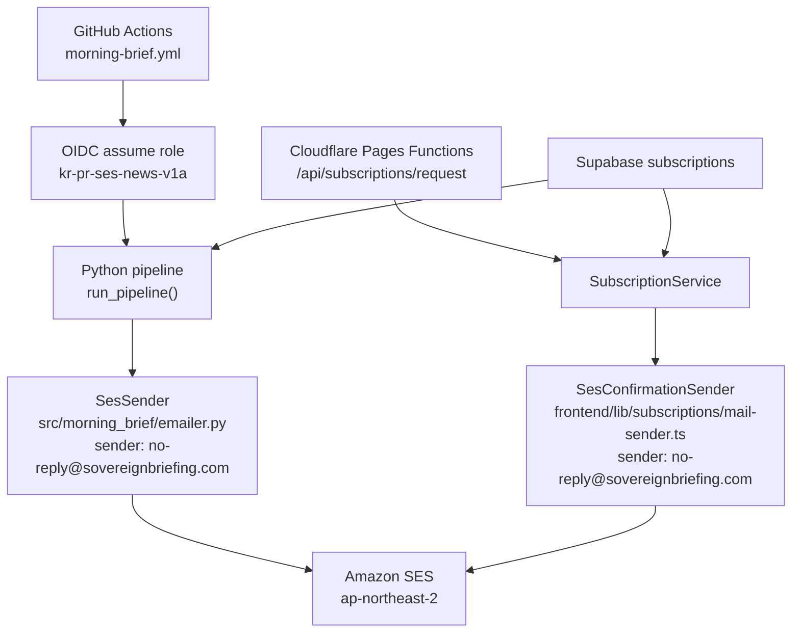

# Design Document: AWS SES Mail Migration

## Overview

현재 Gmail 기반 메일 전송을 AWS SES로 통일하되, 인증 방식은 런타임별로 분리합니다. GitHub Actions에서 실행되는 뉴스레터 발송은 OIDC로 `arn:aws:iam::254849613915:role/kr-pr-ses-news-v1a` 역할을 Assume하고, Cloudflare Pages Functions에서 실행되는 확인 메일 발송은 encrypted secret에 저장된 AWS 자격증명을 사용합니다. 운영 리전은 서울(`ap-northeast-2`)로 고정하고, 뉴스레터와 확인 메일은 모두 SES verified sender `no-reply@sovereignbriefing.com`를 사용합니다. 메일 본문 생성, recipient 해석, unsubscribe/confirm 링크 규칙은 유지하고 transport 계층만 SES로 교체합니다.

## Architecture



## Components and Interfaces

### 1. Python newsletter transport

변경 대상:
- `src/morning_brief/emailer.py`
- `src/morning_brief/pipeline.py`
- `tests/test_emailer.py`
- `tests/test_pipeline_observability.py`

설계:
- 기존 `build_briefing_message()`와 `_unsubscribe_url()`는 유지합니다.
- `GmailSender`를 `SesSender`로 교체합니다.
- `SesSender.send()`는 기존 MIME 메시지를 그대로 생성하고 `boto3` SES client의 `send_raw_email`로 전송합니다.
- `pipeline.py`는 `GmailSender` 대신 `SesSender`를 호출합니다.
- 뉴스레터 발송 sender는 `no-reply@sovereignbriefing.com`로 고정하고 SES client region은 `ap-northeast-2`로 고정합니다.

Design Decision:
- MIME 생성 로직은 유지하고 transport만 교체합니다.
- 이유: 현재 HTML/plain-text multipart 구조, `List-Unsubscribe` 헤더, recipient별 개별 전송 규칙을 그대로 보존하면서 회귀 범위를 최소화할 수 있습니다.

예상 인터페이스:

```python
class SesSender:
    def __init__(self, settings: Settings) -> None: ...

    def send(
        self,
        subject: str,
        body: str,
        *,
        packet: dict | None = None,
        unified: UnifiedOutput | None = None,
    ) -> None: ...
```

### 2. Python runtime auth and config

변경 대상:
- `src/morning_brief/config.py`
- `.github/workflows/morning-brief.yml`
- `docs/subscriptions-ops.md`
- `README.md` 또는 가장 가까운 운영 문서

설계:
- `gmail_sender`, `gmail_credentials_file`, `gmail_token_file`, `gmail_oauth_interactive`를 제거합니다.
- `ses_sender`, `ses_region`, `ses_configuration_set`(optional)을 설정에 추가합니다.
- GitHub Actions는 `permissions.id-token: write`와 `aws-actions/configure-aws-credentials`로 role을 Assume합니다.
- workflow에서 Gmail OAuth 파일 복원 단계는 삭제합니다.
- Python 런타임은 `boto3` 기본 자격증명 체인을 사용하므로, OIDC에서 주입된 임시 자격증명을 별도 애플리케이션 설정으로 읽지 않습니다.
- Python 설정의 `ses_sender`는 `SES_SENDER` 환경변수에서 읽고 값은 `no-reply@sovereignbriefing.com`로 운영합니다.
- Python 설정의 `ses_region`은 `AWS_REGION` 환경변수에서 읽고 값은 `ap-northeast-2`로 운영합니다.
- 로컬 개발은 실제 SES 발송을 지원하지 않고, 단위 테스트/fixture 기반 비발송 검증만 공식 경로로 둡니다.

Design Decision:
- GitHub Actions는 access key fallback 없이 OIDC를 기본 경로로 고정합니다.
- 이유: 이미 IAM OIDC provider와 role이 준비되어 있고, secret 관리량과 회전 부담을 줄이면서 가장 적은 변경으로 안전하게 운영할 수 있습니다.

### 3. Cloudflare confirmation mail transport

변경 대상:
- `frontend/lib/subscriptions/mail-sender.ts`
- `frontend/lib/subscriptions/service.ts`
- `frontend/lib/subscriptions/types.ts`
- `frontend/tests/subscription-service.test.ts`
- `frontend/tests/subscriptions-api.test.ts`
- `frontend/wrangler.toml`
- `docs/subscriptions-ops.md`

설계:
- `sendConfirmationMail()` 함수 시그니처는 유지합니다.
- 내부 구현은 Gmail token refresh + Gmail API 호출 대신 AWS SES SDK 호출로 교체합니다.
- 확인 메일은 `@aws-sdk/client-sesv2`의 `SendEmailCommand`를 사용해 `Subject/Text/Html`을 직접 구성합니다.
- Cloudflare runtime은 encrypted secret로 `AWS_ACCESS_KEY_ID`, `AWS_SECRET_ACCESS_KEY`, `AWS_REGION`, `CONFIRMATION_SES_SENDER`를 읽습니다.
- `frontend/wrangler.toml`에는 `nodejs_compat` compatibility flag를 추가합니다.
- Cloudflare runtime 값은 `AWS_REGION=ap-northeast-2`, `CONFIRMATION_SES_SENDER=no-reply@sovereignbriefing.com`로 고정합니다.
- 로컬 `wrangler pages dev`는 라우팅과 Functions 초기화 확인까지만 지원하고 실제 SES 발송 smoke test는 preview 환경에서만 수행합니다.

Design Decision:
- 서비스 계층의 `sendConfirmationMail()` 인터페이스는 유지하고 구현만 SES로 교체합니다.
- 이유: `SubscriptionService`와 API route의 계약을 유지해 테스트와 호출 흐름을 거의 바꾸지 않고 provider migration에 집중할 수 있습니다.

Design Decision:
- Cloudflare에서는 SES SMTP 대신 SES API + AWS SDK를 사용합니다.
- 이유: SMTP credential은 리전별 장기 자격증명이 필요하고, AWS는 SDK 또는 CLI 사용을 권장합니다. SES API를 쓰면 HTML/text 본문을 구조적으로 다룰 수 있고 오류 해석도 단순합니다.

예상 인터페이스:

```ts
export interface SubscriptionEnv {
  SUPABASE_URL: string;
  SUPABASE_SERVICE_ROLE_KEY: string;
  PUBLIC_APP_BASE_URL: string;
  SUBSCRIPTION_TOKEN_SECRET: string;
  AWS_ACCESS_KEY_ID: string;
  AWS_SECRET_ACCESS_KEY: string;
  AWS_REGION: string;
  CONFIRMATION_SES_SENDER: string;
}
```

### 4. Logging and provider naming

변경 대상:
- `src/morning_brief/emailer.py`
- `docs/specs/logging-unification/design.md`
- 관련 테스트

설계:
- provider 로그 값은 `gmail`에서 `ses`로 바꿉니다.
- `mail_intent="newsletter"`와 recipient 단위 로깅은 유지합니다.
- Cloudflare 확인 메일 실패도 설정 누락, 인증 실패, identity 검증 실패, 전송 실패를 구분 가능한 에러 메시지로 남깁니다.

Design Decision:
- provider 명칭을 완전히 `ses`로 전환합니다.
- 이유: Gmail 제거 이후 관측성 필드와 실제 런타임이 일치해야 운영 혼선을 줄일 수 있습니다.

## Data Models

### Python `Settings` 변경

제거:
- `gmail_sender: str`
- `gmail_credentials_file: Path`
- `gmail_token_file: Path`
- `gmail_oauth_interactive: bool`

추가:
- `ses_sender: str`
- `ses_region: str`
- `ses_configuration_set: str`

운영값:
- `SES_SENDER=no-reply@sovereignbriefing.com`
- `AWS_REGION=ap-northeast-2`

### Frontend `SubscriptionEnv` 변경

제거:
- `CONFIRMATION_GMAIL_CLIENT_ID: string`
- `CONFIRMATION_GMAIL_CLIENT_SECRET: string`
- `CONFIRMATION_GMAIL_REFRESH_TOKEN: string`
- `CONFIRMATION_GMAIL_SENDER: string`

추가:
- `AWS_ACCESS_KEY_ID: string`
- `AWS_SECRET_ACCESS_KEY: string`
- `AWS_REGION: string`
- `CONFIRMATION_SES_SENDER: string`

운영값:
- `AWS_REGION=ap-northeast-2`
- `CONFIRMATION_SES_SENDER=no-reply@sovereignbriefing.com`

## Correctness Properties

1. *For any* active recipient set, `SesSender.send()`는 recipient 수와 동일한 횟수만큼 SES 전송을 수행하고 각 MIME 메시지의 `To` 및 `List-Unsubscribe`가 recipient별로 달라야 하며 sender는 항상 `no-reply@sovereignbriefing.com`여야 합니다.
   - Validates: Requirement 1.2, 1.3, 1.4, 1.6

2. *For any* newsletter run with zero active recipients, `SesSender.send()`는 SES client를 호출하지 않아야 합니다.
   - Validates: Requirement 1.5

3. *For any* confirmation request, `sendConfirmationMail()`는 현재와 동일한 confirm URL, subject, text, html을 유지한 채 SES 요청을 생성해야 하며 sender는 항상 `no-reply@sovereignbriefing.com`이어야 합니다.
   - Validates: Requirement 3.1, 3.2, 3.3

4. *For any* confirmation send failure, `SubscriptionService.requestSubscription()`는 예외를 전파하고 subscription status를 `pending`으로 유지해야 합니다.
   - Validates: Requirement 3.6

5. *For any* GitHub Actions newsletter run, workflow는 Gmail OAuth 파일 복원 없이 AWS role assumption 이후에만 메일 발송 단계를 수행하고 `ap-northeast-2`를 사용해야 합니다.
   - Validates: Requirement 2.1, 2.3, 2.4, 2.5

## Error Handling

| 상황 | 처리 방식 |
| --- | --- |
| GitHub OIDC role assumption 실패 | workflow에서 즉시 실패시키고 Python 메일 발송 단계로 진입하지 않음 |
| SES verified identity 미설정 | provider=`ses` 오류 로그와 함께 실행 실패 |
| sender 값이 `no-reply@sovereignbriefing.com`와 다르거나 identity와 불일치 | 설정 오류로 간주하고 명시적 실패 처리 |
| SES 전송 중 일부 recipient 실패 | 실패 recipient를 누적하고 전체 실행을 실패 처리 |
| active recipient 없음 | 기존처럼 skip 로그를 남기고 정상 종료 |
| Cloudflare secret 누락 | 확인 메일 요청 시 명시적 설정 오류를 발생시키고 subscription은 `pending` 유지 |
| confirmation mail 전송 실패 | 예외를 전파하고 subscription을 활성화하지 않음 |
| 로컬 개발에서 실제 SES 발송을 시도 | 지원하지 않는 운영 경로로 간주하고 문서/테스트는 mock 또는 비발송 검증만 사용 |

## Testing Strategy

- Python 단위 테스트
  - `tests/test_emailer.py`
  - SES client mock으로 recipient별 `send_raw_email` 호출 수와 raw MIME payload를 검증합니다.
- Python 회귀 테스트
  - `tests/test_pipeline_observability.py`
  - `pipeline.py`가 `SesSender`를 사용하고 provider/phase 로깅을 유지하는지 검증합니다.
- Python 설정 테스트
  - `tests/test_config.py`
  - SES env 로딩과 Gmail env 제거 또는 deprecated 처리 여부, `AWS_REGION=ap-northeast-2`, `SES_SENDER=no-reply@sovereignbriefing.com` 반영 여부를 검증합니다.
- Frontend 단위 테스트
  - `frontend/tests/subscription-service.test.ts`
  - 확인 메일 함수 인터페이스 유지, 실패 전파, pending 유지 규칙을 검증합니다.
- Frontend API 테스트
  - `frontend/tests/subscriptions-api.test.ts`
  - SES env shape 변경 이후 request route가 정상 동작하는지와 `AWS_REGION=ap-northeast-2`, `CONFIRMATION_SES_SENDER=no-reply@sovereignbriefing.com`이 반영되는지 검증합니다.
- 문서 기반 검증
  - GitHub Actions에서 `aws sts get-caller-identity`
  - preview 환경에서 `/api/subscriptions/request`
  - 실제 수신 mailbox에서 confirm 링크와 newsletter unsubscribe 링크 확인
  - 로컬 환경에서는 실제 SES 발송 대신 단위 테스트와 route 초기화 확인만 수행
