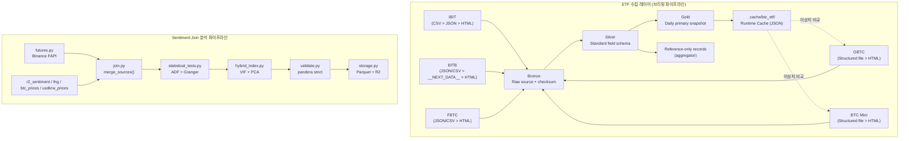

# Design Document: BTC ETF Collection Redesign

## Overview

본 설계는 두 독립적인 서브시스템을 다룬다.

1. **ETF 수집 레이어** (`btc_etf_official.py` + `models.py`) — 공식 구조화 다운로드 우선 정책, Bronze/Silver/Gold 분리, 집계 사이트 reference 격리
2. **Sentiment Join 분석 파이프라인** (`analysis/sentiment_join/`) — Binance 선물 지표 수집(`futures.py`), ADF·Granger 통계 검정(`statistical_tests.py`), VIF·PCA 하이브리드 지수(`hybrid_index.py`)

두 서브시스템은 데이터 흐름 상 직접 연결되지 않는다. ETF 수집 결과는 Bronze/Silver/Gold 계층을 통해 브리핑 파이프라인에 전달되고, Sentiment Join 파이프라인은 분석 배치(`make sentiment-join`)에서 독립 실행된다.

---

## Architecture

### 전체 데이터 흐름



### 스토리지 계층

```
Runtime Cache (.cache/btc_etf/)   ← fetch 재사용, 이상치 전일 비교 참조
    └─ official_snapshots.json    ← Gold primary snapshot 캐시
    └─ state.json                 ← 수집 상태 메타데이터

Bronze (Supabase Storage)         ← raw payload, checksum, fetch metadata, run_id
Silver (Supabase Postgres)        ← 표준 컬럼 스키마, source_type별 레코드, reference 분리
Gold   (Supabase Postgres)        ← ticker/as_of_date별 단일 primary snapshot, schema_version

Sentiment Join Master Parquet     ← data/sentiment_join/master_{YYYYMMDD}.parquet
    └─ schema metadata key        ← sentiment_join_stats (JSON summary)
```

### 운영 경계

- 집계 사이트(Coinglass, Farside 등)는 primary 값 생성 경로에 참여하지 않는다.
- 공식 원천이 없고 집계 사이트 값만 존재하는 경우 Gold primary 레코드는 생성하지 않는다.
- 모든 Bronze/Silver/Gold 레코드와 구조화 로그는 동일 `run_id`를 공유한다.
- 재처리는 Bronze 원문 + `schema_version` 기준으로 수행하며 동일 checksum 입력은 멱등적으로 upsert한다.

---

## Components and Interfaces

### 1. Silver / Gold 모델 분리

`BitcoinEtfIssuerSnapshot`은 Gold 일별 집계 DTO로만 사용하고, Silver 표준 레코드는 별도 모델로 분리한다.

#### 1.1 `SilverNormalizedFieldRecord`

목표 인터페이스.

```python
@dataclass
class SilverNormalizedFieldRecord:
    run_id: str
    ticker: str
    issuer: str
    field_name: str
    field_value: str | float | int | None
    value_type: str
    unit: str | None
    as_of_date: date
    collected_at: datetime
    source_url: str
    source_type: str
    source_format: str
    parse_method: str
    source_file_url: str | None = None
    quality_status: str = "ok"
    raw_label: str | None = None
    raw_text: str | None = None
    schema_version: str = "v1"
```

Silver 모델은 Bronze 원문을 field-level 표준 스키마로 보존하는 역할만 가진다.

#### 1.2 `BitcoinEtfIssuerSnapshot` (`models.py`)

목표 인터페이스.

```python
@dataclass
class BitcoinEtfIssuerSnapshot:
    ticker: str
    issuer: str
    source_url: str
    as_of_date: date                     # as_of: str 에서 마이그레이션
    shares_outstanding: int
    daily_volume: int
    aum_usd: float
    total_btc: float
    bitcoin_per_share: float
    source_type: str = "official_html"   # official_json / official_csv / official_html / aggregator
    quality_status: str = "ok"           # ok / degraded / critical
    collected_at: datetime | None = None
```

Gold 모델은 브리핑 파이프라인이 소비하는 일별 선택 결과만 표현한다. `run_id`, `field_name`, `raw_label`, `raw_text`, `source_file_url` 같은 Silver 전용 필드는 포함하지 않는다.

**DD-1. `as_of: str` → `as_of_date: date` 교체 이유**
구버전 캐시(`as_of: "03/14/2026"` 형식)와의 역호환을 위해 `_deserialize_snapshot_item()`이 `as_of` 키를 자동 마이그레이션한다.

---

### 2. ETF 수집 포맷 우선순위 매트릭스

| Ticker | 1순위 | 2순위 | 3순위 | source_type 결과 |
|--------|-------|-------|-------|-----------------|
| IBIT | CSV 다운로드 (ishares.com) | 페이지 내 구조화 JSON | HTML 라벨 파싱 | `official_csv` / `official_json` / `official_html` |
| BITB | 공식 JSON/CSV 다운로드 | `__NEXT_DATA__` JSON | HTML 라벨 파싱 | `official_json` / `official_csv` / `official_html` |
| GBTC | 구조화 공식 다운로드(XLSX 포함) | HTML 라벨 파싱 | — | `official_csv` / `official_html` |
| BTC  | 구조화 공식 다운로드(XLSX 포함) | HTML 라벨 파싱 | — | `official_csv` / `official_html` |
| FBTC | 공식 JSON/CSV 다운로드 | HTML 라벨 파싱 | — | `official_json` / `official_csv` / `official_html` |

---

### 3. IBIT 파서 (`parse_ibit_snapshot`)

**설계 기준**: `official_csv` 또는 `official_json` 우선, 실패 시 `official_html` fallback.

**Req 4 설계**: CSV 다운로드가 가능한 경우 `official_csv` 1순위 시도 → 실패 시 JSON → HTML fallback.

```python
def parse_ibit_snapshot(text: str) -> BitcoinEtfIssuerSnapshot:
    # 1순위: 공식 CSV
    # 2순위: 공식 JSON
    # 3순위: HTML 라벨 파싱
    ...
```

---

### 4. BITB 파서 (`parse_bitb_snapshot`)

**목표 설계**: 공식 JSON/CSV 다운로드 1순위, 페이지 내 구조화 JSON 2순위, HTML fallback 3순위.

```python
# __NEXT_DATA__ 키 매핑 (현재 구현 기준)
# totalReserve → total_btc
# netAssets    → aum_usd
# sharesOutstanding → shares_outstanding
# volume       → daily_volume
# timestamp    → as_of_str (ISO 8601)
```

---

### 5. GBTC / BTC 공용 파서 (`_parse_grayscale_snapshot`)

#### 5.1 실사 결과

리서치를 통해 확인한 실제 페이지 구조 (2026-04-10 기준):

| 필드 | 실제 HTML 레이블 | 현재 코드 레이블 | 버그 여부 |
|------|-----------------|-----------------|----------|
| Total BTC | `TOTAL BITCOIN IN FUND` | `TOTAL BITCOIN IN TRUST` | **버그** |
| AUM (non-GAAP) | `ASSETS UNDER MANAGEMENT (NON-GAAP)` | `ASSETS UNDER MANAGEMENT` | 부분 일치 (동작 가능) |
| Shares Outstanding | `SHARES OUTSTANDING` | `SHARES OUTSTANDING` | 정상 |
| Daily Volume | `DAILY VOLUME (SHARES)` | `DAILY VOLUME (SHARES)` | 정상 |
| BTC per Share | `BITCOIN PER SHARE` | `BITCOIN PER SHARE` | 정상 |

**기준일 파싱**: `Data as of MM/DD/YYYY` 패턴 → `_extract_page_date()` 동작 정상.

> **중요**: `TOTAL BITCOIN IN TRUST` 레이블을 `TOTAL BITCOIN IN FUND`로 수정하지 않으면 모든 Grayscale ETF 수집이 실패하고 primary Gold 레코드가 생성되지 않는다.

#### 5.2 Grayscale XLSX 1순위 경로

두 ETF 모두 공개 S3에 일별 성능 XLSX를 제공한다 (인증 불필요, daily ~04:52 UTC 갱신).

```
# GBTC
https://reporting-prod-20231113144948145500000003.s3.us-east-1.amazonaws.com/
  product-performance/672e88c7-dac6-4fcd-9069-18eef01a2c73.xlsx

# BTC Mini Trust
https://reporting-prod-20231113144948145500000003.s3.us-east-1.amazonaws.com/
  product-performance/9ba286d6-3067-4153-b430-81d9d7a25696.xlsx
```

**XLSX 컬럼 구조** (확인된 필드, Performance 시트 기준):
- `As of Date` — 기준일
- `Shares Outstanding` — 발행 주식수
- `Total Bitcoin in Fund` (또는 `Bitcoin Holdings`) — 보유 BTC
- `Bitcoin per Share` — 주당 BTC
- `Non-GAAP AUM` — 비GAAP 순자산
- `NAV per Share` — 주당 NAV
- `Market Price` — 시장가
- `Daily Volume (Shares)` — 일별 거래량

> **주의**: XLSX 내부 시트명 및 컬럼명은 파일을 실제 다운로드해 확인 후 파서를 작성해야 한다. 컬럼명이 변경될 경우 HTML fallback으로 강등된다.

**DD-3. 구조화 다운로드를 `official_csv`로 분류하는 이유**
요구사항 `source_type` 정의는 `"official_csv"`(운용사 공식 다운로드)를 포함한다. XLSX는 구조화 바이너리 포맷으로 HTML보다 신뢰도가 높으며, `quality_status="ok"` 자격을 가진다. PDF와 달리 `openpyxl`로 파싱 가능하다.

**DD-4. Vercel 봇 차단 회피를 XLSX로 해결하는 이유**
`etfs.grayscale.com`은 Vercel 보안 미들웨어가 적용되어 비브라우저 HTTP 요청에 429를 반환한다. XLSX S3 URL은 AWS CloudFront를 직접 경유하므로 봇 차단 없이 접근 가능하다. Headless 브라우저 도입 없이 안정적인 구조화 데이터를 얻는 가장 현실적인 경로다.

```python
GBTC_XLSX_URL = (
    "https://reporting-prod-20231113144948145500000003.s3.us-east-1.amazonaws.com"
    "/product-performance/672e88c7-dac6-4fcd-9069-18eef01a2c73.xlsx"
)
BTC_MINI_XLSX_URL = (
    "https://reporting-prod-20231113144948145500000003.s3.us-east-1.amazonaws.com"
    "/product-performance/9ba286d6-3067-4153-b430-81d9d7a25696.xlsx"
)

def _parse_grayscale_snapshot(
    ticker: str, issuer: str, page_url: str, xlsx_url: str, text: str
) -> BitcoinEtfIssuerSnapshot:
    """
    1순위: XLSX S3 다운로드 (source_type="official_csv", quality_status="ok")
    2순위: HTML 라벨 파싱 (source_type="official_html", quality_status="degraded")
          └─ 레이블 버그 수정: "TOTAL BITCOIN IN FUND" (not "TOTAL BITCOIN IN TRUST")
    """
    ...
```

**XLSX 파싱 의존성**: `openpyxl>=3.1`이 `requirements.txt`에 없는 경우 추가 필요.

---

### 6. FBTC 파서 (`parse_fbtc_snapshot`) — 신규

#### 6.1 실사 결과

Fidelity Digital 페이지(`digital.fidelity.com`)는 React SPA다. 데이터는 POST XHR(BFF 프록시)로 로드되며, 세션 쿠키 없이는 직접 API 호출이 불가하다.

**Static HTML에서 파싱 가능한 필드 (비JS 렌더링 기준 추정)**:
- `NAV` + 날짜 suffix (예: `"NavAs of Apr-10-2026 $63.693871"`)
- `Market Price` (hero bar — JS 없이는 불완전)
- `Total bitcoin in fund` = 189,171.8706 (as of 04/10/2026)
- `Bitcoin per share` = 0.00087084
- `Shares outstanding` = "215.2M" (compact 형식)
- `Premium/discount` = +0.13%
- `Net assets` = $12.74B (as of Mar-31-2026 — 지연 값)

> **중요**: SPA 특성상 비JS static HTML에서 위 필드가 실제로 보이는지 실제 `requests.get()` 응답으로 검증 필요. JS 없이 렌더링되지 않는다면 모든 필드가 빈 상태로 반환되므로 HTML 파서는 즉시 실패로 처리하고 Gold primary 레코드를 만들지 않는다.

**레이블 파싱 특이점**: 날짜 suffix가 레이블 텍스트에 인라인으로 포함된다.

```python
# 기존 패턴: "label_text\s+value"
# FBTC 패턴: "label_text As of MMM-DD-YYYY value" 또는 "label_textAs of..."
FBTC_LABEL_DATE_STRIP_RE = re.compile(
    r"\s*[Aa]s\s+of\s+[A-Z][a-z]{2}-\d{1,2}-\d{4}", flags=re.IGNORECASE
)
```

**DD-5. FBTC는 기본적으로 `degraded` 가능성이 높은 이유**
Req 7.3: PDF 배제 정책으로 공식 구조화 경로가 없을 수 있다. 이 경우 HTML 파싱이 성공해도 SPA 특성상 구조 안정성이 낮으므로 `quality_status="degraded"`로 분류하고, 공식 원천이 실패하면 reference-only 상태로 남긴다.

```python
FBTC_URL = "https://digital.fidelity.com/prgw/digital/research/quote/dashboard/summary?symbol=FBTC"

def parse_fbtc_snapshot(text: str) -> BitcoinEtfIssuerSnapshot:
    """
    1순위: HTML 라벨 파싱 (날짜 suffix 제거 후 매칭)
    항상 source_type="official_html", quality_status="degraded"
    total_btc 없으면 None → quality_status="critical"
    """
    normalized = _normalize_page_text(text)
    normalized = FBTC_LABEL_DATE_STRIP_RE.sub("", normalized)
    ...
```

---

### 7. JSON 직렬화 / 캐시 마이그레이션 (`btc_etf_official.py`)

설계 요약:

```python
class _DateTimeEncoder(json.JSONEncoder):
    """date/datetime → ISO 8601 문자열 변환"""

def _deserialize_snapshot_item(item: dict) -> BitcoinEtfIssuerSnapshot:
    """구버전 as_of: str 키 → as_of_date: date 자동 마이그레이션"""
    if "as_of" in item and "as_of_date" not in item:
        item["as_of_date"] = item.pop("as_of")
    ...
```

---

### 8. 이상치 검증 (`_validate_snapshot_anomalies`)

추가 설계:

| 검증 조건 | 처리 | 로그 이벤트 |
|-----------|------|------------|
| `shares_outstanding <= 0` | `None`으로 대체, `critical` 격상 | `etf.anomaly_invalid_field` |
| `total_btc < 0` | `None`으로 대체, `critical` 격상 | `etf.anomaly_invalid_field` |
| `abs(premium_discount_pct) > 5.0` | 수집 계속, 경고만 | `etf.anomaly_premium_discount` |
| `total_btc` 또는 `aum_usd` 전일 대비 20% 초과 변화 | 수집 계속, 경고만 | `etf.anomaly_rapid_change` |

전일 비교용 참조값: Runtime Cache(`.cache/btc_etf/official_snapshots.json`)에서 읽음. 캐시 없으면 Req 9.4 검증 건너뜀.

---

### 9. `futures.py` — Binance 선물 지표 수집

설계 요약:

```python
# API 엔드포인트
BINANCE_FUNDING_URL = "https://fapi.binance.com/fapi/v1/fundingRate"
BINANCE_OI_URL     = "https://fapi.binance.com/futures/data/openInterestHist"

def fetch_futures_data(lookback_days: int) -> pd.DataFrame:
    """columns: date, funding_rate, open_interest_usd"""
```

**집계 방식**:
- `funding_rate`: 8h 주기 3건 **합산** (평균 아님) → `_aggregate_daily_funding()`
- `open_interest_usd`: 일별 `sumOpenInterestValue` 필드 → `_extract_daily_oi()`

**실패 처리**: Binance 응답 없음 → 전체 NaN DataFrame 반환, 파이프라인 계속.

---

### 10. `statistical_tests.py` — ADF + Granger

설계 요약:

```python
def run_statistical_tests(df: pd.DataFrame) -> dict[str, Any]:
    """
    - ADF: btc_log_return 정상성 검정 (p < 0.05 기준)
    - Granger: 3 쌍 × lag 1,2,3 = 9회 검정
      - news_sentiment_mean → btc_log_return
      - funding_rate_lag1   → btc_log_return
      - fng_value           → btc_log_return
    - 행 수 < 30: 검정 건너뜀
    """
```

**Granger 검정 입력 순서**: `grangercausalitytests`는 `[target, predictor]` 순서의 2컬럼 DataFrame을 요구한다. `fng_value`는 `Int64` nullable dtype → `pd.to_numeric(..., errors='coerce')` 변환 후 dropna.

**DD-7. 통계 결과 메타데이터 저장 계약**
통계 결과는 Parquet schema metadata의 `sentiment_join_stats` 키에 UTF-8 JSON 문자열로 저장한다. JSON 요약에는 최소 `run_id`, `generated_at_utc`, `adf`, `granger_results`, `vif_diagnostics`, `pca_summary`를 포함한다. 상세 수치와 예외 문맥은 observability 로그에 남기고, Parquet metadata에는 재현과 비교에 필요한 요약만 저장한다.

---

### 11. `hybrid_index.py` — VIF + PCA

설계 요약:

```python
HYBRID_FEATURE_CANDIDATES = [
    "news_sentiment_mean",
    "fng_value",
    "funding_rate_lag1",
    "etf_net_inflow_usd",  # 미구현, 없으면 자동 제외
]

def compute_hybrid_index(df: pd.DataFrame) -> pd.DataFrame:
    """
    1. 후보 변수 중 DataFrame에 있는 것만 선별
    2. StandardScaler + VIF 계산 (Req 13.1)
    3. VIF >= 10: 최고 VIF 변수 1개씩 반복 제거 (Req 13.2)
    4. PCA: 누적 설명 분산 >= 80% 달성하는 최소 주성분 수 자동 선택 (Req 13.3)
    5. PC1 → hybrid_index 컬럼 (Req 13.4)
    가드: 변수 < 2 또는 행 < 10 → NaN 채우고 경고 로그
    """
```

**DD-6. VIF 계산 전 StandardScaler를 적용하는 이유**
`variance_inflation_factor`는 스케일 차이에 민감하다. `fng_value`(0~100)와 `funding_rate_lag1`(~0.001 단위)를 스케일 정규화 없이 VIF 행렬에 넣으면 수치 불안정이 발생한다.

---

### 12. `join.py` — 선물 지표 조인 + Lag-1 처리

설계 요약:

```python
def _add_futures_lag_columns(df: pd.DataFrame) -> pd.DataFrame:
    """
    funding_rate_lag1    = funding_rate.shift(1)
    oi_change_pct_lag1   = open_interest_usd.pct_change().shift(1)
    """

def merge_sources(
    sentiment_df, fng_df, btc_df, usdkrw_df,
    futures_df: pd.DataFrame | None = None,
) -> pd.DataFrame:
    """futures_df 없으면 4개 NaN 컬럼 추가 후 계속"""
```

**Lag-1 적용 이유**: 당일 `funding_rate`를 그대로 조인하면 당일 수익률(`btc_log_return`)과 미래 오염(data leakage)이 발생한다. Lag-1 처리로 "어제의 선물 지표가 오늘의 수익률을 선행하는가"를 검증하는 올바른 인과 구조를 만든다.

---

### 13. `validate.py` — pandera MASTER_SCHEMA

설계 기준. 신규 컬럼 5개 추가 (`nullable=True`, `strict=True` 유지):

```python
"funding_rate":       pa.Column(float, nullable=True)
"open_interest_usd":  pa.Column(float, nullable=True)
"funding_rate_lag1":  pa.Column(float, nullable=True)
"oi_change_pct_lag1": pa.Column(float, nullable=True)
"hybrid_index":       pa.Column(float, nullable=True)
```

---

## Data Models

### `BitcoinEtfIssuerSnapshot`

| 필드 | 타입 | 기본값 | 필수 여부 | 비고 |
|------|------|--------|----------|------|
| `ticker` | `str` | — | 필수 | `"IBIT"` / `"BITB"` / `"GBTC"` / `"BTC"` / `"FBTC"` |
| `issuer` | `str` | — | 필수 | 운용사 이름 |
| `source_url` | `str` | — | 필수 | 공식 페이지 URL |
| `as_of_date` | `date` | — | 필수 | ISO 8601 직렬화 (`YYYY-MM-DD`) |
| `shares_outstanding` | `int` | — | 필수 | 이상치 시 `None` 처리 후 `critical` |
| `daily_volume` | `int` | — | 필수 | |
| `aum_usd` | `float` | — | 필수 | |
| `total_btc` | `float` | — | 필수 | FBTC PDF 배제 시 `None` 가능 |
| `bitcoin_per_share` | `float` | — | 필수 | |
| `source_type` | `str` | `"official_html"` | 선택 | `official_json` / `official_csv` / `official_html` / `aggregator` |
| `quality_status` | `str` | `"ok"` | 선택 | `ok` / `degraded` / `critical` |
| `collected_at` | `datetime \| None` | `None` | 선택 | UTC 타임스탬프 |

### Master DataFrame 스키마 (Sentiment Join)

| 컬럼 | dtype | nullable | 신규 | 비고 |
|------|-------|----------|------|------|
| `date` | `str` | No | — | `YYYY-MM-DD`, unique |
| `news_sentiment_mean` | `float` | No | — | FinBERT −1~1 |
| `n_articles` | `Int64` | Yes | — | |
| `fng_value` | `Int64` | Yes | — | 0~100 |
| `btc_log_return` | `float` | Yes | — | ADF 검정 대상 |
| `usdkrw_log_return` | `float` | Yes | — | |
| `is_outlier` | `bool` | No | — | |
| `funding_rate` | `float` | **Yes** | **신규** | Binance 8h×3 합산 |
| `open_interest_usd` | `float` | **Yes** | **신규** | `sumOpenInterestValue` |
| `funding_rate_lag1` | `float` | **Yes** | **신규** | `funding_rate.shift(1)` |
| `oi_change_pct_lag1` | `float` | **Yes** | **신규** | OI 변화율 lag-1 |
| `hybrid_index` | `float` | **Yes** | **신규** | PCA PC1 |

---

## Correctness Properties

**Req 1 — 포맷 우선순위**
*For any* ETF 수집 실행에서, `source_type="official_json"` 또는 `"official_csv"` 스냅샷이 존재하면 `"official_html"` 스냅샷으로 대체되지 않아야 한다.

**Req 8 — quality_status 단조성**
*For any* 스냅샷에서, `source_type`이 `"official_html"`이면 `quality_status`는 `"ok"`가 될 수 없다. (`_compute_quality_status` 보장)

**Req 9 — 이상치 격상 단조성**
*For any* 스냅샷에서, `shares_outstanding <= 0` 또는 `total_btc < 0`이면 `quality_status`는 반드시 `"critical"`이어야 한다.

**Req 11 — 선물 Lag-1 인과 방향**
*For any* 마스터 데이터셋 행에서, `funding_rate_lag1[t]`는 `funding_rate[t-1]`과 동일해야 하고 `funding_rate[t]`와 같아서는 안 된다.

**Req 11 — 펀딩비 합산**
*For any* 날짜 `d`에서, `funding_rate[d] = sum(8h 펀딩비 3건)` (평균이 아닌 합산).

**Req 13 — VIF 수렴 보장**
*For any* VIF 반복 제거 루프에서, 루프가 종료될 때 남은 모든 변수의 VIF는 10 미만이거나 변수 수가 2 미만이어야 한다.

**Req 13 — hybrid_index NaN 보장**
*For any* 입력 데이터에서 PCA 실행 가능한 행 수가 `MIN_PCA_ROWS(10)` 미만이거나 변수 수가 `MIN_PCA_FEATURES(2)` 미만이면, `hybrid_index` 컬럼은 전체 NaN이어야 한다.

**JSON 직렬화 왕복**
*For any* `BitcoinEtfIssuerSnapshot`에서, `save → load` 왕복 후 `as_of_date` 필드는 동일한 `date` 객체를 유지해야 한다.

---

## Error Handling

### ETF 수집 레이어

| 상황 | 처리 방식 | quality_status |
|------|-----------|---------------|
| XLSX S3 다운로드 실패 | HTML 파싱으로 강등 | `degraded` |
| HTML 파싱 실패 (Grayscale 429 포함) | `failures` 목록에 기록, 다음 ticker 계속 | `critical` (건너뜀) |
| FBTC HTML 파싱 실패 | reference-only 상태로 기록, 다음 ticker 계속 | `critical` |
| 비공식 도메인 URL 감지 | `ValueError` 발생 | — |
| `shares_outstanding <= 0` | 필드 `None`, `critical` 격상 | `critical` |
| `total_btc < 0` | 필드 `None`, `critical` 격상 | `critical` |
| `abs(premium_discount_pct) > 5.0` | WARNING 로그, 수집 계속 | 변경 없음 |
| 전일 대비 20% 초과 변화 | WARNING 로그, 수집 계속 | 변경 없음 |
| reference source 수집 실패 | reference 레코드 생략, 파이프라인 계속 | — |
| 전체 snapshots 빈 배열 | `state.json` 기록, `btc_etf_reference_empty` 이벤트 | — |

### Sentiment Join 분석 파이프라인

| 상황 | 처리 방식 |
|------|-----------|
| Binance API 전체 실패 | NaN DataFrame 반환, 파이프라인 계속 |
| ADF/Granger 예외 | 해당 검정만 건너뜀, WARNING 로그 |
| VIF 수렴 실패 (변수 < 2) | PCA 건너뜀, `hybrid_index` = NaN |
| pandera 스키마 검증 실패 | `SchemaError` 발생, Parquet 저장 중단 |
| 행 수 < 30 | 통계 검정 건너뜀 (`stats.insufficient_rows`) |

---

## Testing Strategy

### ETF 수집 레이어

**테스트 파일**: `tests/test_btc_etf_official.py`, `tests/test_market_btc_official_flow.py`

| 테스트 대상 | 검증 내용 | 유형 |
|-------------|----------|------|
| `_parse_grayscale_snapshot()` | `"TOTAL BITCOIN IN FUND"` 레이블로 파싱 성공 확인 | 단위 |
| `_parse_grayscale_snapshot()` | XLSX 1순위 → HTML fallback 강등 경로 | 단위 |
| `parse_fbtc_snapshot()` | HTML 파싱 성공 시 `source_type="official_html"`, `quality_status="degraded"` | 단위 |
| `parse_fbtc_snapshot()` | 날짜 suffix 포함 레이블에서 올바른 값 추출 | 단위 |
| `_validate_snapshot_anomalies()` | `shares_outstanding <= 0` → `critical` 격상 | 단위 |
| `_deserialize_snapshot_item()` | 구버전 `as_of: str` → `as_of_date: date` 마이그레이션 | 단위 |
| `save_official_btc_etf_cache()` + `load_official_btc_etf_cache()` | `date` 왕복 직렬화 | 단위 |
| `fetch_bitcoin_snapshot()` | Grayscale 수집 실패 시 파이프라인 계속 | 통합 |

**버그 회귀 방지**:
- `"TOTAL BITCOIN IN TRUST"` 레이블 사용 시 `HttpFetchError` 발생을 검증하는 테스트 추가.
  ```python
  def test_parse_grayscale_snapshot_rejects_wrong_label(grayscale_page_fixture):
      # "TOTAL BITCOIN IN TRUST" 레이블로는 파싱 실패
      # "TOTAL BITCOIN IN FUND" 레이블로는 파싱 성공
  ```

### Sentiment Join 분석 파이프라인

**테스트 파일**: `tests/analysis/test_sentiment_join/`

| 테스트 파일 | 테스트 대상 | 유형 |
|-------------|------------|------|
| `test_join.py` | `merge_sources()` 신규 컬럼 포함 여부 | 단위 |
| `test_join.py` | `funding_rate_lag1[t] == funding_rate[t-1]` 보장 | 단위 |
| `test_validate.py` | 신규 5개 nullable 컬럼 포함 스키마 통과 | 단위 |
| `test_validate.py` | 신규 컬럼 누락 시 `SchemaError` 발생 | 단위 |
| `test_futures.py` | Binance API 실패 시 NaN DataFrame 반환 | 단위 |
| `test_futures.py` | `funding_rate` = 8h 3건 합산 (평균 아님) | 단위 |
| `test_statistical_tests.py` | 행 < 30: 빈 dict 반환, `stats.insufficient_rows` 로그 | 단위 |
| `test_statistical_tests.py` | ADF 예외 시 Granger 검정은 계속 진행 | 단위 |
| `test_hybrid_index.py` | VIF >= 10 변수 제거 후 재계산 루프 검증 | 단위 |
| `test_hybrid_index.py` | 변수 1개 남을 때 `hybrid_index` = NaN | 단위 |
| `test_hybrid_index.py` | `hybrid_index` 컬럼이 결측 없는 입력에서 NaN 아님 | 속성 기반 |

**프레임워크**: pytest + hypothesis (속성 기반), `caplog` (로그 이벤트 검증)

**의존성 (`requirements-analysis.txt` 추가)**:
```
statsmodels>=0.14
scikit-learn>=1.4
openpyxl>=3.1     # Grayscale XLSX 파싱 (브리핑 파이프라인 공용)
```

> `openpyxl`은 `requirements.txt`(메인 파이프라인)에도 추가 필요. `statsmodels`, `scikit-learn`은 분석 배치 전용(`requirements-analysis.txt`).
