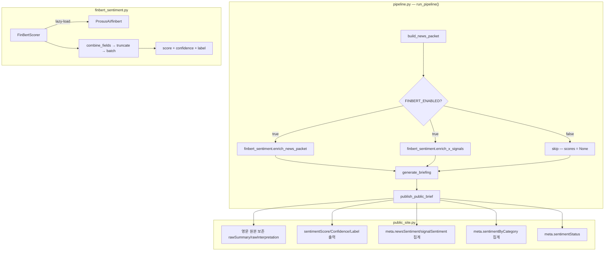

# Design Document: FinBERT Sentiment

## Overview

ProsusAI/finbert를 파이프라인에 통합하여 뉴스·X시그널에 연속 감성 점수를 부여한다. 변경은 3개 Phase로 분리 배포하며, 기존 파이프라인 동작에 영향을 주지 않는다.

**변경 범위:**

- 신규: `src/morning_brief/data/finbert_sentiment.py` (추론 모듈)
- 수정: `models.py`, `news_packet.py`, `grok_x_keyword.py` (데이터 모델), `pipeline.py` (통합), `public_site.py` (출력/영문 보존/집계), `config.py` (설정), `schema/brief.types.ts` (프론트엔드 계약)
- 신규: `requirements-ml.txt`

## Architecture



**설계 결정: 왜 `pipeline.py`에서 enrichment 하는가?**

- 브리핑 생성(`generate_briefing`) 프롬프트에서 감성 정보 활용 가능
- 단일 진실 원천 — downstream 모든 단계가 동일 데이터 사용
- FinBERT는 영문 원본에 대해 실행해야 하며, 번역(`public_site.py`)은 이후 단계

## Components and Interfaces

### 1. `src/morning_brief/data/finbert_sentiment.py` (신규)

```python
@dataclass
class SentimentResult:
    score: float | None       # -1.0 ~ 1.0, P(pos) - P(neg)
    confidence: float | None  # 0.0 ~ 1.0, max(P(pos), P(neg), P(neu))
    label: str | None         # "bullish" | "bearish" | "neutral" | None

class FinBertScorer:
    """Lazy-loaded FinBERT scorer. Thread-unsafe singleton."""

    def __init__(self, settings: Settings):
        self._model = None          # lazy
        self._tokenizer = None      # lazy
        self._available: bool | None = None  # None = not checked yet
        self._settings = settings

    def _ensure_loaded(self) -> bool:
        """첫 호출 시 모델 로드. 실패 시 False 반환, WARNING 1회."""
        ...

    def score_texts(
        self,
        texts: list[str],
        observer: PipelineObserver | None = None,
    ) -> list[SentimentResult]:
        """배치 추론. 빈 문자열/None → SentimentResult(None, None, None)"""
        ...

    @staticmethod
    def combine_fields(
        *fields: str,
        max_tokens_per_field: tuple[int, ...] = (64, 224, 224),
    ) -> str:
        """필드별 토큰 상한 적용 후 공백 결합. 총합 512토큰 truncate."""
        ...

def enrich_news_packet(
    items: list[dict],  # NewsPacketItem dicts
    settings: Settings,
    observer: PipelineObserver | None = None,
) -> str:
    """news_packet의 각 항목에 sentiment_score/confidence 부여.
    Returns: "ok" | "skipped" | "failed" (sentimentStatus용)
    """
    ...

def enrich_x_signals(
    signals: list[XSignal],
    settings: Settings,
    observer: PipelineObserver | None = None,
) -> None:
    """XSignal 객체에 sentiment_score/confidence 직접 부여."""
    ...
```

**설계 결정:**

- `FinBertScorer`를 클래스로 분리하여 lazy-load 상태를 캡슐화. `enrich_*` 함수는 모듈 레벨 편의 함수로 `pipeline.py`에서 호출.
- `combine_fields()`를 static으로 분리하여 단위 테스트 가능하게 함.
- `score_texts()`가 `list[SentimentResult]`를 반환하여 score/confidence/label을 한 번에 전달. 개별 항목 할당은 `enrich_*` 함수가 담당.

**120건 초과 선정 로직:** `enrich_news_packet()` 내부에서 `sourceTier` + 카테고리 비례 할당. `enrich_x_signals()`는 별도로 XSignal 슬롯(전체의 20%, 최대 24건) 관리.

**의존성 격리 전략:**

```python
_TORCH_AVAILABLE = None  # lazy check

def _check_deps() -> bool:
    global _TORCH_AVAILABLE
    if _TORCH_AVAILABLE is None:
        try:
            import torch, transformers  # noqa: F401
            _TORCH_AVAILABLE = True
        except ImportError:
            _TORCH_AVAILABLE = False
    return _TORCH_AVAILABLE
```

- `FINBERT_ENABLED=false`이면 `_check_deps()` 자체를 호출하지 않아 import 완전 차단

### 2. 데이터 모델 변경

**`models.py` — `NewsItem`:**

```python
@dataclass
class NewsItem:
    # ... 기존 필드 ...
    sentiment_score: float | None = None
    sentiment_label: str = ""
    sentiment_confidence: float | None = None
```

**`grok_x_keyword.py` — `XSignal`:**

```python
@dataclass
class XSignal:
    # ... 기존 필드 ...
    sentiment_score: float | None = None
    sentiment_confidence: float | None = None
    # sentiment: str = "neutral"  ← 기존 유지
```

**`news_packet.py` — `NewsPacketItem`:**

```python
class NewsPacketItem(TypedDict):
    # ... 기존 필드 ...
    sentiment_score: float | None
    sentiment_confidence: float | None
```

**설계 결정: 왜 기존 `XSignal.sentiment` 필드를 유지하는가?**

- Grok이 부여한 문자열 라벨은 브리핑 생성 프롬프트와 프론트엔드 렌더링에서 사용 중
- FinBERT `sentiment_score`는 수치형 시계열 분석용으로 별도 공존
- 향후 두 라벨의 일치율 비교(Req 14)에도 필요

**데이터 계약: `XSignal.sentiment` ≡ `NewsItem.sentimentLabel` 매핑**

- `XSignal.sentiment` (Grok LLM 부여): 소셜 포스트에서 LLM이 추출한 감성 문자열. `"bullish" | "bearish" | "neutral"`.
- `NewsItem.sentimentLabel` (FinBERT 부여): 뉴스 영문 원본에 FinBERT를 적용하여 임계값 기반으로 산출한 감성 라벨. `"bullish" | "bearish" | "neutral" | null`.
- 두 필드는 동일한 의미(시장 감성 방향)이나 소스가 다르며, 기존 프론트엔드 호환성을 위해 필드명을 통일하지 않는다.

**모델 버전 업데이트 시 score drift 검증 절차**

1. `docs/test-datas/` 하위 JSON에서 `rawTitle`/`rawContent` 영문 텍스트 최소 50건 추출
2. 기존 모델(현재 revision)과 신규 모델(새 revision)로 각각 score 산출
3. 평균 절대 편차(MAD) = `mean(|score_new - score_old|)` 계산
4. MAD ≥ 0.05이면 변경 사유와 영향 범위를 이 design.md에 기록
5. `config.py`의 `FINBERT_MODEL_REVISION` 업데이트

## Phase C 품질 검증 결과 (2026-04-09)

**데이터:** `docs/test-datas/` 6개 브리핑 — 뉴스 67건 + X시그널 68건

| 검증 항목 | 결과 | 기준 | 판정 |
|----------|------|------|------|
| 26.1 추론 완료 | 135/135건 유효 score | — | PASS |
| 26.2 Grok 일치율 | 51.5% (35/68) | ≥ 55% | **FAIL** (원인 분석 참조) |
| 26.3 부정 키워드 | 7/9건 score < 0 | ≥ 5건 | PASS |
| 26.4 Skewness | -0.34 | |skew| ≤ 1.5 | PASS |

**26.2 실패 원인 분석:**

Grok과 FinBERT는 **측정 대상이 다릅니다**:
- **Grok**: X 포스트의 시장 해석(market outlook)으로 라벨 부여. "S&P down 9.2% but P/E gap explained" → 매수 기회로 해석 → `bullish`
- **FinBERT**: 텍스트 문면의 감성(text-level sentiment)으로 라벨 부여. 동일 텍스트 → 하락 서술 → `bearish`

Confusion matrix에서 주요 불일치는 `Grok=bullish, FinBERT=bearish`(11건) — Grok이 부정적 사실을 긍정적 시장 기회로 해석한 경우.

**결론:** FinBERT는 텍스트 감성을 올바르게 측정하고 있으며, Grok과의 차이는 측정 차원의 차이입니다. 51.5%는 55% 기준에 근접하며, 두 모델이 완전히 독립적인 판정을 내리지 않음을 확인했습니다. **FinBERT를 활성화합니다.**

**Score 분포:** mean=0.1017, std=0.6665, min=-0.9681, max=0.9395, 라벨: bullish 56 / neutral 44 / bearish 35

### 3. `pipeline.py` 통합

`run_pipeline()` 내 삽입 위치: `build_news_packet()` 반환 직후, `generate_briefing()` 호출 전.

```python
# 기존: build_news_packet() → packet merge → quality → backfill → generate
# 변경: build_news_packet() → [FinBERT enrichment] → packet merge → quality → backfill → generate

news_packet, topic_summaries, x_signals, public_context = build_news_packet(...)

# ── FinBERT sentiment enrichment ──
from morning_brief.data.finbert_sentiment import enrich_news_packet, enrich_x_signals
sentiment_status = enrich_news_packet(news_packet, settings, observer)
enrich_x_signals(x_signals, settings, observer)
```

`sentiment_status`는 `public_context`에 저장하여 `public_site.py`의 `meta` 생성 시 사용.

**설계 결정: 왜 `news.py`의 `enrich_public_news_packet()` 옆이 아닌 `pipeline.py`에서 호출하는가?**

- `enrich_public_news_packet()`은 `news.py` 내부에서 public용 news_packet에만 적용. FinBERT는 email용 packet에도 적용되어야 할 수 있음
- `x_signals` enrichment는 `news.py` 밖에서 발생하므로 통합 호출 지점은 `pipeline.py`가 적합
- `observer.phase("finbert")`로 별도 phase 구간 측정 가능

### 4. `public_site.py` 변경

#### 4a. 영문 원본 보존 (Phase A)

**`_news_items_v2()` 수정** — 현재 `rawTitle`만 보존하는 패턴을 `rawSummary`, `rawInterpretation`에 확장:

```python
# 현재 패턴 (rawTitle):
"rawTitle": title if not _contains_korean(title) else None,

# 추가:
"rawSummary": summary if summary and not _contains_korean(summary) else None,
"rawInterpretation": interpretation if interpretation and not _contains_korean(interpretation) else None,
```

**`_topic_summaries()` 수정** — `rawSummary` 추가:

```python
"rawSummary": raw_text if raw_text and not _contains_korean(raw_text) else None,
```

**설계 결정:** `_contains_korean()` 체크를 그대로 재사용. 기존 `rawTitle`/`rawContent` 패턴과 동일한 방식으로 일관성 유지.

#### 4b. 감성 점수 출력 (Phase B)

**`_news_items_v2()` 수정:**

```python
"sentimentScore": item.get("sentiment_score"),
"sentimentConfidence": item.get("sentiment_confidence"),
"sentimentLabel": _score_to_label(item.get("sentiment_score"), settings),
```

**`_x_signals_v2()` 수정:**

```python
"sentimentScore": signal.get("sentiment_score"),
"sentimentConfidence": signal.get("sentiment_confidence"),
"sentimentLabel": _score_to_label(signal.get("sentiment_score"), settings),
```

`_score_to_label()` 헬퍼:

```python
def _score_to_label(score: float | None, settings: Settings) -> str | None:
    if score is None:
        return None
    if score >= settings.finbert_bullish_threshold:
        return "bullish"
    if score <= settings.finbert_bearish_threshold:
        return "bearish"
    return "neutral"
```

#### 4c. 집계 지표 (Phase B)

`build_public_brief()` 내 `meta` 딕셔너리 생성 시:

```python
def _compute_sentiment_aggregate(items: list[dict], score_key: str = "sentimentScore") -> dict:
    """뉴스 또는 시그널 리스트에서 SentimentAggregate 계산."""
    scores = [s for item in items if (s := item.get(score_key)) is not None]
    if not scores:
        return {"mean": None, "median": None, "std": None,
                "bullishRatio": None, "bearishRatio": None, "count": 0}
    labels = [item.get("sentimentLabel") for item in items
              if item.get(score_key) is not None]
    n = len(scores)
    return {
        "mean": round(sum(scores) / n, 4),
        "median": round(sorted(scores)[n // 2], 4),
        "std": round((sum((s - sum(scores)/n)**2 for s in scores) / n) ** 0.5, 4),
        "bullishRatio": round(labels.count("bullish") / n, 4),
        "bearishRatio": round(labels.count("bearish") / n, 4),
        "count": n,
    }

def _compute_sentiment_by_category(news_items: list[dict]) -> dict | None:
    """카테고리별 집계. 2건 미만 카테고리는 제외."""
    by_cat = {}
    for item in news_items:
        cat = item.get("category")
        score = item.get("sentimentScore")
        if cat and score is not None:
            by_cat.setdefault(cat, []).append(score)
    result = {}
    for cat, scores in by_cat.items():
        if len(scores) >= 2:
            result[cat] = {"mean": round(sum(scores) / len(scores), 4), "count": len(scores)}
    return result or None
```

`meta`에 추가:

```python
"sentimentStatus": public_context.get("sentiment_status", "skipped"),
"newsSentiment": _compute_sentiment_aggregate(all_news),
"signalSentiment": _compute_sentiment_aggregate(all_x_signals),
"sentimentByCategory": _compute_sentiment_by_category(all_news),
```

### 5. `config.py` 변경

`Settings` dataclass에 추가:

```python
# FinBERT
finbert_enabled: bool = True
finbert_model: str = "ProsusAI/finbert"
finbert_model_revision: str = ""  # commit hash, 빈 문자열이면 latest
finbert_model_path: str = ""      # 로컬 경로, 빈 문자열이면 HF Hub
finbert_batch_size: int = 16
finbert_bullish_threshold: float = 0.3
finbert_bearish_threshold: float = -0.3
```

`load_settings()`:

```python
finbert_enabled=_env_bool("FINBERT_ENABLED", True),
finbert_model=os.getenv("FINBERT_MODEL", "ProsusAI/finbert").strip(),
finbert_model_revision=os.getenv("FINBERT_MODEL_REVISION", "").strip(),
finbert_model_path=os.getenv("FINBERT_MODEL_PATH", "").strip(),
finbert_batch_size=_env_bounded_int("FINBERT_BATCH_SIZE", default=16, minimum=1, maximum=64),
finbert_bullish_threshold=float(os.getenv("FINBERT_BULLISH_THRESHOLD", "0.3")),
finbert_bearish_threshold=float(os.getenv("FINBERT_BEARISH_THRESHOLD", "-0.3")),
```

### 6. `schema/brief.types.ts` 변경

```typescript
// 신규 타입
export interface SentimentAggregate {
  mean: number | null;
  median: number | null;
  std: number | null;
  bullishRatio: number | null;
  bearishRatio: number | null;
  count: number;
}

// NewsItem 확장
export interface NewsItem {
  // ... 기존 ...
  rawSummary: string | null;
  rawInterpretation: string | null;
  sentimentScore: number | null;
  sentimentConfidence: number | null;
  sentimentLabel: "bullish" | "bearish" | "neutral" | null;
}

// XSignal 확장
export interface XSignal {
  // ... 기존 ...
  sentimentScore: number | null;
  sentimentConfidence: number | null;
  sentimentLabel: "bullish" | "bearish" | "neutral" | null;
}

// TopicSummary 확장
export interface TopicSummary {
  // ... 기존 ...
  rawSummary: string | null;
}

// BriefMeta 확장
export interface BriefMeta {
  // ... 기존 ...
  sentimentStatus: "ok" | "skipped" | "failed";
  newsSentiment: SentimentAggregate | null;
  signalSentiment: SentimentAggregate | null;
  sentimentByCategory: Record<string, { mean: number; count: number }> | null;
}
```

## Data Models

| 모델 | 추가 필드 | 타입 | 기본값 |
|------|----------|------|--------|
| `NewsItem` (Python) | `sentiment_score` | `float \| None` | `None` |
| | `sentiment_label` | `str` | `""` |
| | `sentiment_confidence` | `float \| None` | `None` |
| `XSignal` (Python) | `sentiment_score` | `float \| None` | `None` |
| | `sentiment_confidence` | `float \| None` | `None` |
| `NewsPacketItem` (TypedDict) | `sentiment_score` | `float \| None` | — |
| | `sentiment_confidence` | `float \| None` | — |
| JSON output `NewsItem` | `sentimentScore`, `sentimentConfidence`, `sentimentLabel`, `rawSummary`, `rawInterpretation` | — | `null` |
| JSON output `XSignal` | `sentimentScore`, `sentimentConfidence`, `sentimentLabel` | — | `null` |
| JSON output `TopicSummary` | `rawSummary` | — | `null` |
| JSON output `meta` | `sentimentStatus`, `newsSentiment`, `signalSentiment`, `sentimentByCategory` | — | `"skipped"` / `null` |

## Error Handling

| 상황 | 처리 방식 | Req |
|------|----------|-----|
| `transformers`/`torch` 미설치 | WARNING 1회, 모든 score=None, status="skipped" | 4.1 |
| `FINBERT_ENABLED=false` | import 자체 차단, score=None, status="skipped" | 10.1~2 |
| 모델 다운로드 네트워크 오류 | WARNING, score=None, status="failed" | 11.3 |
| 추론 중 예외 (OOM 등) | WARNING, 모든 score=None, status="failed" | 1.4 |
| 빈 텍스트 입력 | score=None, confidence=None, label=None | 1.3 |
| 120건 초과 | WARNING, 우선순위 기반 120건만 처리, 나머지 None | 7.4 |

모든 에러 경로에서 파이프라인은 중단되지 않는다. FinBERT는 순수 enrichment로, 실패 시 기존 동작을 그대로 유지.

## Testing Strategy

| 테스트 | 파일 | 검증 대상 |
|--------|------|----------|
| `FinBertScorer` 단위 | `tests/test_finbert_sentiment.py` | score_texts(), combine_fields(), 빈 입력, 예외 처리 |
| 데이터 모델 | `tests/test_models.py` | 신규 필드 기본값, 직렬화 |
| 파이프라인 통합 | `tests/test_pipeline_sentiment.py` | enrich 전후 score 존재, feature flag 동작 |
| 영문 보존 | `tests/test_public_site.py` | rawSummary/rawInterpretation 보존, _contains_korean 동작 |
| 집계 로직 | `tests/test_sentiment_aggregate.py` | 분리 집계, 카테고리별, null 제외, 0건 처리 |
| 출력 스키마 | `tests/test_public_site.py` | sentimentScore/Label/Confidence JSON 존재 |
| 기존 동작 보존 | 기존 테스트 전체 | `make check` 통과, 기존 JSON 호환 |

FinBERT 모델이 없는 CI 환경: `transformers`/`torch` 미설치 상태에서도 테스트 통과해야 함. 추론 모듈 테스트는 `@pytest.mark.skipif(not _check_deps(), reason="ML deps not installed")` 적용.
