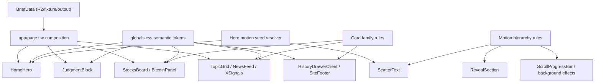

# Design Document: front-page-readability-refresh

## Overview

이 설계는 `frontend/` 공개 홈 화면의 정보 우선순위, 타이포, 카드 시스템, 모션 시스템을 뉴스레터형 읽기 경험에 맞게 재정렬한다. 기존 데이터 계약과 페이지 라우팅은 유지하고, 표현 레이어만 정비한다. 핵심은 1) 시드 기반 히어로 모션 유지, 2) semantic token 도입, 3) 카드 패밀리 3종 정리, 4) 모션 계층 3종 축소다.

## Architecture



### Design Decision 1: 데이터 계약은 그대로 유지한다

- 변경 파일: `frontend/app/page.tsx`, `frontend/lib/r2.ts`
- 결정: `BriefData` 구조와 fetch 계층은 변경하지 않는다.
- 이유: 이번 작업은 표현 레이어 개선이며 요구사항도 데이터 계약 변경을 범위 밖으로 둔다.

### Design Decision 2: 홈 화면의 시스템화는 CSS semantic token + 컴포넌트 variant로 푼다

- 변경 파일: `frontend/app/globals.css`
- 보조 추가 후보: `frontend/lib/ui/home-system.ts`
- 결정: 하드코딩 색상/반경/간격을 직접 제거하기보다 semantic token을 루트에 정의하고, 컴포넌트는 token 이름과 카드 family를 사용한다.
- 이유: 현재는 루트 토큰이 있어도 실제 컴포넌트가 임의값을 우회하고 있어 일관성 수정 비용이 크다.

## Components and Interfaces

### 1. Home composition

**Target modules**
- `frontend/app/page.tsx`
- `frontend/components/hero/HomeHero.tsx`

**Interface**

```ts
type HomeHeroProps = {
  brief: BriefData;
  heroSeed: string;
};
```

**Decision**

- `page.tsx`는 `heroSeed={brief.meta.date}` 를 계산해 `HomeHero`로 전달한다.
- `HomeHero`는 375px 폭 기준 고정 헤더(최대 64px) 아래 첫 스크린 안에 가치 제안, 구독 CTA, 핵심 브리프 진입 요소가 모두 보이도록 재배치한다.
- 주요 CTA와 히스토리 메뉴 트리거는 첫 스크린의 하단 60% 영역 안에서 우선 인지 가능한 위치를 사용한다.
- 터미널 패널은 제거하지 않되 보조 계층으로 내린다.
- 터미널 패널은 첫 스크린의 핵심 콘텐츠 배치 이후에만 노출되도록 배치하거나, 모바일에서는 축약된 높이 프로필을 사용한다.

**Why**

- Requirement 1, 2, 6 충족.
- seed source를 단일화해 QA 가능성을 확보한다.

### 2. Seeded generative hero

**Target modules**
- `frontend/components/hero/ScatterText.tsx`

**Interface**

```ts
type ScatterTextProps = {
  text: string;
  seed: string;
  className?: string;
  color?: string;
  fontSize?: number;
  density?: number;
  spread?: number;
  durationMs?: number;
};
```

**Decision**

- `Math.random()` 직접 호출을 제거하고 seed 기반 PRNG로 대체한다.
- seed source는 `brief.meta.date` 고정.
- reduced motion에서는 정적 텍스트만 렌더링한다.
- 생성 효과는 "보조 계층"이므로 입자 수, spread, shadow, animation duration은 낮은 잡음 프로파일로 제한한다.

**Why**

- Requirement 1.6, 1.7, 1.8 충족.
- algorithmic-art 관점에서 재현 가능한 브랜드 모션이 필요하다.

### 3. Semantic token layer

**Target modules**
- `frontend/app/globals.css`

**Token groups**

```ts
type SemanticTokenName =
  | "accent.primary"
  | "accent.positive"
  | "accent.warning"
  | "surface.canvas"
  | "surface.panel"
  | "surface.panelStrong"
  | "text.primary"
  | "text.secondary"
  | "text.muted"
  | "label.meta"
  | "label.section"
  | "status.positive"
  | "status.warning"
  | "status.negative"
  | "card.radius.reading"
  | "card.radius.data"
  | "card.radius.utility"
  | "card.padding.reading"
  | "card.padding.data"
  | "card.padding.utility"
  | "meta.type";
```

**Typography and spacing values**

```ts
type TypographyTokenSpec = {
  bodyMobile: "16px/1.6";
  bodyDesktop: "17px/1.7";
  secondaryMobile: "13px/1.55";
  metaMinimum: "12px/1.4";
  labelSection: "12px/1.3";
  labelMeta: "12px/1.4";
  headingHeroMobile: "32px/1.08";
  headingHeroDesktop: "54px/1.04";
};

type SpacingTokenSpec = {
  cardPaddingReading: "24px";
  cardPaddingData: "16px";
  cardPaddingUtility: "16px";
  cardGapMobile: "12px";
  cardGapDesktop: "16px";
};
```

**Contrast rule**

- `text.primary`와 `text.secondary`는 `surface.canvas`, `surface.panel`, `surface.panelStrong` 위에서 WCAG 2.2 AA 기준 4.5:1 이상을 만족하는 조합만 허용한다.

**Decision**

- 기존 `--accent-*`, `--text-*`, `--bg-*`를 유지하되 semantic alias를 추가한다.
- 컴포넌트별 직접 색상값은 alias 또는 family class로 치환한다.
- Typography token은 위 값을 하한으로 고정하고, `metaMinimum` 아래의 텍스트 크기는 허용하지 않는다.

**Why**

- Requirement 7.1 충족.
- Requirement 4.2, 4.3, 4.5, 4.6을 구체 값으로 고정한다.
- 점진적 전환이 가능하고 전체 리디자인 없이 안정적으로 수렴할 수 있다.

### 4. Card family consolidation

**Target modules**
- `frontend/components/market/StocksBoard.tsx`
- `frontend/components/bitcoin/BitcoinPanel.tsx`
- `frontend/components/news/NewsFeedList.tsx`
- `frontend/components/brief/TopicGrid.tsx`
- `frontend/components/layout/HistoryDrawerClient.tsx`

**Family definition**

```ts
type CardFamily = "reading" | "data" | "utility";
```

**Rules**

- `reading card`: 해설/뉴스/토픽. 가장 넓은 본문 line-height, 가장 낮은 메타 비중.
- `data card`: 숫자/라벨 우선. 모바일 1열 기본, 핵심 2개만 첫 그룹 허용.
- `utility card`: 아카이브/상태/보조 액션. 낮은 강조, 짧은 메타.

**Token mapping**

```ts
type CardFamilySpec = {
  reading: {
    radius: "card.radius.reading = 24px";
    padding: "card.padding.reading = 24px";
    label: "label.section";
    meta: "labelMeta 12px / 1.4";
  };
  data: {
    radius: "card.radius.data = 18px";
    padding: "card.padding.data = 16px";
    label: "label.meta";
    meta: "numeric/value first, supporting label 12px minimum";
  };
  utility: {
    radius: "card.radius.utility = 20px";
    padding: "card.padding.utility = 16px";
    label: "label.meta";
    meta: "12px / 1.4, muted";
  };
};
```

**Layout rule**

- `data card`는 375px 폭에서 단일 컬럼을 기본값으로 사용하고, 첫 그룹에서만 최대 2개의 핵심 카드 조합을 허용한다.
- `reading card`는 line-length를 65자 이내로 유지한다.

**Why**

- Requirement 5, 7.2 충족.
- Requirement 5.2, 5.5를 실제 카드 규칙으로 고정한다.
- 현재 카드마다 반경·패딩·메타 규칙이 흩어져 있어 family 재정의가 우선이다.

### 5. Motion hierarchy reduction

**Target modules**
- `frontend/app/globals.css`
- `frontend/components/ui/RevealSection.tsx`
- `frontend/components/layout/ScrollProgressBar.tsx`
- `frontend/components/hero/TerminalPanel.tsx`

**Hierarchy**

```ts
type MotionLayer =
  | "background"
  | "emphasis"
  | "status-feedback";
```

**Decision**

- `background`: `site-noise`만 유지하고 `scanline`은 제거한다.
- `emphasis`: `ScatterText`를 대표 강조 모션으로 유지하고 card line draw, bloom, sweep 계열은 제거한다.
- `status-feedback`: `ScrollProgressBar`만 유지하고 나머지 상태성 반복 점멸은 제거한다.
- `RevealSection`은 이동 거리 8px 이하, opacity 중심의 단일 reveal만 허용한다.
- focus ring은 접근성 표시로 유지하되 모션 계층에는 포함하지 않는다.

**Why**

- Requirement 7.3 충족.
- 홈 화면이 연출보다 읽기 중심으로 보여야 한다.

## Data Models

이번 설계는 외부 JSON 계약을 바꾸지 않는다.

추가되는 로컬 모델만 정의한다.

```ts
type HeroMotionProfile = {
  seed: string;
  particleCount: number;
  spreadX: number;
  spreadY: number;
  durationMs: number;
  glowAlpha: number;
};

type CardStyleProfile = {
  family: CardFamily;
  radiusToken: string;
  paddingToken: string;
  labelToken: string;
};

type MotionPolicy = {
  background: "noise";
  emphasis: "seeded-scatter";
  statusFeedback: "progress";
};
```

## Correctness Properties

- *For any* `BriefData` where `brief.meta.date` is identical, `ScatterText`는 동일한 파티클 초기 위치와 동일한 애니메이션 전개를 생성해야 한다.  
  _Requirements: 1.7_

- *For any* mobile viewport width `375`, 핵심 CTA와 메뉴 트리거는 최소 `44px` hit area와 최소 `8px` 간격을 유지해야 한다.  
  _Requirements: 3.1, 3.2_

- *For any* `data card` rendered on mobile, 숫자와 라벨은 확대 없이 같은 카드 안에서 함께 읽혀야 하며, 기본 레이아웃은 1열이어야 한다.  
  _Requirements: 5.1, 5.2, 5.5_

- *For any* home render with partial data, 주요 섹션은 비어도 높이 점프로 인해 읽기 흐름이 붕괴되지 않아야 한다.  
  _Requirements: 8.3, 8.5_

- *For any* focusable interactive element, 기본 outline을 제거하면 대체 focus indicator가 반드시 존재해야 한다.  
  _Requirements: 4.7, 4.9_

## Error Handling

| 상황 | 처리 방식 |
| --- | --- |
| `brief.meta.date` 누락 | 시드 모션 비활성화, 정적 타이포 fallback |
| canvas/context 생성 실패 | `ScatterText`는 anchor 텍스트만 표시 |
| `prefers-reduced-motion` 활성화 | 생성 효과/불필요 reveal 비활성화 |
| 시장/비트코인 데이터 누락 | `data card` family 상태 카드로 대체 |
| 홈 첫 스크린 공간 부족 | 터미널 패널을 축소/하단 이동하고 브리프 진입 요소 우선 |
| semantic token 미정의 | 기존 root token fallback 사용 |
| 아카이브/상태 카드 값 누락 | utility card로 빈 상태 메시지 유지 |

## State UI Structure

### Shared interfaces

```ts
type StateTone = "loading" | "partial" | "empty" | "error";

type StateFrameProps = {
  tone: StateTone;
  family: CardFamily;
  title: string;
  description?: string;
  minHeight?: number;
};

type SectionSkeletonProps = {
  family: CardFamily;
  lines?: number;
  minHeight: number;
};
```

### Component responsibilities

- `DataState`는 `empty`, `partial`, `error` 텍스트 상태를 담당하도록 확장한다.
- `SectionSkeleton`(신규)은 `loading` 상태에서 reserved space를 유지한다.
- `StocksBoard`, `BitcoinPanel`, `NewsFeedList`, `XSignalsList`, `HistoryDrawerClient`는 ad-hoc 상태 마크업 대신 `StateFrame` 또는 `SectionSkeleton`을 사용한다.
- 홈 히어로와 핵심 브리프 구간은 첫 스크린의 높이 점프를 막기 위해 최소 높이 프로필을 가진 skeleton 또는 placeholder를 사용한다.

### Reserved space policy

- hero auxiliary panel: 최소 높이 `120px`
- home data card group: 최소 높이 `160px`
- reading card list: 카드당 최소 높이 `220px`
- utility drawer status block: 최소 높이 `96px`

### Why

- Requirement 8.4, 8.5 충족.
- 상태 UI를 공용 구조로 묶어 구현 시 ad-hoc 분산을 막는다.

## Testing Strategy

### Unit / rendering

- 파일: `frontend/tests/public-brief-ui.test.ts`
- 추가 검증:
  - 홈 주요 섹션 렌더 순서
  - 빈 데이터 시 상태 메시지 유지
  - 히어로 seed source 전달

### Deterministic motion

- 신규 테스트 후보: `frontend/tests/scatter-text.test.ts`
- 검증:
  - 같은 seed면 동일한 particle layout
  - 다른 seed면 다른 layout
  - reduced motion이면 canvas 없이 정적 텍스트

### Token / family consistency

- 신규 테스트 후보: `frontend/tests/ui-system.test.ts`
- 검증:
  - 카드 family가 3종으로 제한되는지
  - semantic token alias가 최소 요구 목록을 가지는지
  - typography token이 최소 크기와 line-height 하한을 지키는지

### Verification commands

- `cd frontend && npm run lint`
- `cd frontend && npm test`
- `cd frontend && npm run build:fixture`

### Visual QA

- `375px`, `768px`, `1024px`, `1440px`
- 홈 히어로 첫 스크린
- data card 1열 유지
- focus state visible
- partial data 시 content jumping 없음
