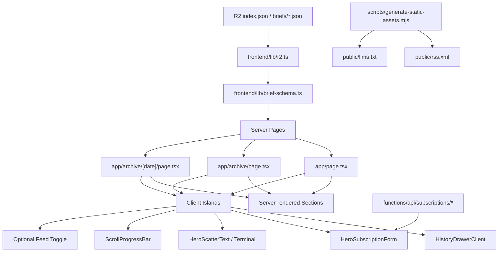

# Design Document: Frontend SSG Redesign Migration

## Overview

이 설계는 현재 운영 프론트인 `frontend/`의 Next.js App Router + `output: "export"` 구조를 유지한 채, `sovereign-brief/` 샘플 프론트의 디자인과 상호작용을 높은 충실도로 이식하는 방식을 정의한다.

핵심 목표는 세 가지다.

1. 데이터 계약과 정적 생성 구조는 유지한다.
2. 샘플의 시각 언어와 인터랙션은 가능한 한 동일하게 재현한다.
3. hydration은 메뉴, 히어로 애니메이션, 터미널, 구독 입력처럼 실제 상호작용이 필요한 범위로 제한한다.

이 작업은 프레임워크 교체나 데이터 계약 변경이 아니라, 운영 프론트의 표시 계층과 공용 디자인 시스템을 재구성하는 마이그레이션이다.

## Architecture

### 현재 기준

- 운영 프론트 진입점은 `frontend/app/page.tsx`, `frontend/app/archive/page.tsx`, `frontend/app/archive/[date]/page.tsx` 이다.
- 데이터 계층은 `frontend/lib/r2.ts`, `frontend/lib/brief-schema.ts`, `schema/brief.types.ts` 를 기준으로 동작한다.
- 정적 산출물은 `frontend/scripts/generate-static-assets.mjs` 에서 `rss.xml`, `llms.txt` 를 생성한다.
- 구독 처리 API는 `frontend/functions/api/subscriptions/*` 와 `frontend/lib/subscriptions/*` 를 통해 유지되고 있다.
- 샘플 프론트는 `sovereign-brief/src/App.tsx` 와 `sovereign-brief/src/index.css` 를 중심으로 메뉴 드로어, 히어로, 터미널, 섹션 배치, 애니메이션 언어를 정의한다.

### 목표 구조

- 라우팅과 SSG 구조는 `frontend/`에서 유지한다.
- 데이터 fetch는 서버 컴포넌트에서 수행하고, 각 페이지는 빌드 시점 JSON으로 렌더링한다.
- 메뉴 드로어, 히어로 애니메이션, 터미널, 구독 입력, 선택적 토글 UI만 클라이언트 아일랜드로 분리한다.
- 나머지 섹션은 서버 렌더링 가능한 표현 컴포넌트로 유지한다.
- 샘플 프론트의 스타일 언어는 `app/layout.tsx` + `app/globals.css` + 공용 UI primitive로 재구성한다.

### 계층 다이어그램



### 변경 영향 범위

- 유지:
  - `frontend/next.config.ts`
  - `frontend/lib/r2.ts`
  - `frontend/lib/brief-schema.ts`
  - `schema/brief.types.ts`
  - `frontend/scripts/generate-static-assets.mjs`
  - `frontend/functions/api/subscriptions/*`
- 대폭 변경:
  - `frontend/app/layout.tsx`
  - `frontend/app/globals.css`
  - `frontend/app/page.tsx`
  - `frontend/app/archive/page.tsx`
  - `frontend/app/archive/[date]/page.tsx`
  - `frontend/components/layout/*`
  - `frontend/components/brief/*`
  - `frontend/components/news/*`
  - `frontend/components/signals/*`
  - `frontend/components/market/*`
  - `frontend/components/bitcoin/*`
- 신규 추가 가능:
  - `frontend/components/chrome/*`
  - `frontend/components/hero/*`
  - `frontend/components/design-system/*`

## Components and Interfaces

### 1. 페이지 엔트리 유지

```ts
export default async function HomePage(): Promise<JSX.Element>
export default async function ArchivePage(): Promise<JSX.Element>
export default async function ArchiveDetailPage(...): Promise<JSX.Element>
export async function generateStaticParams(): Promise<Array<{ date: string }>>
```

- `HomePage`는 `fetchLatest()`와 `fetchIndex()`를 함께 읽는다.
- `ArchivePage`는 `fetchIndex()`와 각 날짜의 요약 메타를 읽는다.
- `ArchiveDetailPage`는 `fetchBriefByDate(date)`와 `fetchIndex()`를 함께 읽는다.

Design Decision:
페이지 엔트리는 서버 컴포넌트로 유지한다.
이유: SSG 요구사항과 JSON 기반 렌더링 모델을 유지하면서, 홈/아카이브/상세 페이지 모두 동일한 빌드 타임 데이터 경로를 공유하기 위해서다.

### 2. 공용 상단 크롬과 히스토리 메뉴

```ts
type PageChromeProps = {
  variant: "home" | "archive-list" | "archive-detail";
  generatedAt: string;
  index: BriefIndex;
  currentDate?: string;
  showNews?: boolean;
  showSignals?: boolean;
};

type HistoryMenuEntry = {
  date: string;
  href: string;
  isCurrent: boolean;
};

type HistoryDrawerClientProps = {
  entries: HistoryMenuEntry[];
  currentDate?: string;
  initialVisibleCount?: number;
};
```

- 기존 `SiteHeader`는 단순 링크형 헤더에서 샘플 기준 상단 바 + 메뉴 버튼형 구조로 재설계한다.
- 히스토리 메뉴는 홈, `/archive`, `/archive/[date]` 모든 공개 페이지에 동일하게 노출한다.
- 메뉴 목록 데이터는 서버가 `BriefIndex`에서 만들고, 클라이언트는 열기/닫기/더보기/포커스만 담당한다.

Design Decision:
히스토리 메뉴 데이터는 클라이언트 fetch로 다시 읽지 않고, 서버 페이지에서 전달한다.
이유: 샘플 Vite 앱은 `manifest.json`을 클라이언트에서 읽지만, 운영 프론트는 SSG이므로 빌드 시점 데이터로 동일 경험을 제공하는 것이 더 안정적이다.

Design Decision:
메뉴 드로어는 독립된 클라이언트 아일랜드로 분리한다.
이유: 오버레이, ESC 닫기, 포커스 복귀, 애니메이션은 클라이언트 상태가 필요하지만, 나머지 페이지 콘텐츠를 함께 hydration할 필요는 없기 때문이다.

### 3. 홈 히어로 시스템

```ts
type HomeHeroProps = {
  brief: BriefData;
};

type HeroSubscriptionFormProps = {
  actionPath?: string;
};

type TerminalLine = {
  type: "SYSTEM" | "INFO" | "ANALYSIS";
  text: string;
  status?: string;
  tone?: "primary" | "success" | "muted";
};
```

- 홈 히어로는 샘플의 카피 위계, scatter headline, 보조 카피, 이메일 입력 UI, CTA, 시스템 터미널을 그대로 재현한다.
- 히어로 아래 터미널은 홈 전용으로 유지한다.
- 아카이브 목록/상세는 동일한 상단 크롬을 공유하되, 히어로는 축약형 또는 archive 전용 카피로 조정한다.
- 히어로 headline의 `데이터 인텔리전스` 텍스트는 샘플의 흩어졌다 모이는 ScatterText 효과를 핵심 이식 대상으로 취급한다.

Design Decision:
히어로의 시각 효과는 샘플과 동일하게 가져가되, 실제 데이터 바인딩은 `BriefData`를 기준으로 서버에서 주입한다.
이유: 샘플의 인상은 유지해야 하지만 운영 프론트는 정적 데이터 기반이어야 하기 때문이다.

Design Decision:
터미널과 scatter text는 홈 전용 클라이언트 컴포넌트로 분리한다.
이유: 타이핑 애니메이션과 문자 효과는 클라이언트 실행이 필요하지만, 뉴스/토픽/비트코인 섹션까지 같은 방식으로 hydration할 필요는 없기 때문이다.

Design Decision:
`데이터 인텔리전스`의 ScatterText 효과는 단순 유사 연출이 아니라 샘플 구현을 기준으로 가장 우선적으로 보존한다.
이유: 이 효과는 홈 첫 화면의 브랜드 인상을 결정하는 핵심 요소이며, 사용자도 가장 중요한 이식 대상으로 명시했기 때문이다.

### 4. 구독 입력 UI와 기존 구독 처리 연동

```ts
type SubscriptionPhase = "idle" | "submitting" | "success" | "error";

type HeroSubscriptionState = {
  phase: SubscriptionPhase;
  message: string | null;
  error: string | null;
  email: string;
};
```

- 현재 `SubscriptionForm`의 제출 로직은 유지한다.
- 시각적 형태는 샘플 히어로 안의 입력 UI와 CTA 스타일로 교체한다.
- API 엔드포인트는 `/api/subscriptions/request` 를 유지한다.
- 제출 중, 성공, 실패 상태는 샘플 시각 언어에 맞춰 표현하되 기존 의미는 유지한다.

Design Decision:
구독 처리 로직과 UI 스킨을 분리한다.
이유: 구독 API와 서비스 계층은 이미 운영 중이며, 이번 스펙의 목적은 디자인 마이그레이션이므로 기존 동작을 재사용하는 편이 회귀 위험이 낮다.

### 5. 브리프 섹션 재구성

```ts
type SummarySectionProps = {
  headline: string;
  summaryLead: string;
  summarySupport: string | null;
  generatedAt: string;
  quality: BriefMeta["dataQuality"];
};

type MetricsOverviewProps = {
  marketSnapshot: MarketSnapshot;
  bitcoin: BitcoinSection;
  stocks?: TechStock[];
};

type ThemeGridProps = {
  items: TopicSummary[];
  variant: "home" | "detail";
};

type NewsDeckProps = {
  featuredItems: NewsItem[];
  allItems: NewsItem[];
  variant: "home" | "detail";
};

type SignalDeckProps = {
  featuredItems: XSignal[] | null;
  allItems: XSignal[] | null;
  variant: "home" | "detail";
};

type DataStatusProps = {
  meta: BriefMeta;
};
```

- 섹션 순서는 requirements를 따른다.
- 홈은 `요약 → 정량 지표 → 테마 → 뉴스 → X 시그널 → 데이터 상태`
- 상세는 같은 순서를 유지하되 본문, 주식 보드, 비트코인, 전체 뉴스, 전체 X 시그널까지 더 높은 밀도로 배치한다.
- 뉴스/X는 샘플처럼 홈에서 featured/all 토글을 허용할 수 있으나, 상세는 전체 목록 고정 렌더링을 기본값으로 둔다.

Design Decision:
샘플 섹션 컴포넌트를 그대로 복사하지 않고, 현재 운영 스키마에 맞게 재작성한다.
이유: 샘플 컴포넌트는 `manifest` 재요청, mock history, fake status, 스키마에 없는 author 정보 등 운영 계약에 없는 전제를 포함하고 있기 때문이다.

Design Decision:
정량 지표 섹션은 샘플의 감각을 유지하되 `Fear & Greed` 히스토리 차트처럼 스키마에 없는 데이터는 추가하지 않는다.
이유: 디자인 충실도보다 데이터 계약 보존이 우선이며, 없는 데이터를 시각 효과를 위해 인위적으로 만들지 않기 위해서다.

### 6. 디자인 시스템

```ts
type DesignTokenSet = {
  colors: Record<string, string>;
  typography: Record<string, string>;
  spacing: Record<string, string>;
  radius: Record<string, string>;
  shadows: Record<string, string>;
  motion: Record<string, string>;
};
```

- 현재 `layout.tsx`의 폰트 세트는 샘플 기준으로 교체한다.
- 목표 폰트 계층:
  - sans: Pretendard + Inter
  - mono: JetBrains Mono
  - serif: Instrument Serif
- `globals.css`는 샘플 기준의 컬러, 글로우, border density, scanline, blur, hover tone, CTA, drawer 스타일을 토큰화한다.
- 공용 primitive 예시:
  - `SectionShell`
  - `PanelSurface`
  - `MetricTile`
  - `MetaLabel`
  - `TickerPill`
  - `DrawerListItem`
  - `StatusChip`

Design Decision:
폰트와 토큰은 페이지별 스타일 복붙이 아니라 전역 토큰으로 정의한다.
이유: 홈, 아카이브 목록, 아카이브 상세, 구독 UI 모두에서 동일한 시각 언어를 유지해야 하며 이후 유지보수도 가능해야 하기 때문이다.

Design Decision:
Pretendard는 운영 환경 제어를 위해 self-host 우선, 불가 시 documented fallback 을 둔다.
이유: 샘플과의 시각 충실도를 유지하면서도 외부 CDN 의존을 줄이기 위해서다.

### 7. 공개 부가 산출물 유지

```ts
async function writeStaticAssets(): Promise<void>
export const metadata: Metadata
export async function generateMetadata(...): Promise<Metadata>
```

- `rss.xml`, `llms.txt` 생성 구조는 유지한다.
- `MarkdownDownloadButton`은 계속 상세 본문에 연결한다.
- 홈 메타데이터의 `description`은 `글로벌 마켓 데이터의 정교한 연결, 원본의 무결성으로 완성하는 투자 주권.` 고정 문구를 사용한다.
- 아카이브 목록/상세 메타데이터는 기존 구조를 유지하면서 새 디자인 기준 문구로 정리한다.
- 푸터 또는 보조 내비게이션에서 `/archive`, `/privacy`, `/rss.xml`, `/llms.txt` 접근성을 유지한다.

Design Decision:
정적 산출물과 메타데이터는 디자인 변경과 별개로 보존한다.
이유: 디자인 이식은 공개 배포 자산의 회귀를 허용하지 않는 작업이기 때문이다.

Design Decision:
홈 메타데이터의 `description`은 최신 브리프 headline 대신 고정 브랜딩 문구를 사용한다.
이유: 사용자가 홈의 첫 인상과 브랜드 메시지를 고정하길 원했고, 이번 작업은 최신 브리프 노출보다 샘플 충실도와 브랜딩 일관성이 더 중요하기 때문이다.

### 8. 프레임워크 버전 전략

- 이 마이그레이션은 Next.js/React 메이저 업그레이드를 포함하지 않는다.
- 현재 운영 중인 `frontend/` 버전 범위를 유지한 채 디자인 이식을 완료한다.
- 프레임워크 업그레이드는 별도 후속 스펙으로 분리한다.

Design Decision:
버전 업그레이드와 디자인 이식을 분리한다.
이유: SSG 구조, 디자인 시스템 재구성, 인터랙션 이식만으로도 변경 범위가 크기 때문에 회귀 원인을 분리하기 위해서다.

## Data Models

### 원본 계약

이 설계는 아래 계약을 변경하지 않는다.

```ts
interface BriefIndex {
  dates: string[];
  updatedAt: string;
}

interface BriefData {
  meta: BriefMeta;
  marketSnapshot: MarketSnapshot;
  aiJudgment: AIJudgment;
  topicSummaries: TopicSummary[];
  techStocks: TechStock[];
  bitcoin: BitcoinSection;
  featuredXSignals: XSignal[] | null;
  allXSignals: XSignal[] | null;
  featuredNews: NewsItem[];
  allNews: NewsItem[];
}
```

### 파생 View Model

```ts
type HistoryMenuEntry = {
  date: string;
  href: string;
  isCurrent: boolean;
};

type PageChromeModel = {
  variant: "home" | "archive-list" | "archive-detail";
  generatedAt: string;
  currentDate?: string;
  historyEntries: HistoryMenuEntry[];
  showNews: boolean;
  showSignals: boolean;
};

type DataStatusModel = {
  quality: BriefMeta["dataQuality"];
  qualityNotes: string[];
  translationStatus: BriefMeta["translationStatus"];
  sourceCounts: SourceCounts;
};

type FeedDisplayMode = "featured" | "all";

type HeroSubscriptionState = {
  phase: "idle" | "submitting" | "success" | "error";
  email: string;
  message: string | null;
  error: string | null;
};
```

### 데이터 모델 원칙

- R2/fixture JSON shape 는 바꾸지 않는다.
- UI 표현에 필요한 값은 파생 model에서만 계산한다.
- 샘플과 동일한 시각 효과를 위해 추가 데이터가 필요해 보여도, 계약에 없는 값은 mock으로 생성하지 않는다.
- 메타 정보는 `BriefMeta`와 기존 공개 산출물에서만 구성한다.
- 홈 메타데이터 문구는 데이터와 무관한 고정 브랜딩 값으로 취급한다.

## Correctness Properties

1. *For any* 유효한 `BriefIndex` 에 대해, `generateStaticParams` 가 만드는 상세 경로 집합과 히스토리 메뉴가 제공하는 날짜 집합은 동일해야 한다.  
   _Requirements: 1, 5, 13, 15_

2. *For any* 유효한 `BriefData` 에 대해, 홈/아카이브/상세 페이지의 정적 콘텐츠는 서버에서 JSON만으로 렌더링 가능해야 하며 클라이언트 재요청을 필요로 하지 않아야 한다.  
   _Requirements: 1, 15_

3. *For any* `featuredNews`, `featuredXSignals`, `allXSignals` 가 비어 있거나 `null` 인 경우, 해당 보조 섹션은 숨기되 나머지 페이지 구조와 상단 크롬은 유지되어야 한다.  
   _Requirements: 5, 6, 10, 11_

4. *For any* `dataQuality` 값이 `degraded` 또는 `critical` 인 경우, 사용자는 페이지 상단 또는 요약 인접 영역에서 신뢰도 경고를 식별할 수 있어야 한다.  
   _Requirements: 7, 12_

5. *For any* 성공적인 구독 요청 결과에 대해, 구독 입력 컴포넌트는 `submitting → success` 상태로 전이하고 입력값을 초기화해야 한다.  
   _Requirements: 4_

6. *For any* 실패한 구독 요청 결과에 대해, 구독 입력 컴포넌트는 `submitting → error` 상태로 전이하고 오류 메시지를 표시해야 한다.  
   _Requirements: 4_

7. *For any* 정적 빌드 실행에 대해, `rss.xml`, `llms.txt`, 페이지 메타데이터, 마크다운 다운로드 진입점은 계속 유지되어야 한다.  
   _Requirements: 17_

8. *For any* 페이지 variant 가 `home`, `archive-list`, `archive-detail` 중 하나일 때, 상단 메뉴 버튼을 통한 히스토리 메뉴 진입 경험은 동일한 상호작용 규칙을 따라야 한다.  
   _Requirements: 5, 13, 16_

9. *For any* 홈 페이지 렌더링에 대해, `데이터 인텔리전스` headline 효과는 샘플과 동등한 흩어짐/재조합 인상을 제공해야 한다.  
   _Requirements: 3_

## Error Handling

| 상황 | 처리 방식 |
| --- | --- |
| `BRIEF_DATA_SOURCE` 가 fixture 가 아닌데 `NEXT_PUBLIC_R2_BASE_URL` 이 없음 | `lib/r2.ts` 에서 빌드 실패로 처리 |
| `index.json` 이 비어 있거나 `dates[0]` 이 없음 | 홈 빌드 실패로 처리 |
| 날짜별 JSON shape 가 `schema/brief.types.ts` 와 다름 | `brief-schema.ts` parse error 로 빌드 실패 |
| 특정 `/archive/[date]` 렌더링 중 데이터를 읽지 못함 | 상세 페이지는 `notFound()` 또는 정적 생성 실패로 처리 |
| 뉴스/X/토픽 등 선택 섹션 데이터 없음 | 섹션 자체를 숨기거나 `DataState` 로 상태 표시 |
| 비트코인/시장 핵심 수치 누락 | 핵심 블록은 유지하고 상태 문구 표시 |
| 구독 API 요청 실패 | 폼 내부 인라인 오류 메시지로 처리, 페이지 전역 실패로 확장하지 않음 |
| 히스토리 메뉴에 추가 날짜가 없음 | “Load More” 류 컨트롤을 숨기고 현재 목록만 노출 |
| reduced motion 환경 | CSS/클라이언트 로직에서 비필수 애니메이션 축소 또는 제거 |
| 샘플이 사용한 fake status 데이터가 운영 계약에 없음 | 실제 메타 기반 상태 블록으로 치환하고 fake 값은 도입하지 않음 |
| 홈 메타데이터 생성 시 최신 headline과 고정 문구가 충돌할 수 있음 | 홈은 고정 브랜딩 문구를 우선하고, 동적 headline은 메타 생성에 사용하지 않음 |

## Testing Strategy

### 1. 데이터 계층 회귀 테스트

- `frontend/tests/brief-schema.test.ts`
- `frontend/tests/r2.test.ts`

검증 목표:
- 기존 `BriefIndex`, `BriefData` 계약 유지
- fixture / R2 데이터 로딩 정상 동작
- 잘못된 JSON 입력 시 실패 방식 일관성 유지

### 2. 구독 플로우 회귀 테스트

- 기존
  - `frontend/tests/subscription-service.test.ts`
  - `frontend/tests/subscriptions-api.test.ts`

추가 검증 목표:
- 히어로 입력 UI로 바뀌어도 `/api/subscriptions/request` 연동은 유지
- success / error / submitting 상태가 새 UI에서도 동일하게 동작
- 입력 초기화와 오류 메시지 동작 유지

### 3. 정적 라우트 및 산출물 검증

검증 명령:
- `cd frontend && npm run lint`
- `cd frontend && npm test`
- `cd frontend && npm run build:fixture`

검증 목표:
- `/`
- `/archive`
- `/archive/[date]`
- `rss.xml`
- `llms.txt`
- 상세 본문의 markdown download 진입점
- 각 페이지 메타데이터 생성

### 4. 인터랙션 및 접근성 검증

Playwright 기반 검증:
- 홈에서 메뉴 열기/닫기
- `/archive` 에서 메뉴 열기/닫기
- `/archive/[date]` 에서 메뉴 열기/닫기
- ESC 닫기, 오버레이 닫기, 포커스 이동
- 히어로 이메일 입력 및 제출 상태
- 모바일/데스크톱 반응형 배치

권장 산출물:
- 홈 모바일/데스크톱 스크린샷
- 아카이브 목록 모바일/데스크톱 스크린샷
- 아카이브 상세 모바일/데스크톱 스크린샷

### 5. 시각 회귀 검토

- 샘플 `sovereign-brief` 와 운영 `frontend` 를 나란히 비교한다.
- 비교 기준:
  - 상단 메뉴와 드로어 인상
  - 히어로 카피와 타이포그래피
  - 입력 UI와 CTA
  - 터미널 효과
  - 섹션 간격과 배경 밀도
  - hover / glow / scanline / border tone
- 데이터가 없는 상태에서도 레이아웃이 무너지지 않는지 함께 확인한다.
