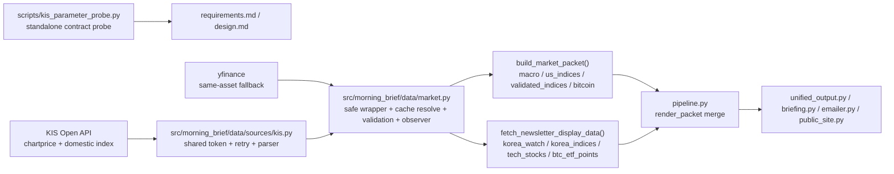

# KIS Market Data Expansion — Design Document

## Overview

이 설계의 1차 목표는 live probe와 요구사항에서 동시에 검증된 KIS 정형 데이터만 production 경로에 편입하는 것이다. 2026-04-07 기준 확정 범위는 `usdkrw/FX@KRW`, `dow30/.DJI`, `kospi/0001`, `kosdaq/1001` 네 항목뿐이다.

이전 설계 초안은 ETF proxy, 한국 국채 FRED fallback, 원자재 선물, 신규 `kis_market_fetcher.py` 신설을 전제로 했지만, 최신 요구사항과 probe 결과 기준으로 이는 모두 1차 범위를 벗어난다. 따라서 이번 설계는 기존 `src/morning_brief/data/sources/kis.py`와 `src/morning_brief/data/market.py`를 최소 확장해 검증된 계약만 production에 넣고, 미검증 항목은 probe와 문서 수준에서만 유지한다. 또한 현재 `pipeline.py`, `unified_output.py`, `briefing.py`, `emailer.py`가 고정된 packet/display section만 읽고, `QuantitativeLayer`도 고정 슬롯 구조이므로 새 structured field를 추가할 때는 소비 경로와 dataclass 확장을 같은 변경에서 함께 갱신해야 한다.

### Phase 1 Scope Matrix

| 상태 | canonical key | KIS contract | 현재 판단 |
|---|---|---|---|
| 확정 | `usdkrw` | `FHKST03030100`, `X`, `FX@KRW` | 기존 경로 유지 |
| 확정 | `dow30` | `FHKST03030100`, `N`, `.DJI` | 신규 direct index 경로 추가 |
| 확정 | `kospi` | `FHPUP02100000`, `U`, `0001` | 신규 국내지수 경로 추가 |
| 확정 | `kosdaq` | `FHPUP02100000`, `U`, `1001` | 신규 국내지수 경로 추가 |
| 보류 | `sp500`, `nasdaq100`, `nasdaq_composite`, `dax`, `nikkei225` | `.SPX`, `.INX`, `.NDX`, `.IXIC`, `.GDAXI`, `.DAX`, `.N225`, `.NKY` | `zero_payload`, 1차 범위 제외 |
| 보류 | `jpykrw`, `eurkrw`, `cnykrw` | `FX@JPY`, `FX@EUR`, `FX@CNY` | direct KRW 단위 미확정, 1차 범위 제외 |
| 보류 | 한국 국채, 원자재 | 미확정 | 공식 경로·코드 검증 전 제외 |

### Non-goals

- 기존 `SPY`, `QQQ`, `SOXX` ETF proxy 경로를 이번 설계에서 direct index로 재정의하지 않는다.
- `jpykrw`, `eurkrw`, `cnykrw`를 direct quote처럼 출시하지 않는다.
- 한국 국채 3Y·10Y, WTI, Gold, Silver를 1차 범위에 넣지 않는다.
- `MarketPoint` 스키마에 `data_as_of` 같은 새 필드를 추가하지 않는다.
- 장기 TTL을 갖는 신규 인메모리 캐시 계층을 만들지 않는다.

## Architecture



### Architectural Decisions

| 결정 | 내용 | 이유 |
|---|---|---|
| Decision 1 | 신규 `kis_market_fetcher.py`를 만들지 않고 기존 `kis.py`를 확장한다 | 토큰 singleton, retry 정책, KIS 에러 해석이 이미 `kis.py`에 모여 있어 1차 범위에서는 분리보다 재사용이 안전하다 |
| Decision 2 | direct index 결과를 기존 `us_indices`와 분리해 `validated_indices`로 노출한다 | 기존 `us_indices`는 ETF proxy 기반이며, 이번 설계의 "검증된 실제 지수"와 의미가 다르다 |
| Decision 3 | `kospi`, `kosdaq`는 `fetch_newsletter_display_data()`의 새 `korea_indices` 필드에 넣는다 | 기존 `korea_watch`는 `usdkrw`, `nq_futures` 중심의 참고 지표라서 국내 대표지수를 섞으면 의미가 흐려진다 |
| Decision 4 | `zero_payload`는 probe/contract 수준 실패로 취급하고 runtime에서는 fallback 트리거로 변환한다 | `rt_cd="0"`만으로 usable success를 선언하면 요구사항 2와 3을 위반한다 |
| Decision 5 | 1차 범위 밖 항목은 helper 인터페이스에도 노출하지 않는다 | 미래 범위를 미리 공개 인터페이스로 만들면 미검증 계약이 사실상 출시 범위처럼 굳어진다 |
| Decision 6 | 새 packet/display field는 downstream consumer와 같은 변경에서 함께 도입한다 | 현재 소비자들은 고정 section/key만 읽으므로 field만 추가하면 dead field가 생긴다 |
| Decision 7 | display-stage provider usage가 필요하면 `observer`를 `fetch_newsletter_display_data()`까지 전달한다 | 현재 display-stage 수집은 observer를 받지 않아 observability 요구사항을 만족시키기 어렵다 |

## Components and Interfaces

### 1. `src/morning_brief/data/sources/kis.py`

이 파일은 KIS 인증, rate limit 대응, HTTP 오류 해석의 단일 경계로 유지한다. 1차 범위를 위해 새 공개 함수는 "검증된 항목"에 대해서만 추가한다.

#### Proposed Interfaces

```python
def _authorized_kis_get(
    *,
    path: str,
    params: dict[str, str],
    tr_id: str,
    target: str,
) -> dict[str, Any]:
    ...

def _fetch_chartprice_point(
    *,
    market_div_code: str,
    input_iscd: str,
    target: str,
) -> tuple[float, float]:
    ...

def _fetch_domestic_index_point(
    *,
    input_iscd: str,
    target: str,
) -> tuple[float, float]:
    ...

def fetch_dow30_point() -> tuple[float, float]:
    ...

def fetch_kospi_point() -> tuple[float, float]:
    ...

def fetch_kosdaq_point() -> tuple[float, float]:
    ...
```

#### Design Notes

- `fetch_usdkrw_point()`는 유지하되 내부적으로 `_fetch_chartprice_point(market_div_code="X", input_iscd="FX@KRW", target="usdkrw")`를 재사용할 수 있다.
- `_authorized_kis_get()`는 `_ensure_token()`, `_build_headers()`, `_kis_get_with_retry()`를 묶는 단일 진입점이다.
- `401` 또는 토큰 만료가 오면 `_TOKEN = None`으로 무효화하고 동일 요청을 1회만 재시도한다.
- chartprice 응답에서 `rt_cd="0"`이어도 `output1.ovrs_nmix_prpr in {None, 0}` 이고 `output2` 유효 행이 비어 있으면 `HttpFetchError`를 발생시켜 fallback으로 넘긴다.
- `FX@JPY`, `FX@EUR`, `FX@CNY`, `.SPX`, `.NDX` 같은 후보 코드는 이 단계에서 공개 함수로 만들지 않는다.

### 2. `src/morning_brief/data/market_policy.py`

이 파일은 canonical key, label, validation bound를 정의하는 단일 위치로 유지한다.

#### Required Changes

| 항목 | 변경 | 이유 |
|---|---|---|
| `CANONICAL_LABELS` | `dow30`, `kospi`, `kosdaq` 추가 | 렌더링과 로깅에서 일관된 표시명 보장 |
| `CANONICAL_KEY_BY_SOURCE` | `.DJI -> dow30` 추가 | direct index source를 canonical key로 안정적으로 정규화 |
| `MARKET_VALIDATION_BOUNDS` | `dow30`, `kospi`, `kosdaq` 범위 추가 | 비정상 값이 캐시와 렌더링 경로로 그대로 퍼지는 것을 방지 |
| `DISPLAY_ONLY_VALIDATION` | 필요 시 `kospi`, `kosdaq` 추가 여부 검토 | `fetch_newsletter_display_data()`에서 직접 렌더링되는 항목이기 때문 |

#### Bound Strategy

초기 bound는 과도하게 좁히지 않고 "단위 오류와 잘못된 자산 치환"만 막는 수준으로 둔다.

| key | 제안 범위 | 근거 |
|---|---|---|
| `dow30` | `10_000 ~ 80_000` | 미국 대표지수의 장기 스케일 대비 여유 있는 상하한 |
| `kospi` | `1_000 ~ 6_500` | probe 값과 한국 대표지수의 가능한 레벨 범위를 함께 고려 |
| `kosdaq` | `300 ~ 2_000` | probe 값과 시장 레벨 대비 여유 있는 상하한 |

### 3. `src/morning_brief/data/market.py`

이 파일은 fallback, cache restore, anomaly validation, observer 기록을 맡는 orchestration 계층으로 유지한다.

#### Proposed Interfaces

```python
def fetch_validated_global_index_points(
    observer: PipelineObserver | None = None,
) -> list[MarketPoint]:
    ...

def fetch_korea_index_points(
    observer: PipelineObserver | None = None,
) -> list[MarketPoint]:
    ...

def fetch_newsletter_display_data(
    cache_dir: Path | None = None,
    observer: PipelineObserver | None = None,
) -> dict:
    ...
```

#### Design Notes

- `fetch_validated_global_index_points()`는 1차에서 `dow30` 하나만 반환한다.
- `fetch_korea_index_points()`는 `kospi`, `kosdaq`를 반환하고, 각 항목별 fallback은 `^KS11`, `^KQ11`로 유지한다.
- 기존 `fetch_us_index_points()`는 `SPY`, `QQQ`, `SOXX` proxy 경로를 계속 담당한다. 이 경로는 이번 설계의 "실제 지수 검증" 범위에 포함되지 않는다.
- `build_market_packet()`는 기존 `us_indices`를 유지하면서 새 `validated_indices` 필드를 추가한다.
- `fetch_newsletter_display_data()`는 기존 `korea_watch`를 유지하면서 새 `korea_indices` 필드를 추가한다.
- `fetch_newsletter_display_data()`는 필요 시 `observer`를 받아 display-stage provider usage를 기록할 수 있게 한다.
- `_safe_with_fallback()`, `_resolve_points_from_cache()`, `_validate_market_points()`는 그대로 재사용한다.
- provider usage는 `market.py`에서 기록한다. source adapter인 `kis.py`는 네트워크 계약과 파싱만 담당한다.

### 4. `src/morning_brief/pipeline.py` and downstream render consumers

이 계층은 새 structured field가 실제 사용자 출력까지 도달하도록 보장하는 전달 경로다.

#### Required Changes

| 파일 | 필요한 반영 |
|---|---|
| `src/morning_brief/pipeline.py` | `observer`를 `fetch_newsletter_display_data()`로 전달하고, `korea_indices`를 `render_packet`에 병합하며, 필요 시 `build_market_packet()`의 `validated_indices`를 그대로 전달 |
| `src/morning_brief/unified_output.py` | `validated_indices` 또는 `korea_indices`를 quantitative layer에서 읽어 새 ticker slot 또는 확장 필드로 반영 |
| `src/morning_brief/briefing.py` | 새 section을 narrative 문장에 사용할지, 아니면 기존 `spy`/`qqq` 중심 판단을 유지할지 명시적으로 결정 |
| `src/morning_brief/emailer.py` | snapshot badge나 본문 카드에서 새 항목을 보여줄지 결정하고, 미표시라면 의도적으로 제외 상태를 유지 |
| `src/morning_brief/public_site.py` | public summary/quant block이 새 section을 읽어야 한다면 같은 변경에 반영 |
| `src/morning_brief/unified_output.py` 내 `QuantitativeLayer` | `dow30`, `kospi`, `kosdaq`를 담을 고정 슬롯 또는 동등한 구조 확장을 같은 변경에서 반영 |

#### Design Notes

- `render_packet` merge가 먼저 갱신되지 않으면 `fetch_newsletter_display_data()`에 `korea_indices`를 추가해도 실제 이메일/공개 페이지에는 전달되지 않는다.
- `validated_indices`는 기존 `us_indices`와 의미가 다르므로, `unified_output.py`에서 `spy`/`qqq` 자리에 덮어쓰지 않는다.
- `QuantitativeLayer`는 schema-driven map이 아니라 고정 dataclass라서, packet key를 추가해도 dataclass와 fixture를 바꾸지 않으면 아무 것도 노출되지 않는다.
- initial phase에서는 새 section을 packet에 포함하되 렌더링은 제한적으로 시작할 수 있다. 다만 이 경우 design과 requirements에 "미사용 structured field"임을 명시해야 한다.

### 5. `scripts/kis_parameter_probe.py`

이 스크립트는 production 코드에서 import하지 않는 수동 계약 검증 도구로 유지한다.

#### Role in the Design

- 구현 전 concrete code와 단위를 확인하는 선행 검증 산출물 역할
- `usable`, `zero_payload`, `api_error`, `unit_unresolved` 분류를 남기는 계약 체크포인트 역할
- requirements/design의 scope gate를 뒷받침하는 증거 역할

## Data Models

### Runtime Model

기존 `MarketPoint`는 변경하지 않는다.

| 필드 | 타입 | phase 1 사용 방식 |
|---|---|---|
| `price` | `float | None` | 현재값 또는 마지막 성공값 |
| `change_pct` | `float | None` | `usdkrw`, `dow30`, `kospi`, `kosdaq`에 사용 |
| `change_bps` | `float | None` | phase 1 신규 항목에는 사용하지 않음 |
| `validation_status` | `str` | `ok`, `previous_value`, `anomaly`, `missing` 유지 |
| `raw_value` / `resolved_value` | `float | None` | cache restore 및 anomaly 설명에 사용 |

### Probe Artifact Model

`zero_payload`는 runtime `MarketPoint` 상태가 아니라 probe/validation artifact 상태다. runtime에서는 아래 규칙을 따른다.

| probe 상태 | runtime 처리 |
|---|---|
| `usable` | KIS primary success로 간주 |
| `zero_payload` | `HttpFetchError`로 승격 후 fallback 진입 |
| `api_error` | 즉시 fallback 진입 |
| `unit_unresolved` | 1차 범위에서 구현 제외 |

### Validated Contract Table

| category | code | expected unit | response field | sample as-of | 상태 |
|---|---|---|---|---|---|
| `usdkrw` | `FX@KRW` | KRW per USD | `output1.ovrs_nmix_prpr` | 2026-04-07 probe | usable |
| `dow30` | `.DJI` | index level | `output1.ovrs_nmix_prpr` | 2026-04-07 probe | usable |
| `kospi` | `0001` | index level | `output.bstp_nmix_prpr` | 2026-04-07 probe | usable |
| `kosdaq` | `1001` | index level | `output.bstp_nmix_prpr` | 2026-04-07 probe | usable |
| `sp500` | `.SPX`, `.INX` | index level | same path | 2026-04-07 probe | zero_payload |
| `nasdaq100` | `.NDX` | index level | same path | 2026-04-07 probe | zero_payload |
| `nasdaq_composite` | `.IXIC` | index level | same path | 2026-04-07 probe | zero_payload |
| `jpykrw` | `FX@JPY` | unresolved | `output1.ovrs_nmix_prpr` | 2026-04-07 probe | unit_unresolved |
| `eurkrw` | `FX@EUR` | unresolved | `output1.ovrs_nmix_prpr` | 2026-04-07 probe | unit_unresolved |
| `cnykrw` | `FX@CNY` | unresolved | `output1.ovrs_nmix_prpr` | 2026-04-07 probe | unit_unresolved |

## Correctness Properties

### Property 1: 1차 범위 gate 유지

_For any_ production 코드 변경에서, 새 KIS 수집 경로는 `usdkrw`, `dow30`, `kospi`, `kosdaq` 외 항목을 공개 인터페이스나 orchestration 결과에 추가하지 않아야 한다 (SHALL).

**Validates:** Requirements 1.1, 1.2, 1.4

### Property 2: zero payload는 성공이 아니다

_For any_ chartprice 응답에서 `rt_cd="0"`이더라도 유효 가격이 `0`이고 시계열이 비어 있으면, `kis.py`는 이를 usable success로 반환하지 않고 예외로 승격해 fallback으로 넘겨야 한다 (SHALL).

**Validates:** Requirements 2.3, 3.3, 3.4

### Property 3: direct index와 proxy를 섞어 의미를 바꾸지 않는다

_For any_ 새 direct index 항목에서, 시스템은 기존 `SPY`, `QQQ`, `EWG`, `EWJ` 같은 ETF proxy를 같은 canonical key의 대체값으로 사용하지 않아야 한다 (SHALL).

**Validates:** Requirements 3.2, 9.1, 9.2

### Property 4: 같은 자산 fallback만 사용한다

_For any_ `dow30`, `kospi`, `kosdaq`의 KIS primary 실패에서, fallback은 같은 자산 의미의 yfinance 심볼로만 연결되어야 하며 자산 의미가 다른 소스로 치환되지 않아야 한다 (SHALL).

**Validates:** Requirements 3.5, 5.6, 9.1, 9.2

### Property 5: 인증·재시도 정책은 단일 경계에서 공유한다

_For any_ 새 KIS 요청에서, 토큰 발급과 retry/backoff는 기존 `_ensure_token()`과 `provider_runtime.py`의 `kis` 정책을 공유해야 하며 별도 레이트리밋 정책을 만들지 않아야 한다 (SHALL).

**Validates:** Requirements 4.8, 7.1, 7.2, 7.4

### Property 6: `MarketPoint` 호환성 유지

_For any_ 신규 `dow30`, `kospi`, `kosdaq` `MarketPoint`에서, `change_pct`는 유지하고 `change_bps`는 `None`이어야 하며 `data_as_of` 같은 새 필드를 요구하지 않아야 한다 (SHALL).

**Validates:** Requirements 5.4, 10.1

### Property 7: 실행 중 dedupe와 디스크 복구를 혼동하지 않는다

_For any_ 같은 실행 내 중복 조회 방지에서, 시스템은 per-run memoization 수준만 허용하고 장기 TTL 의미를 갖는 신규 인메모리 캐시를 추가하지 않아야 한다 (SHALL). 마지막 성공값 복구는 기존 market snapshot 디스크 캐시만 사용해야 한다.

**Validates:** Requirements 8.1, 8.2, 8.3

### Property 8: 새 structured field는 dead field가 아니어야 한다

_For any_ `build_market_packet()` 또는 `fetch_newsletter_display_data()`에 새 section을 추가할 때, `pipeline.py` merge와 최소 하나 이상의 downstream consumer가 같은 변경에서 해당 section을 읽거나, 문서에 의도적 미사용 상태가 명시되어야 한다 (SHALL).

**Validates:** Requirements 10.5, 11.5

### Property 9: 기존 packet key는 유지된 채 확장되어야 한다

_For any_ `build_market_packet()` schema 확장에서, 기존 `macro`, `korea_watch`, `us_indices`, `tech_stocks`, `bitcoin` key는 그대로 유지되어야 하고, 새 key는 additive change로만 도입되어야 한다 (SHALL).

**Validates:** Requirements 10.6

## Error Handling

| 상황 | 처리 방식 | 이유 |
|---|---|---|
| KIS 자격증명 없음 | `market.py`가 항목별로 즉시 yfinance fallback으로 전환하고 `_info_once`로 1회만 알린다 | 기존 운영 패턴과 일치 |
| 토큰 발급 실패 | `HttpFetchError`로 표준화하고 fallback으로 전환한다 | source adapter는 네트워크 경계이기 때문 |
| `401` 또는 토큰 만료 | `_TOKEN` 무효화 후 동일 요청을 1회만 재시도한다 | Requirements 7.3 |
| `EGW00201` | `_KisRateLimitError`로 인식하고 기존 `execute_with_provider_retry()` 백오프를 재사용한다 | Requirements 7.2 |
| `rt_cd="0"` + zero payload | 계약 실패로 승격하고 fallback으로 전환한다 | transport success와 data success를 분리 |
| yfinance fallback 실패 | `MarketPoint.validation_status="missing"`으로 남기고 파이프라인은 계속 진행한다 | Requirements 9.3 |
| 값이 validation bound를 벗어남 | 기존 `_validate_market_point()`가 `anomaly` 또는 `missing`으로 정리한다 | 사용자-facing 숫자 품질 보호 |
| probe에서 단위 미해결 | production 구현 제외, 문서와 probe 결과만 남긴다 | Requirements 4.3, 4.4 |
| 새 section이 pipeline/render 경로에 미연결 | 같은 변경에서 merge/consumer를 보완하거나, 출시 범위에서 제외한다 | dead field 방지 |
| display-stage에서 observer가 누락됨 | `fetch_newsletter_display_data()` 시그니처와 `pipeline.py` 호출을 함께 갱신한다 | provider usage 누락 방지 |

## Testing Strategy

### Unit Tests

| 파일 | 테스트 초점 |
|---|---|
| `tests/test_kis_source.py` | KIS parser, zero payload 승격, token refresh, EGW00201 retry, domestic index field parsing |
| `tests/test_market_reliability.py` 또는 신규 `tests/test_market_kis_expansion.py` | orchestration fallback, cache restore, validation bounds, `validated_indices`/`korea_indices` 노출 |
| 신규 `tests/test_pipeline_render_packet.py` | `observer` 전달과 `render_packet` merge 후 새 section이 전달되는지 확인 |
| `tests/test_unified_output.py` / `tests/test_emailer.py` | 새 section을 실제 출력 계층이 소비하거나 의도적으로 무시하는지 확인 |
| `tests/test_preservation_properties.py` | 기존 packet key 보존과 additive schema 확장 확인 |
| `tests/test_logging_surface.py` | `observer.record_provider_usage(...)` 추가 시 allowlist 갱신 |

### Contract Tests

| 파일 | 테스트 초점 |
|---|---|
| `tests/test_kis_live_contract.py` | `.DJI`, `0001`, `1001`, `FX@KRW` live contract 유지 확인 |
| `scripts/kis_parameter_probe.py` | future-phase 후보 code를 standalone으로 재검증 |

### Required Scenarios

1. `.DJI`가 usable payload일 때 `fetch_dow30_point()`가 정상 값을 반환한다.
2. `.SPX`, `.NDX` 등 zero payload 후보가 runtime success로 승격되지 않는다.
3. `0001`, `1001` 응답 필드가 `change_pct` 중심 `MarketPoint`로 매핑된다.
4. `kis.is_available() == False`이면 `dow30`, `kospi`, `kosdaq`, `usdkrw`가 category별 fallback으로 전환된다.
5. `401` 수신 시 토큰을 무효화하고 1회만 재발급한다.
6. `EGW00201` 수신 시 `provider_runtime.py` 정책으로 재시도한다.
7. `validated_indices`와 `korea_indices`가 기존 packet/display 구조를 깨지 않고 추가된다.
8. `dow30`, `kospi`, `kosdaq`에 validation bound가 적용되어 비정상 스케일이 `anomaly`로 차단된다.
9. `pipeline.py`가 `korea_indices`를 `render_packet`에 병합하고, 필요한 consumer가 같은 변경에서 이를 읽는다.
10. `build_market_packet()`가 새 key를 추가해도 기존 key 집합은 유지된다.

### Out of Scope for Phase 1 Tests

- `jpykrw`, `eurkrw`, `cnykrw` direct KRW 정규화 테스트
- `sp500`, `nasdaq100`, `nasdaq_composite`, `dax`, `nikkei225` production fetch 테스트
- 한국 국채, 원자재 production fetch 테스트

## Requirements Traceability

| Design item | Requirements |
|---|---|
| Phase 1 scope limited to four verified items | 1.1, 1.2, 1.4 |
| Probe artifact retained as gate | 2.1, 2.2 |
| Zero payload treated as failure | 2.3, 3.4 |
| `.DJI` only direct overseas index in phase 1 | 3.1, 3.2, 3.6 |
| Additional FX deferred until direct KRW meaning is proven | 4.2, 4.3, 4.4 |
| `0001`, `1001` domestic index path | 5.1, 5.2, 5.4 |
| Bonds and commodities excluded | 6.1, 6.2, 6.4, 6.5 |
| Shared token and provider policy reuse | 7.1, 7.2, 7.3, 7.4 |
| No long-lived in-memory TTL cache | 8.1, 8.2, 8.3 |
| Same-asset fallback only | 9.1, 9.2, 9.3, 9.4 |
| Direct rendering and structured field expansion | 10.1, 10.3, 10.4, 10.5, 10.6 |
| Observer/logging and test coverage | 11.1, 11.2, 11.3, 11.4, 11.5 |
