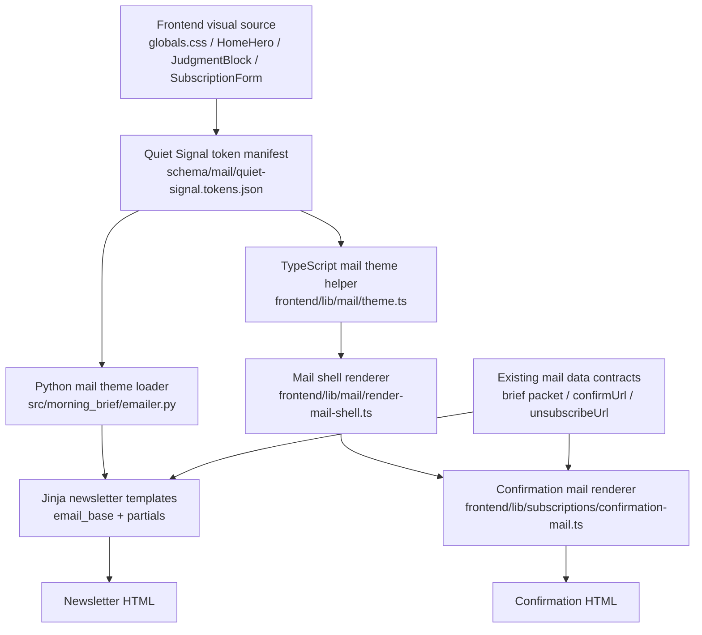

# Design Document: Mail Template Brand Alignment

## Overview

현재 공개 프론트는 다크 베이스, cyan/green 이중 포인트, mono label, serif display emphasis를 조합한 강한 브랜드 문법을 갖고 있지만, newsletter email과 confirmation mail은 각각 별도 하드코딩 스타일을 사용하고 있습니다. 이번 설계는 홈 hero의 인상을 그대로 복제하지 않고, 이메일 제약에 맞게 절제한 `Quiet Signal` 문법으로 번역해 newsletter와 confirmation을 하나의 메일 채널로 정렬합니다. 발송 로직, 데이터 조립, subject/confirm/unsubscribe 계약은 유지하고 HTML 시각 계층과 공통 디자인 자산만 재구성합니다.

- Purpose: 웹과 메일을 같은 제품군으로 인식시키되, 장문 브리핑과 트랜잭션 메일의 읽기 성격 차이는 유지합니다.
- Tone: `Quiet Signal`은 홈 hero의 공격적 에너지를 차분한 editorial-terminal 톤으로 번역한 메일 전용 미학입니다.
- Constraints: email-safe HTML, 인라인 스타일, 600px 단일 컬럼 우선, 커스텀 폰트/blur/noise/motion 미의존이 핵심 제약입니다.
- Differentiation: 이 채널의 기억 포인트는 검은 패널 안을 가르는 얇은 green signal rail과, cyan/green 역할 분리가 드러나는 절제된 briefing shell입니다.

보존/축소/제거 대상은 아래처럼 고정합니다.
- 보존: dark base, cyan/green 역할 분리, mono label, editorial hierarchy, thin signal rail
- 축소: hero 스케일, panel depth 강도, serif emphasis 범위
- 제거: scanline, noise texture, motion, backdrop blur, 웹 전용 커스텀 폰트 의존

## Architecture



## Components and Interfaces

### 1. Shared Quiet Signal token contract

변경 대상:
- `schema/mail/quiet-signal.tokens.json` (new)
- `frontend/lib/mail/theme.ts` (new)
- `src/morning_brief/emailer.py`

설계:
- 메일 채널의 단일 시각 source of truth로 `schema/mail/quiet-signal.tokens.json`을 추가합니다.
- 토큰은 색상, 타이포 역할, spacing, borders, CTA, pills, section rhythm 값을 담습니다.
- frontend는 `@schema` 경로로 JSON을 import해 typed helper로 사용하고, Python은 같은 JSON 파일을 읽어 Jinja context의 `mail_theme`로 주입합니다.
- 토큰은 CSS variable이 아니라 email-safe inline style에 바로 넣을 수 있는 문자열 값으로 저장합니다.

예상 인터페이스:

```ts
export interface MailTheme {
  name: "quiet-signal";
  colors: {
    shellBg: string;
    panelBg: string;
    panelBgStrong: string;
    border: string;
    borderStrong: string;
    textStrong: string;
    textBody: string;
    textMuted: string;
    accentCyan: string;
    accentGreen: string;
    accentDown: string;
  };
  typography: {
    labelMono: string;
    bodySans: string;
    displaySerif: string;
  };
  spacing: {
    shellX: string;
    shellY: string;
    sectionGap: string;
    blockGap: string;
  };
  rhythm: {
    hero: "signal-rail";
    narrative: "open-stack";
    data: "panel-split";
    utility: "compressed";
  };
  components: {
    pill: Record<string, string>;
    badge: Record<string, string>;
    cta: Record<string, string>;
    footerLink: Record<string, string>;
  };
}
```

```python
def _load_mail_theme() -> dict[str, Any]: ...
```

Design Decision:
- 토큰의 canonical 위치를 `schema/` 아래에 둡니다.
- 이유: 이미 frontend가 `@schema` alias를 사용하고 있고, Python도 repo root 기준으로 같은 파일을 읽기 쉬워 cross-runtime drift를 가장 적게 만들 수 있습니다.

Design Decision:
- 메일 공통 문법의 분위기 cue는 `thin signal rail`과 `restrained panel depth` 두 가지만 채택하고 `subtle glow`는 공통 문법에서 제외합니다.
- 이유: glow는 메일 클라이언트별 표현 편차가 크고, 현재 요구사항은 가독성 우선이므로 가장 재현성이 높은 두 요소만 공통 규칙으로 고정하는 편이 안전합니다.

Design Decision:
- display serif는 homepage의 정확한 웹폰트 복제가 아니라 email-safe fallback serif로 번역합니다.
- 이유: 메일 클라이언트는 커스텀 웹폰트 보장이 약하므로, 역할 일치가 폰트 동일성보다 중요합니다.

### 2. Python newsletter shell and section rhythms

변경 대상:
- `src/morning_brief/emailer.py`
- `src/morning_brief/templates/email_base.html.j2`
- `src/morning_brief/templates/email_macros.html.j2`
- `src/morning_brief/templates/email_header.html.j2`
- `src/morning_brief/templates/email_hero.html.j2`
- `src/morning_brief/templates/email_news.html.j2`
- `src/morning_brief/templates/email_market.html.j2`
- `src/morning_brief/templates/email_btc.html.j2`
- `src/morning_brief/templates/email_sector.html.j2`
- `src/morning_brief/templates/email_calendar.html.j2`
- `src/morning_brief/templates/email_footer.html.j2`

설계:
- `render_briefing_email_html()`와 `render_briefing_email_text()`의 public signature는 유지합니다.
- `_build_email_context_v2()` 결과에 `mail_theme`를 추가합니다.
- `email_base.html.j2`는 공통 shell, 모바일 규칙, text classes를 토큰 기반으로 재작성합니다.
- `email_macros.html.j2`는 하드코딩 배지 대신 semantic macro 계층으로 바꿉니다.
- 새 macro는 `eyebrow`, `signal_pill`, `delta_badge`, `section_label`, `utility_link`, `cta_button` 정도로 제한합니다.
- 헤더/hero는 현재 2단 구성을 유지하되 첫 화면 계층을 `brand label -> briefing identity -> status pill -> top-line judgment -> snapshot strip` 순서로 정리합니다.
- hero block은 `JudgmentBlock`의 left signal rail 문법을 email-safe하게 가져오고, serif emphasis는 opening block 한정으로만 사용합니다.
- 뉴스 섹션은 full-box 반복 대신 `meta row -> headline -> body -> market meaning`의 open-stack rhythm으로 재구성합니다.
- market, bitcoin, sector, calendar 섹션은 `summary strip + detailed table`의 panel-split rhythm으로 통일합니다.
- footer는 newsletter와 confirmation이 공유하는 utility grammar로 축소 정리합니다.

예상 인터페이스:

```python
def _build_email_context_v2(
    subject: str,
    body: str,
    packet: dict[str, Any] | None,
) -> dict[str, Any]:
    return {
        ...existing_keys,
        "mail_theme": theme,
    }
```

Design Decision:
- newsletter 템플릿은 data parsing 구조를 건드리지 않고 render shell만 바꿉니다.
- 이유: 현재 `_build_email_context_v2()`와 partial tests가 이미 section inclusion/fallback 규칙을 강하게 보장하고 있어, 디자인 변경이 데이터 회귀로 번지지 않도록 경계를 분리하는 편이 안전합니다.

Design Decision:
- 섹션 리듬은 hero, narrative, data, utility 네 계층으로 제한합니다.
- 이유: 메일은 프론트보다 표현 수단이 적기 때문에 리듬 종류를 늘리면 오히려 일관성이 약해집니다. 네 가지 계층만 유지해야 긴 뉴스레터에서도 스캔성이 살아납니다.

Design Decision:
- `email_sector.html.j2`와 `email_calendar.html.j2`는 별도 aesthetic를 만들지 않고 quantitative block grammar를 상속합니다.
- 이유: 이 두 섹션은 선택적 보조 섹션이므로, 별도 시각 규칙을 만들면 newsletter 전체 rhythm이 다시 분산됩니다.

### 3. Confirmation mail shared shell in TypeScript

변경 대상:
- `frontend/lib/mail/theme.ts`
- `frontend/lib/mail/render-mail-shell.ts` (new)
- `frontend/lib/subscriptions/confirmation-mail.ts`

설계:
- `buildConfirmationMail()`의 반환 계약은 그대로 유지합니다.
- HTML 생성은 inline string 하나에 모든 스타일을 넣는 방식에서, `frontend/lib/mail/render-mail-shell.ts`의 `renderMailShell()` helper를 사용하는 구조로 정리합니다.
- confirmation mail은 newsletter와 같은 `Quiet Signal` shell을 공유하되, 구조는 `eyebrow -> concise headline -> support copy -> primary CTA -> raw link fallback -> muted note -> utility footer`로 단순화합니다.
- CTA는 홈페이지 subscription form의 high-contrast 인상을 유지하지만 email-safe하게 단색 filled button으로 번역합니다.
- headline은 newsletter보다 짧고 명확하게 유지하되, opening block에서만 restrained serif emphasis를 허용합니다.
- newsletter와 동일한 footer grammar와 accent semantics를 사용합니다.
- utility footer 링크는 고정 프로덕션 URL을 하드코딩하지 않고 `confirmUrl`의 origin을 따라가도록 구성합니다.

예상 인터페이스:

```ts
export interface MailShellInput {
  eyebrow: string;
  headline: string;
  support: string;
  ctaLabel?: string;
  ctaHref?: string;
  fallbackUrl?: string;
  note?: string;
  footerHref?: string;
  footerLabel?: string;
}

export function renderMailShell(input: MailShellInput, theme: MailTheme): string;
```

Design Decision:
- confirmation mail을 Python/Jinja로 이동하지 않고 TypeScript에서 유지합니다.
- 이유: 현재 발송 런타임이 Cloudflare Functions이고 subject/text/html 계약도 이미 이 경로에 붙어 있으므로, 디자인 공통화만을 위해 렌더링 런타임을 이동시키는 것은 과도한 변경입니다.

Design Decision:
- newsletter와 confirmation은 토큰과 semantic shell grammar를 공유하지만 HTML partial 자체는 공유하지 않습니다.
- 이유: Jinja와 TypeScript 문자열 렌더링은 런타임과 escaping 모델이 달라 literal partial 공유보다 semantic layer 공유가 유지보수성이 높습니다.

Design Decision:
- confirmation footer 링크는 `confirmUrl`의 origin을 따라가게 둡니다.
- 이유: preview, staging, production 환경에서 같은 shell grammar를 유지하면서도 특정 배포 환경의 절대 URL을 하드코딩하지 않기 위함입니다.

### 4. Intentional differences and review boundary

변경 대상:
- `src/morning_brief/templates/email_v2.txt.j2`
- `frontend/lib/subscriptions/confirmation-mail.ts`
- 테스트 및 리뷰 산출물

설계:
- plain-text 메일은 정보 계약만 유지하고 시각 redesign 대상에서 제외합니다.
- newsletter는 long-form 브리핑 특성상 snapshot strip, narrative sections, data tables를 유지합니다.
- confirmation mail은 transactional clarity를 위해 section 수를 줄이되, 동일한 Quiet Signal opening grammar만 유지합니다.
- 리뷰 산출물에는 preserved/reduced/omitted hero traits를 명시하되, 이 정보는 runtime render context가 아니라 spec/PR/completion note에서 관리합니다.

예상 인터페이스:

```json
{
  "preserved": ["dark base", "mono labels", "signal rail", "cyan/green role split"],
  "reduced": ["hero scale", "panel depth", "serif emphasis range"],
  "omitted": ["scanline", "noise texture", "motion", "backdrop blur", "custom webfont dependency"]
}
```

Design Decision:
- plain-text 본문은 visual token을 공유하지 않습니다.
- 이유: plain-text는 시각 정렬보다 계약 안정성이 더 중요하며, HTML redesign의 회귀 범위를 불필요하게 넓히지 않기 위함입니다.

## Data Models

### Mail theme manifest

```json
{
  "name": "quiet-signal",
  "colors": {
    "shellBg": "#050505",
    "panelBg": "#090909",
    "panelBgStrong": "rgba(255,255,255,0.04)",
    "border": "rgba(255,255,255,0.10)",
    "borderStrong": "rgba(255,255,255,0.18)",
    "textStrong": "#ffffff",
    "textBody": "rgba(255,255,255,0.72)",
    "textMuted": "rgba(255,255,255,0.42)",
    "accentCyan": "#00ffff",
    "accentGreen": "#00ff66",
    "accentDown": "#ff6b6b"
  },
  "typography": {
    "labelMono": "'SFMono-Regular','Menlo','Consolas',monospace",
    "bodySans": "'Pretendard','Apple SD Gothic Neo','Noto Sans KR','Malgun Gothic',sans-serif",
    "displaySerif": "Georgia,'Times New Roman',serif"
  },
  "mood": {
    "signalRail": true,
    "panelDepth": true,
    "subtleGlow": false
  }
}
```

### Python render context additions

- `mail_theme: dict[str, Any]`

### TypeScript confirmation render types

- `MailTheme`
- `MailShellInput`
- `MailShellInput.footerHref`
- `MailShellInput.footerLabel`

## Correctness Properties

1. *For any* valid mail theme manifest, newsletter HTML과 confirmation HTML은 동일한 accent hex values, label typography role, CTA tone, footer link grammar를 사용해야 합니다.
   - Validates: Requirement 1.1, 1.2, 6.1, 6.2

2. *For any* newsletter packet rendered through `render_briefing_email_html()`, section order, conditional inclusion, unsubscribe URL, source listing, fallback messages는 redesign 전과 동일해야 합니다.
   - Validates: Requirement 3.4, 3.5, 6.3

3. *For any* confirmation input rendered through `buildConfirmationMail()`, subject, text body, confirm URL, and primary action semantics는 유지되어야 하며 visual hierarchy만 Quiet Signal grammar로 바뀌어야 합니다.
   - Validates: Requirement 4.1, 4.3, 4.5

4. *For any* email viewport 600px 이하에서, newsletter와 confirmation HTML은 single-column reading order와 tap-safe CTA를 유지해야 합니다.
   - Validates: Requirement 5.3, 5.4

5. *For any* homepage hero trait that is not email-safe, render output은 임의의 대체 효과를 추가하지 않고 documented omission 또는 reduced equivalent만 사용해야 합니다.
   - Validates: Requirement 2.4, 2.5, 6.5

## Error Handling

| 상황 | 처리 방식 |
| --- | --- |
| shared token manifest 파일이 없거나 JSON schema가 깨짐 | render 단계에서 명시적으로 실패시키고 legacy hardcoded style로 silently fallback하지 않음 |
| optional decorative token이 누락됨 | 구조를 유지한 neutral style로 단순화하지 않고, manifest를 required contract로 간주해 테스트에서 실패 처리 |
| newsletter section 데이터가 없음 | 기존 status/fallback 문구를 유지하고 section shell만 렌더링 |
| confirmation CTA URL이 비어 있음 | 기존 입력 검증 흐름에 맡기고 디자인 레이어는 예외를 숨기지 않음 |
| 특정 메일 클라이언트가 decorative detail을 지원하지 않음 | signal rail, border, spacing만으로 읽기 구조를 유지하고 glow/complex styling은 사용하지 않음 |

## Testing Strategy

- Python render regression
  - `tests/test_email_v2_rendering.py`
  - `tests/test_email_partials_rendering.py`
  - token-driven style 값, `role="presentation"`, 금지 기능, section hierarchy marker를 검증합니다.
- Python contract preservation
  - `tests/test_email_context_v2_integration.py`
  - `tests/test_pbt_email_redesign.py`
  - 데이터 payload, fallback message, unsubscribe/source contract 보존을 검증합니다.
- Frontend confirmation rendering
  - `frontend/tests/confirmation-mail.test.ts` (new)
  - subject/text/confirmUrl 보존, Quiet Signal shell marker, CTA/footer grammar를 검증합니다.
- Frontend service regression
  - `frontend/tests/subscription-service.test.ts`
  - request/confirm 플로우 계약이 HTML redesign으로 깨지지 않는지 확인합니다.
- Cross-runtime token contract
  - Python 테스트 1개와 TypeScript 테스트 1개에서 같은 token manifest key set을 읽어 필수 키 존재를 검증합니다.
- Review output
  - 구현 완료 시 preserved/reduced/omitted hero traits를 문서 또는 PR 설명에 명시합니다.
