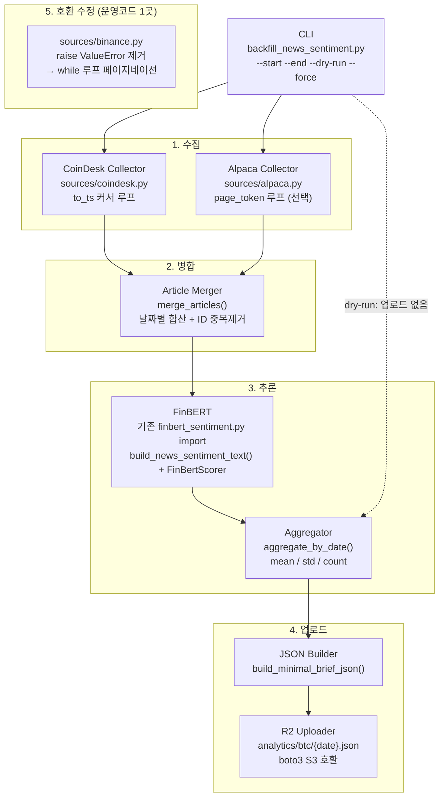

# Design Document: news-sentiment-backfill

## Overview

`scripts/backfill_news_sentiment.py` 단독 실행 스크립트로 460일치 BTC 뉴스를 수집·추론·업로드한다. CoinDesk Data API(무인증)를 1차 소스로, Alpaca Markets News API(선택)를 보완 소스로 사용하며, 기존 `finbert_sentiment.py`의 `build_news_sentiment_text()`와 `FinBertScorer`를 직접 import해 추론 로직을 재사용한다. 운영 파이프라인 파일은 `sources/binance.py` 단 하나만 수정(ValueError 가드 제거)하며, 나머지는 신규 파일로만 구성된다.

---

## Architecture



### 신규/변경 파일 목록

| 파일 | 신규/수정 | 설명 |
|------|-----------|------|
| `scripts/backfill_news_sentiment.py` | 신규 | CLI 진입점, 전체 오케스트레이션 |
| `scripts/backfill/sources/coindesk.py` | 신규 | CoinDesk API 수집기 |
| `scripts/backfill/sources/alpaca.py` | 신규 | Alpaca API 수집기 |
| `scripts/backfill/merge.py` | 신규 | 소스 병합·중복 제거 |
| `scripts/backfill/scorer.py` | 신규 | FinBERT 래퍼 + 날짜별 집계 |
| `scripts/backfill/uploader.py` | 신규 | R2 JSON 생성·업로드 |
| `scripts/backfill/reporter.py` | 신규 | 진행 로그·요약 리포트 |
| `scripts/backfill/__init__.py` | 신규 | 패키지 초기화 |
| `src/morning_brief/analysis/sentiment_join/sources/binance.py` | **수정** | ValueError 가드 → 페이지네이션 |

---

## Components and Interfaces

### 1. CoinDesk Collector (`scripts/backfill/sources/coindesk.py`)

#### 확인된 API 스펙 (직접 호출 검증)

```
GET https://data-api.coindesk.com/news/v1/article/list

Query Parameters:
  lang        = "EN"           # 영어 기사만
  categories  = "BTC"          # BTC 카테고리 필터 (확인됨)
  limit       = 50             # 페이지당 최대 기사 수 (50 동작 확인)
  to_ts       = {unix_int}     # 이 시각 이하(inclusive) 기사 반환

Authentication: 불필요 (무인증 동작 확인)

Response:
{
  "Data": [
    {
      "ID":           21950171,          # int, 고유 기사 ID (중복제거 키)
      "TITLE":        "...",             # str, 기사 제목
      "BODY":         "...",             # str, 기사 본문 (FinBERT summary 입력용)
      "PUBLISHED_ON": 1699999854,        # int, Unix timestamp (UTC)
      "SENTIMENT":    "NEUTRAL",         # str, 자체 감성 (무시, FinBERT 사용)
      "LANG":         "EN",              # str
      "STATUS":       "ACTIVE",          # str
      "KEYWORDS":     "BTC|ETH|...",     # str, 파이프 구분
      "CATEGORY_DATA": [
        { "TYPE": "122", "ID": 14, "NAME": "BTC", "CATEGORY": "BTC" }
      ],
      "SOURCE_DATA": {
        "SOURCE_KEY": "coindesk",
        "NAME": "CoinDesk"
      }
    }
  ],
  "Err": {}
}

Pagination:
  - 응답에 NextPage 필드 없음
  - to_ts는 inclusive (직접 테스트로 확인: to_ts=T이면 PUBLISHED_ON=T인 기사 포함)
  - 다음 커서 = min(PUBLISHED_ON) - 1  ← -1 필수, 미적용 시 동일 기사 무한 반복
  - 종료 조건: Data가 빈 배열이거나, 배치에 start_ts 이전 기사가 하나라도 포함된 경우
  - 루프 종료 후 start_ts 이전 기사는 결과에서 필터링

날짜 변환:
  - PUBLISHED_ON(Unix timestamp) → UTC 기준 YYYY-MM-DD
  - 예: 1704066621 → datetime.utcfromtimestamp(1704066621) → "2024-01-01"
  - KST 변환 없음 (UTC 기준 통일)
```

#### 페이지네이션 상세 로직

```
예시: start=2024-12-09(ts=1733702400), end=2026-04-13(ts=1744502400)

1회: to_ts=1744502400 → [1744499870, 1744498120, ..., 1744456910] → min=1744456910
2회: to_ts=1744456909 → [...] → min=T2
...
N회: 반환된 모든 PUBLISHED_ON < 1733702400 → 루프 종료, 초과분 필터링
```

#### 함수 시그니처

```python
# scripts/backfill/sources/coindesk.py
# scripts/backfill/sources/alpaca.py 와 공유하는 공통 dataclass

BASE_URL = "https://data-api.coindesk.com/news/v1/article/list"

@dataclass
class RawArticle:
    source: Literal["coindesk", "alpaca"]
    article_id: str          # CoinDesk: str(ID), Alpaca: id 필드
    date: str                # YYYY-MM-DD (UTC 기준, published_ts로부터 변환)
    title: str               # FinBERT title 입력
    body: str                # FinBERT summary 입력 (BODY null/empty → "")
    published_ts: int        # 원본 Unix timestamp (커서 계산용)


def fetch_coindesk_articles(
    start_date: str,         # YYYY-MM-DD (UTC 기준)
    end_date: str,           # YYYY-MM-DD (UTC 기준)
    *,
    delay_seconds: float = 0.3,
) -> list[RawArticle]:
    """
    to_ts 커서 방식으로 역방향 페이지네이션.
    배치에 start_ts 이전 기사가 하나라도 등장하면 루프 종료 후 필터링.
    BODY가 null/빈 문자열이면 body=""로 설정 (title만으로 FinBERT 입력).
    """
    ...
```

**Design Decision — categories=BTC만 사용:**
CoinDesk API에서 `categories=BTC`를 지정하면 CATEGORY_DATA에 BTC가 포함된 기사만 반환된다. 직접 호출로 확인. 노이즈(ETH only, DEFI only 등)를 줄이기 위해 BTC 필터를 유지한다.

**Design Decision — to_ts 커서에 -1 적용:**
직접 테스트 결과 `to_ts`는 inclusive이므로 `min(PUBLISHED_ON) - 1`을 다음 커서로 사용해야 동일 기사가 중복 반환되지 않는다.

---

### 2. Alpaca Collector (`scripts/backfill/sources/alpaca.py`)

#### 확인된 API 스펙 (공식 문서 `https://docs.alpaca.markets/reference/news-3`)

```
GET https://data.alpaca.markets/v1beta1/news

Headers:
  APCA-API-KEY-ID:     {ALPACA_API_KEY_ID}
  APCA-API-SECRET-KEY: {ALPACA_API_SECRET_KEY}

Query Parameters:
  symbols           (str)    comma-separated symbols  → "BTC/USD"
  start             (str)    RFC-3339 or YYYY-MM-DD   → "2024-12-09T00:00:00Z"
  end               (str)    RFC-3339 or YYYY-MM-DD   → "2026-04-13T23:59:59Z"
  sort              (str)    "asc" | "desc"           → "desc"
  limit             (int)    1-50                     → 50
  include_content   (bool)                            → true  (본문 포함)
  exclude_contentless (bool)                          → true  (본문 없는 기사 제외)
  page_token        (str)    pagination token         → 응답의 next_page_token 사용

Response:
{
  "news": [
    {
      "id":         "31234567",        # str, 고유 기사 ID
      "headline":   "...",             # str, 기사 제목 (= FinBERT title)
      "author":     "...",             # str
      "created_at": "2024-12-09T...", # str, ISO 8601 UTC
      "updated_at": "2024-12-09T...", # str
      "summary":    "...",             # str, 요약 (= FinBERT summary)
      "content":    "<p>...</p>",      # str, HTML 본문 (strip 후 사용)
      "url":        "https://...",     # str
      "images":     [...],             # list
      "symbols":    ["BTC/USD"],       # list[str]
      "source":     "benzinga"         # str
    }
  ],
  "next_page_token": "eyJh..."        # str | null, null이면 마지막 페이지
}

Rate Limit Headers:
  X-RateLimit-Limit, X-RateLimit-Remaining, X-RateLimit-Reset

Errors:
  401: 인증 실패 → EnvironmentError
  429: rate limit → 지수 백오프 3회
  400: 파라미터 오류 → ValueError 발생 후 중단
```

#### 함수 시그니처

```python
# scripts/backfill/sources/alpaca.py

ALPACA_NEWS_URL = "https://data.alpaca.markets/v1beta1/news"

def fetch_alpaca_articles(
    start_date: str,          # YYYY-MM-DD (UTC 기준)
    end_date: str,            # YYYY-MM-DD (UTC 기준)
    api_key_id: str,
    api_secret_key: str,
    *,
    delay_seconds: float = 0.2,
) -> list[RawArticle]:
    """
    next_page_token 방식 순방향 페이지네이션.
    next_page_token이 null이면 루프 종료.
    body 우선순위: content(HTML 제거) → summary → ""
    HTML 제거: re.sub(r"<[^>]+>", "", content).strip()
    날짜 변환: created_at(ISO 8601 UTC) → UTC 기준 YYYY-MM-DD
    """
    ...
```

**Design Decision — symbols=BTC/USD:**
Alpaca는 심볼 기반 필터이므로 `BTC/USD`를 사용한다. Benzinga 기사에서 BTC 관련 기사가 이 심볼로 태깅되어 있음을 공식 문서에서 확인. `BTCUSD`는 주식 종목 코드 형식이며 크립토는 슬래시 포함 형식 사용.

**Design Decision — include_content=true:**
Alpaca의 `summary`만으로는 FinBERT 입력 품질이 낮을 수 있다. `include_content=true`로 본문까지 포함하되, HTML 태그를 제거해 텍스트만 사용한다. `content`가 비어 있으면 `summary`로 fallback.

---

### 3. Article Merger (`scripts/backfill/merge.py`)

```python
def merge_articles(
    coindesk: list[RawArticle],
    alpaca: list[RawArticle],
) -> dict[str, list[RawArticle]]:
    """
    날짜(YYYY-MM-DD) → 기사 리스트 딕셔너리 반환.
    중복 제거: title 소문자+공백 정규화 후 seen_titles: set[str]으로 추적.
    CoinDesk 기사를 먼저 삽입(우선 보존)한 뒤 Alpaca 기사 추가.

    구현 패턴:
        result: dict[str, list[RawArticle]] = defaultdict(list)
        seen: dict[str, set[str]] = defaultdict(set)   # date → normalized titles
        for article in coindesk + alpaca:
            key = article.title.lower().strip()
            if key not in seen[article.date]:
                seen[article.date].add(key)
                result[article.date].append(article)
    """
    ...
```

**중복 제거 키 설계:**
`article_id` 기반이 아닌 `title` 정규화 기반으로 처리하는 이유는 두 소스의 ID 체계가 달라 동일 기사가 다른 ID로 등록될 수 있기 때문이다. `title.lower().strip()` 후 정확 일치(exact match) 비교로 충분하다고 판단. 두 소스(CoinDesk 자체 기사 vs Benzinga 독자 기사)가 동일 제목을 가진 syndicate 기사를 드물게 공유하므로 fuzzy matching은 오히려 오탐(다른 기사를 중복으로 잘못 처리) 위험이 있다.

---

### 4. FinBERT 스코어러 (`scripts/backfill/scorer.py`)

#### FinBERT 입력 규격 (기존 코드 기반)

`finbert_sentiment.py`의 `build_news_sentiment_text(item)` 함수가 읽는 필드:

```python
# src/morning_brief/data/finbert_sentiment.py 내부 로직
text = FinBertScorer.combine_fields(
    str(item.get("title", "")),           # max 64 tokens
    str(item.get("summary", "")),          # max 224 tokens
    str(item.get("why_it_matters", "")),   # max 224 tokens
)
# → 합산 max 512 tokens, truncation 처리됨
```

#### 소스별 필드 매핑

| 소스 | `title` | `summary` | `why_it_matters` |
|------|---------|-----------|-----------------|
| CoinDesk | `TITLE` | `BODY` (null/empty → `""`) | `""` |
| Alpaca | `headline` | `content`(HTML 제거 후) → fallback `summary` → `""` | `""` |

`BODY` 사전 절단(500자 제한) 없음: `combine_fields()` 내부에서 토크나이저 기준 224토큰으로 자동 truncation 처리됨. Python 레벨 사전 절단 시 토크나이저 실제 경계와 불일치할 수 있어 FinBERT에 전체 텍스트를 전달한다.

#### 추론 출력 (`SentimentResult`)

```python
@dataclass
class SentimentResult:
    score: float | None        # p_pos - p_neg, [-1.0, 1.0], 4자리 반올림
    confidence: float | None   # max(p_pos, p_neg, p_neu), [0.0, 1.0]
    label: str | None          # "bullish" | "bearish" | "neutral"
```

#### 날짜별 집계 함수

```python
# scripts/backfill/scorer.py

from dataclasses import dataclass, field
from src.morning_brief.data.finbert_sentiment import (
    build_news_sentiment_text,
    FinBertScorer,
    SentimentResult,
)

# FinBertScorer는 Settings 객체를 필수로 받는다.
# 백필 스크립트는 운영 파이프라인의 Settings(openai_api_key 등 불필요 필드 포함)를
# import하지 않으므로, FinBERT 관련 필드만 포함하는 최소 설정 dataclass를 정의한다.
# FinBertScorer는 settings 인스턴스를 attribute access로만 사용하므로 duck typing 호환.
@dataclass
class _BackfillFinBertSettings:
    finbert_model: str = "ProsusAI/finbert"
    finbert_model_path: str = ""
    finbert_model_revision: str = ""
    finbert_batch_size: int = 32
    finbert_bullish_threshold: float = 0.3
    finbert_bearish_threshold: float = -0.3


@dataclass
class DailyAggregate:
    date: str              # YYYY-MM-DD (UTC 기준)
    mean: float | None     # 유효 score 평균, count=0이면 None
    std: float | None      # 유효 score 표준편차 (ddof=1), count<2이면 None
    count: int             # 유효 score 기사 수 (score=None 제외)
    status: Literal["ok", "degraded", "skipped"]
    coindesk_count: int    # 소스별 기사 수 (리포트용)
    alpaca_count: int


def score_and_aggregate(
    articles_by_date: dict[str, list[RawArticle]],
    *,
    batch_size: int = 32,
) -> list[DailyAggregate]:
    """
    전체 기사를 일괄 배치 추론 후 날짜별 DailyAggregate 리스트 반환.

    처리 순서:
    1. settings = _BackfillFinBertSettings(finbert_batch_size=batch_size)
       scorer = FinBertScorer(settings)  ← 단 한 번 초기화 (모델 가중치 1회 로딩)
       - FinBertScorer.__init__ 시그니처: def __init__(self, settings: Settings) -> None
       - _BackfillFinBertSettings는 FinBERT 관련 attribute만 제공 (duck typing 호환)
    2. 모든 날짜의 기사를 flat list로 합산
    3. build_news_sentiment_text(article_as_dict)로 텍스트 변환
    4. scorer.score_texts(texts)로 일괄 추론
       - score_texts() 시그니처: def score_texts(self, texts, observer=None) -> list[SentimentResult]
       - batch_size는 settings.finbert_batch_size에서 내부적으로 읽음 (파라미터 없음)
    5. article_id → score 매핑 후 날짜별 집계

    GPU 자동 감지: torch.cuda.is_available() → torch.backends.mps.is_available() → CPU 순.
    FinBertScorer 생성 시 device가 자동 선택되므로 명시적 .to(device) 불필요.
    """
    ...
```

**Design Decision — `_BackfillFinBertSettings` 최소 설정 클래스:**
`FinBertScorer(settings: Settings)` 생성자는 운영 파이프라인의 전체 `Settings` 객체를 요구한다. 이 객체는 `openai_api_key`, `kis_app_key` 등 백필과 무관한 수십 개 필드를 포함하고, 환경변수에서 읽는다. 백필 스크립트에서 `Settings()`를 생성하면 불필요한 환경변수 설정이 강제된다. 대신 `_BackfillFinBertSettings`를 정의해 FinBERT 관련 7개 필드만 제공한다. `FinBertScorer`는 settings 객체를 `isinstance` 검사 없이 attribute access로만 사용하므로 duck typing 호환이 보장된다.

**Design Decision — FinBertScorer 단일 인스턴스:**
`FinBertScorer(settings)` 생성 시 모델 가중치(~440MB) 및 토크나이저 로딩이 발생한다. 날짜 루프 안에서 생성하면 460회 반복 로딩으로 CPU 기준 수십 분의 오버헤드가 발생한다. 루프 밖에서 단 한 번 생성하고 전체 기사를 flat list로 일괄 처리해야 한다.

**Design Decision — `build_news_sentiment_text()` + `score_texts()` 조합:**
`build_news_sentiment_text(item)`은 `item.get("title")`, `item.get("summary")`, `item.get("why_it_matters")`를 읽어 `combine_fields()`로 512토큰 내 텍스트를 구성한다. 이 함수를 재사용해야 운영 파이프라인과 동일한 truncation 경계가 적용된다. RawArticle → dict 변환은 `{"title": a.title, "summary": a.body, "why_it_matters": ""}` 형태로 처리한다.

**Design Decision — BODY 사전 절단 제거:**
`combine_fields()` 내부에서 토크나이저 기준으로 각 필드를 64/224/224 토큰으로 자동 절단하므로 Python 레벨 500자 제한이 불필요하다. 토크나이저 경계와 Python 문자 경계가 불일치하므로 오히려 사전 절단 시 유효 정보 손실이 생길 수 있다.

---

### 5. R2 업로더 (`scripts/backfill/uploader.py`)

#### R2에 저장되는 최소 브리프 JSON 스키마

`fetch_r2_sentiment()`가 읽는 경로는 `meta.newsSentiment.mean`, `meta.newsSentiment.std`, `meta.newsSentiment.count`, `meta.sentimentStatus`, `meta.signalSentimentStatus`로 총 5개 필드뿐이다. 나머지 필드(`marketSnapshot`, `featuredNews` 등)는 `fetch_r2_sentiment()`가 무시한다.

```json
{
  "meta": {
    "date": "2025-01-08",
    "generatedAt": "2025-01-08T08:00:00+09:00",
    "sentimentStatus": "ok",
    "signalSentimentStatus": "skipped",
    "newsSentiment": {
      "mean": 0.1423,
      "std": 0.2871,
      "count": 18
    },
    "signalSentiment": null,
    "_backfill": true,
    "_backfillSource": "coindesk+alpaca+finbert",
    "_backfillGeneratedAt": "2026-04-13T12:00:00Z"
  }
}
```

**R2 경로:** `analytics/btc/{YYYY-MM-DD}.json`
- 분석 파이프라인과 직접 일치하는 경로

#### 기존 파일 보호 로직

```python
def _is_pipeline_file(existing_json: dict) -> bool:
    """_backfill 필드 없는 파일 = 파이프라인 원본 → 덮어쓰기 금지"""
    return "_backfill" not in existing_json.get("meta", {})


@dataclass
class UploadResults:
    """upload_all() 반환 타입. print_summary()에서 소비."""
    uploaded: int = 0
    skipped_exists: int = 0
    skipped_protected: int = 0
    failed: int = 0
    aggregates_ok: int = 0       # status="ok" 날짜 수
    aggregates_degraded: int = 0 # status="degraded" 날짜 수
    aggregates_skipped: int = 0  # status="skipped" 날짜 수


def upload_brief(
    date: str,
    aggregate: DailyAggregate,
    s3_client: boto3.client,
    bucket: str,
    *,
    force: bool = False,
) -> Literal["uploaded", "skipped_exists", "skipped_protected", "failed"]:
    ...
```

#### boto3 S3 호환 클라이언트 설정

```python
import boto3

s3 = boto3.client(
    "s3",
    endpoint_url=os.environ["R2_ENDPOINT_URL"],           # https://{account_id}.r2.cloudflarestorage.com
    aws_access_key_id=os.environ["R2_ACCESS_KEY_ID"],
    aws_secret_access_key=os.environ["R2_SECRET_ACCESS_KEY"],
    region_name="auto",
)

# 존재 확인
from botocore.exceptions import ClientError

try:
    s3.head_object(Bucket=bucket, Key=f"analytics/btc/{date}.json")
    # 존재 → --force 시에만 get_object로 _backfill 필드 확인
except ClientError as e:
    if e.response["Error"]["Code"] in ("404", "NoSuchKey"):
        pass  # 존재하지 않음 → 업로드 진행
    else:
        raise  # 네트워크 오류 등 → 상위로 전파

# 업로드
s3.put_object(
    Bucket=bucket,
    Key=f"analytics/btc/{date}.json",
    Body=json.dumps(payload, ensure_ascii=False, separators=(",", ":")),
    ContentType="application/json",
)
```

```python
def upload_all(
    aggregates: list[DailyAggregate],
    s3_client: boto3.client,
    bucket: str,
    *,
    force: bool = False,
    max_concurrency: int = 5,
) -> UploadResults:
    """ThreadPoolExecutor로 날짜별 병렬 업로드. UploadResults 반환."""
    ...
```

**Design Decision — `head_object` / `get_object` 분리:**
`--force` 없을 때는 `head_object`(메타데이터만 조회, 빠름)로 존재 여부만 확인하고 skip한다. `--force` 시에만 `get_object`로 본문을 읽어 `meta._backfill` 필드를 검사한다. 이렇게 분리하면 일반 실행(460회 `head_object`)의 네트워크 비용을 최소화한다.

**Design Decision — 병렬 업로드 안전성:**
`ThreadPoolExecutor(max_workers=BACKFILL_R2_MAX_CONCURRENCY)`로 날짜 단위 병렬 업로드 시, 동일 날짜를 두 스레드가 동시에 처리하는 경우가 없으므로(날짜는 고유 키) 경쟁 조건이 발생하지 않는다. 각 스레드가 서로 다른 R2 키(`analytics/btc/{date}.json`)를 대상으로 독립적으로 동작한다.

**백필 완료 후 필수 수동 실행:**
스크립트 완료 요약에 다음 명령어를 출력한다:
```
백필 완료. 이제 아래 명령어로 parquet을 생성하세요:
  SENTIMENT_JOIN_LOOKBACK_DAYS=460 make sentiment-join
```

---

### 6. Binance Spot 페이지네이션 수정

**수정 파일:** `src/morning_brief/analysis/sentiment_join/sources/binance.py`

**변경 전 (제거할 코드):**

```python
def _fetch_klines(start_date, end_date, api_key):
    ...
    limit = (end_dt - start_dt).days + 2

    if limit > 1000:                          # ← 이 블록 제거
        raise ValueError(
            f"lookback이 klines 단일 요청 한도를 초과합니다: limit={limit} > 1000"
        )
    ...
```

**변경 후 (페이지네이션 루프 추가):**

```python
def _fetch_klines(start_date, end_date, api_key):
    start_dt = datetime.fromisoformat(start_date).replace(tzinfo=timezone.utc)
    end_dt = datetime.fromisoformat(end_date).replace(tzinfo=timezone.utc)
    total_days = (end_dt - start_dt).days + 2

    if total_days <= 1000:
        # 기존 단발 호출 경로 (460일 포함) — 동작 변경 없음
        limit = total_days
        start_ms = int(start_dt.timestamp() * 1000)
        end_ms = int(end_dt.timestamp() * 1000) + 86_400_000 - 1
        params = {"symbol": BINANCE_SYMBOL, "interval": BINANCE_INTERVAL,
                  "startTime": start_ms, "endTime": end_ms, "limit": limit}
        return _call_klines(params, api_key)

    # 1000일 초과: 페이지네이션 루프
    all_rows: list[list[Any]] = []
    cursor_ms = int(start_dt.timestamp() * 1000)
    end_ms = int(end_dt.timestamp() * 1000) + 86_400_000 - 1

    while cursor_ms < end_ms:
        params = {"symbol": BINANCE_SYMBOL, "interval": BINANCE_INTERVAL,
                  "startTime": cursor_ms, "limit": 1000}
        batch = _call_klines(params, api_key)
        if not batch:
            break
        all_rows.extend(batch)
        last_open_time_ms = int(batch[-1][0])
        if last_open_time_ms >= end_ms:
            break
        cursor_ms = last_open_time_ms + 86_400_000  # 다음 날 자정
        time.sleep(0.05)

    return all_rows
```

**460일은 단발 호출 경로 사용 → 기존 동작 100% 보존.**

---

### 7. CLI 진입점 (`scripts/backfill_news_sentiment.py`)

```python
#!/usr/bin/env python3
"""
Usage:
  python scripts/backfill_news_sentiment.py \\
    --start 2024-12-09 \\
    --end   2026-04-13 \\
    [--dry-run] [--force] [--batch-size 32] [--skip-alpaca]

Required env:
  R2_ENDPOINT_URL, R2_ACCESS_KEY_ID, R2_SECRET_ACCESS_KEY, R2_BUCKET_NAME

Optional env:
  ALPACA_API_KEY_ID, ALPACA_API_SECRET_KEY  (없으면 Alpaca 단계 skip)
  BACKFILL_FINBERT_BATCH_SIZE               (기본 32, --batch-size로 override)
  BACKFILL_R2_MAX_CONCURRENCY               (기본 5)
"""

def main() -> int:
    args = _parse_args()
    _validate_env(args)

    # 1. 수집
    coindesk_articles = fetch_coindesk_articles(args.start, args.end)
    alpaca_articles = (
        fetch_alpaca_articles(args.start, args.end, ...)
        if not args.skip_alpaca and _alpaca_creds_present()
        else []
    )

    # 2. 병합
    articles_by_date = merge_articles(coindesk_articles, alpaca_articles)

    # 3. FinBERT 추론 (dry-run 포함 — Req 8.3, 9.2)
    aggregates = score_and_aggregate(articles_by_date, batch_size=args.batch_size)

    # 4. dry-run: 커버리지 리포트 후 종료 (R2 업로드 없음)
    if args.dry_run:
        print_coverage_report(aggregates)   # aggregates: list[DailyAggregate]
        return 0

    # 5. R2 업로드
    results = upload_all(aggregates, force=args.force)

    # 6. 최종 요약
    print_summary(results, aggregates, start_time)
    return 0 if results.failed == 0 else 1
```

---

## Data Models

### `RawArticle`

```python
@dataclass
class RawArticle:
    source: Literal["coindesk", "alpaca"]
    article_id: str        # 중복 제거 보조키 (같은 소스 내 ID 유일성 보장)
    date: str              # YYYY-MM-DD (UTC 기준 통일, KST 변환 없음)
    title: str             # FinBERT title 입력 (item["title"])
    body: str              # FinBERT summary 입력 (item["summary"]) — null/empty 허용
    published_ts: int      # 원본 Unix timestamp (CoinDesk 커서 계산용, Alpaca: created_at → int)
```

### `DailyAggregate`

```python
@dataclass
class DailyAggregate:
    date: str                                          # YYYY-MM-DD (UTC 기준)
    mean: float | None                                 # numpy.mean(valid_scores), count=0이면 None
    std: float | None                                  # numpy.std(valid_scores, ddof=1)
                                                       # count=1이면 ddof=1로 NaN → None으로 처리
                                                       # count=0이면 None
    count: int                                         # 유효 score(non-None) 기사 수
    status: Literal["ok", "degraded", "skipped"]       # count≥5→ok, 2~4→degraded, ≤1→skipped
    coindesk_count: int                                # 원본 기사 수 (dedup 전, 리포트용)
    alpaca_count: int                                  # 원본 기사 수 (dedup 전, 리포트용)
```

`std` 계산 시 주의: `numpy.std([x], ddof=1)`은 NaN을 반환하므로 `count < 2`이면 `std=None`으로 명시적 처리 필요. 단, `sentimentStatus="skipped"`(`count≤1`)인 날짜는 `fetch_r2_sentiment()`에서 NaN 처리되어 inner join에서 탈락하므로 `std` 값이 parquet에 기록되지 않는다.

### 최소 브리프 JSON (`analytics/btc/{date}.json`)

`fetch_r2_sentiment()`가 읽는 필드 경로와 타입:

```
meta.sentimentStatus        str   "ok" | "degraded" | "skipped"
meta.signalSentimentStatus  str   "skipped" (항상 고정)
meta.newsSentiment.mean     float | null
meta.newsSentiment.std      float | null
meta.newsSentiment.count    int
meta.signalSentiment        null  (항상 고정)
```

`r2_sentiment.py`의 파싱 로직에 따른 NaN 처리 규칙:
- `sentimentStatus == "skipped"` → `news_sentiment_mean = NaN` (inner join 탈락)
- `newsSentiment.mean is None` → `news_sentiment_mean = NaN`
- `sentimentStatus == "degraded"` → 값 유지 (inner join 통과, 품질 플래그 없음)

따라서 `count ≤ 1` 날짜는 `status="skipped"`로 설정해 inner join에서 자연스럽게 탈락시킨다.

### R2 → 파케이 컬럼 흐름

백필로 업로드된 JSON이 `make sentiment-join` 실행 후 최종 parquet에 기록되는 경로:

| JSON 필드 | `fetch_r2_sentiment()` 출력 | 최종 parquet 컬럼 | dtype |
|-----------|---------------------------|-------------------|-------|
| `newsSentiment.mean` | `news_sentiment_mean` | `news_sentiment_mean` | float64 |
| `newsSentiment.std` | `news_sentiment_std` | `news_sentiment_std` | float64 |
| `newsSentiment.count` | `n_articles` | `n_articles` | Int64 (nullable) |
| (없음) | `signal_sentiment_mean` = NaN | `signal_sentiment_mean` | float64 |
| (없음) | `signal_sentiment_std` = NaN | `signal_sentiment_std` | float64 |
| (없음) | `n_signals` = 0 → NaN | `n_signals` | Int64 (nullable) |

---

## Correctness Properties

1. *For any* `start_date ≤ date ≤ end_date`에 대해, `fetch_coindesk_articles()`는 해당 날짜의 기사를 중복 없이 반환해야 한다 (`ID` 기준 유일성) → **Req 1.4**

2. *For any* `to_ts = T`에 대해, 반환된 기사의 모든 `PUBLISHED_ON ≤ T`를 만족해야 한다. 다음 커서 `T' = min(PUBLISHED_ON) - 1`이면 `T' < T`가 보장되어 무한 루프가 발생하지 않는다. 배치에 `start_ts` 이전 기사가 하나라도 포함되면 루프 종료하고 해당 기사를 필터링한다 → **Req 1.2**

3. *For any* CoinDesk 기사 `A`와 Alpaca 기사 `B`의 `title.lower().strip()`이 동일할 때, `merge_articles()`는 `A`만 결과에 포함해야 한다 → **Req 3.2**

4. *For any* `DailyAggregate.count = 0`에 대해, `build_minimal_brief_json()`의 `sentimentStatus`는 반드시 `"skipped"`이어야 하며, `fetch_r2_sentiment()`는 해당 날짜를 NaN으로 처리한다 → **Req 5.3**

5. *For any* R2에 `_backfill` 필드가 없는 파일에 대해, `upload_brief(force=True)`는 덮어쓰기를 거부하고 `"skipped_protected"`를 반환해야 한다 → **Req 6.4**

6. *For any* `total_days ≤ 1000`에 대해, 수정된 `_fetch_klines()`는 단발 호출을 사용하며 기존 동작과 동일한 결과를 반환해야 한다 → **Req 7.2, 7.3**

---

## Error Handling

| 상황 | 처리 방식 |
|------|-----------|
| CoinDesk `429` | 지수 백오프 3회 (2s → 4s → 8s) 재시도 |
| CoinDesk 페이지 3회 재시도 후 실패 | 해당 커서 건너뜀, WARNING 로그, 다음 커서 진행 |
| CoinDesk `Data` 배열이 빈 리스트 | 루프 정상 종료 |
| Alpaca `401` | EnvironmentError 즉시 발생 → 스크립트 종료 |
| Alpaca `429` | 지수 백오프 3회 재시도 |
| Alpaca 환경변수 누락 | Alpaca 단계 skip (INFO 로그), 전체 계속 |
| FinBERT `ImportError` | 즉시 종료, `pip install -r requirements-ml.txt` 안내 |
| FinBERT 개별 기사 추론 실패 | `score=None` 처리, `count`에서 제외, 계속 |
| R2 `head_object` 404 | 신규 파일로 간주, 업로드 진행 |
| R2 업로드 실패 | 해당 날짜 skip, WARNING 로그, 다음 날짜 계속 |
| R2 파이프라인 원본 파일 + `--force` | 덮어쓰기 거부, `skipped_protected` 반환 |
| `--start`/`--end` 간격 > 460일 | `ValueError` 즉시 발생, 스크립트 종료 |
| 필수 R2 환경변수 누락 | `EnvironmentError` (변수명 열거), 스크립트 종료 |
| `to_ts` 커서 무한루프 방지 | `min(PUBLISHED_ON) < start_ts`이면 루프 종료 보장 |

---

## Testing Strategy

테스트 파일 위치: `tests/backfill/`
프레임워크: pytest
**운영 파이프라인 pytest는 건드리지 않는다.**

### 단위 테스트

**`tests/backfill/test_coindesk.py`**
- `to_ts` 커서 계산: 배치 min(PUBLISHED_ON) - 1이 다음 to_ts가 되는지
- 루프 종료: Data가 빈 리스트일 때 정상 종료
- 날짜 변환: Unix timestamp → YYYY-MM-DD (UTC 경계값: 자정 정확도)
- ID 중복 제거: 동일 ID가 연속 페이지에서 두 번 반환될 때 1개만 보존

**`tests/backfill/test_alpaca.py`**
- `next_page_token=null`일 때 루프 종료
- HTML 태그 제거: `<p>Bitcoin <b>surges</b></p>` → `"Bitcoin surges"`
- `content`가 빈 문자열일 때 `summary`로 fallback

**`tests/backfill/test_merge.py`**
- 두 소스 합산 날짜별 기사 수 정확성
- 동일 title(대소문자 무관) CoinDesk 우선 보존
- 서로 다른 title 기사는 모두 포함

**`tests/backfill/test_scorer.py`**
- `count=0`이면 `mean=None, std=None, status="skipped"`
- `count=1`이면 `std=None, status="skipped"` (`numpy.std([x], ddof=1)=NaN` → None 변환)
- `count=2`이면 `std` non-null, `status="degraded"`
- `count=3`이면 `status="degraded"`
- `count=5`이면 `status="ok"`
- FinBertScorer 단 한 번 초기화 확인 (score_and_aggregate 호출 전후 인스턴스 동일성)
- UTC 날짜 변환 경계: Unix timestamp `1704067199`(UTC 2023-12-31 23:59:59) → `"2023-12-31"`, `1704067200`(UTC 2024-01-01 00:00:00) → `"2024-01-01"`

**`tests/backfill/test_uploader.py`**
- `_backfill=True` 파일: `--force` 시 덮어쓰기
- `_backfill` 필드 없는 파일: `--force`에서도 `"skipped_protected"` 반환
- 파일 미존재: 신규 업로드

### Binance 수정 회귀 테스트

**`tests/test_sentiment_join_binance.py` (기존 파일에 추가)**
- `total_days=730`: 단발 호출 경로 진입 확인 (페이지네이션 루프 미진입)
- `total_days=460`: 단발 호출 경로 진입 확인
- `total_days=1001`: 페이지네이션 루프 진입, `time.sleep` 호출 확인
- 기존 테스트 통과 유지 (`make test`)
