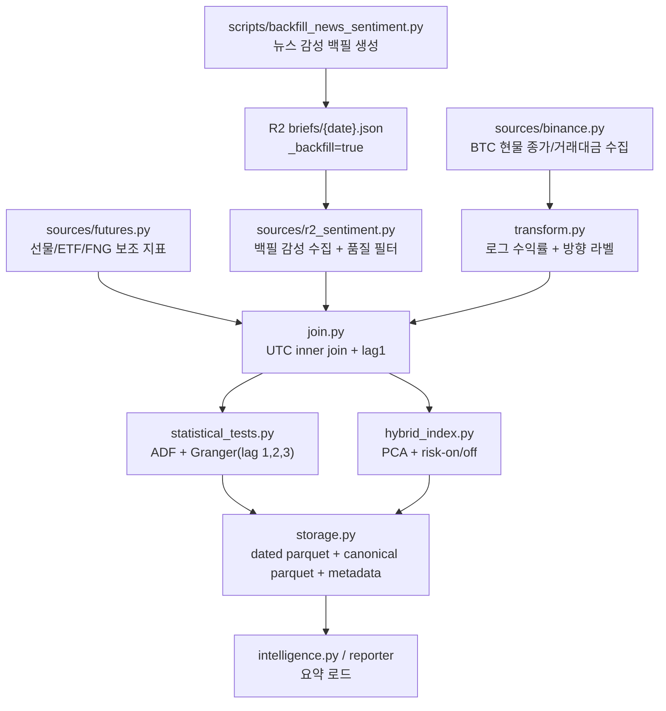

# Design Document: News Sentiment Market Causality

## Overview

이 설계는 기존 `src/morning_brief/analysis/sentiment_join/` 파이프라인을 기반으로, 뉴스 감성 백필 JSON과 Binance BTC 시장 데이터를 결합해 "뉴스 감성이 실제 BTC 등락을 선행 설명하는가"를 검증 가능한 형태로 개선하는 방향을 정의한다. 핵심은 기존 독립 분석 배치를 유지하면서도 입력 계약을 `_backfill` 중심으로 강화하고, 감성 품질 필터, 실제 등락 라벨, 180일 유효 표본 게이트, canonical 마스터 산출물을 추가해 분석 목적에 맞는 결과를 만드는 것이다.

기존 구조를 최대한 재사용하되, 변경은 `R2 sentiment 수집기`, `수익률 변환기`, `결합기`, `통계 검정기`, `저장기`, `intelligence loader`에 집중한다. `scripts/backfill_news_sentiment.py`는 일별 감성 JSON 백필 생성기 역할을 유지하고, `scripts/build_sentiment_join.py` 및 `analysis/sentiment_join`은 그 산출물을 소비하는 분석 파이프라인으로 정렬한다.

## Architecture



변경 영향 범위:

- 백필 생성기: `scripts/backfill/uploader.py`
- 분석 입력 수집: `src/morning_brief/analysis/sentiment_join/sources/r2_sentiment.py`
- 가격 수집 및 변환: `src/morning_brief/analysis/sentiment_join/sources/binance.py`, `transform.py`
- 데이터 결합: `src/morning_brief/analysis/sentiment_join/join.py`
- 통계 검정: `src/morning_brief/analysis/sentiment_join/statistical_tests.py`
- 저장/읽기: `src/morning_brief/analysis/sentiment_join/storage.py`, `intelligence.py`
- 스키마 검증: `src/morning_brief/analysis/sentiment_join/validate.py`

## Components and Interfaces

### 1. Backfill JSON Contract Hardening

대상 파일:

- `scripts/backfill/uploader.py`
- `src/morning_brief/analysis/sentiment_join/sources/r2_sentiment.py`

변경 방향:

- 백필 업로더가 이미 기록 중인 `_backfill`, `_backfillSource`, `_backfillGeneratedAt`를 분석 파이프라인이 실제 계약으로 사용한다.
- R2 sentiment 수집기는 `_backfill` 여부를 검증하고, 운영 brief JSON은 분석 입력에서 제외한다.

예상 인터페이스:

```python
def fetch_r2_sentiment(
    dates: list[str],
    r2_public_bucket: str,
    max_concurrency: int = 10,
    *,
    require_backfill_marker: bool = True,
    min_article_count: int = 2,
) -> pd.DataFrame: ...
```

설계 결정:

- `_backfill` 필터는 수집 단계에서 수행한다.
  이유: downstream 단계에서 운영 파일과 백필 파일이 섞이면 통계 해석이 달라지므로 가장 이른 단계에서 계약을 강제하는 편이 안전하다.
- `count <= 1` 제외는 R2 수집 단계가 아니라 결합 직전의 감성 품질 필터에서 수행한다.
  이유: 원시 입력은 보존하되, "분석 유효 행" 정의는 join 레이어가 소유해야 리포트와 검정 게이트가 일관된다.

### 2. BTC Spot Backfill Reuse with Direction Label

대상 파일:

- `src/morning_brief/analysis/sentiment_join/sources/binance.py`
- `src/morning_brief/analysis/sentiment_join/transform.py`

현재 상태:

- Binance spot 수집은 1000건 초과 시 while 페이지네이션을 이미 지원한다.
- `compute_returns()`는 로그 수익률과 단순 수익률만 생성한다.

변경 방향:

- 기존 `_fetch_klines()` 페이지네이션 로직은 유지한다.
- `transform.py`에서 실제 등락 해석용 컬럼을 추가한다.

예상 인터페이스:

```python
def compute_returns_and_direction(
    df: pd.DataFrame,
    price_col: str,
    *,
    prefix: str,
) -> pd.DataFrame: ...
```

생성 컬럼:

- `btc_log_return`
- `btc_return`
- `btc_direction_label`: `"up" | "down" | "flat" | <NA>`
- `btc_direction_sign`: `1 | -1 | 0 | <NA>`

설계 결정:

- 방향 라벨은 `log_return`에서 파생한다.
  이유: 최종 통계 검정은 로그 수익률을 기준으로 수행하므로, 방향 라벨도 동일 기준에서 파생해야 해석 일관성이 유지된다.
- 기존 `compute_returns()`를 완전히 대체하기보다 thin wrapper 또는 확장 함수로 추가한다.
  이유: USD/KRW 등 기존 호출부와의 호환성을 깨지 않기 위해서다.

### 3. Sentiment Quality Filtering in Join Layer

대상 파일:

- `src/morning_brief/analysis/sentiment_join/join.py`

현재 상태:

- `news_sentiment_mean`이 NaN인 행만 drop한다.

변경 방향:

- 아래 조건을 모두 감성 제외 규칙에 포함한다.
  - `news_sentiment_mean` is NaN
  - `n_articles <= 1`
  - `sentiment_status == "skipped"`
- 제외 사유별 집계를 남긴다.

예상 인터페이스:

```python
def merge_sources(
    sentiment_df: pd.DataFrame,
    fng_df: pd.DataFrame,
    btc_df: pd.DataFrame,
    usdkrw_df: pd.DataFrame,
    futures_df: pd.DataFrame | None = None,
    etf_df: pd.DataFrame | None = None,
    *,
    min_articles: int = 2,
) -> pd.DataFrame: ...
```

설계 결정:

- 감성 상태 컬럼(`sentiment_status`, `is_backfill_source`)을 최종 마스터 DF에 남긴다.
  이유: 검정에 직접 쓰이지 않더라도 무결성 리포트와 사후 해석에 필요하다.
- futures lag 생성은 기존 `_add_futures_lag_columns()`를 그대로 재사용한다.
  이유: 요구사항이 미래 정보 누설 방지이며, 현재 구현이 정확히 그 책임을 수행하고 있기 때문이다.

### 4. Statistical Gate Tightening

대상 파일:

- `src/morning_brief/analysis/sentiment_join/statistical_tests.py`
- `src/morning_brief/analysis/sentiment_join/pipeline.py`

현재 상태:

- 최소 검정 행 수가 30행이다.
- ADF/Granger는 실행 실패 시 warning만 남기고 계속 진행한다.

변경 방향:

- 전체 분석 파이프라인의 "검정 신뢰 가능" 기준을 180행으로 올린다.
- lag 1, 2, 3은 유지한다.
- predictor별 실질 투입 행 수를 함께 저장한다.

예상 인터페이스:

```python
def run_statistical_tests(
    df: pd.DataFrame,
    *,
    min_rows_for_tests: int = 180,
    granger_lags: list[int] = [1, 2, 3],
) -> dict[str, Any]: ...
```

반환 메타데이터 확장:

- `eligible_rows`
- `min_rows_required`
- `gated: bool`
- `gate_reason: str | None`
- predictor별 `rows_used`

설계 결정:

- 180행 미만일 때 파이프라인은 실패시키지 않고, 검정만 gate 처리한다.
  이유: 분석 산출물 생성과 통계적 유의성 판정은 분리해야 하며, 데이터셋 자체는 여전히 EDA나 후속 백필 진척 확인에 가치가 있다.
- ADF 비정상성이 발견돼도 자동 차분을 추가하지 않는다.
  이유: 이번 설계의 목적은 자동 변환 파이프라인이 아니라, "현재 입력이 검정 요건을 만족하는지 명시적으로 보여주는 것"이다.

### 5. Canonical Master Dataset + Snapshot Retention

대상 파일:

- `src/morning_brief/analysis/sentiment_join/storage.py`
- `src/morning_brief/analysis/sentiment_join/intelligence.py`

현재 상태:

- `master_{YYYYMMDD}.parquet`만 저장한다.
- intelligence loader는 최신 날짜 스냅샷을 탐색한다.

변경 방향:

- 날짜 스냅샷 저장을 유지한다.
- 동시에 canonical 파일 `master_sentiment_join.parquet`를 함께 저장한다.
- intelligence loader는 canonical 파일 우선, 없으면 최신 snapshot fallback 순으로 읽는다.

예상 인터페이스:

```python
def save_parquet(
    df: pd.DataFrame,
    output_dir: Path,
    run_date: str,
    *,
    write_canonical: bool = True,
    canonical_name: str = "master_sentiment_join.parquet",
    ...
) -> Path: ...
```

설계 결정:

- canonical 파일과 dated snapshot을 이중 저장한다.
  이유: 요구사항은 고정 이름 마스터 파일을 원하지만, 기존 `master_{run_date}.parquet` 기반 운영/디버깅 흐름도 유지해야 하기 때문이다.
- `cleanup_old_files()`는 dated snapshot에만 적용한다.
  이유: canonical 파일은 항상 최신본 한 개만 유지해야 하므로 보존 기간 삭제 대상이 아니다.

### 6. Schema and Metadata Expansion

대상 파일:

- `src/morning_brief/analysis/sentiment_join/validate.py`
- `src/morning_brief/analysis/sentiment_join/pipeline.py`
- `src/morning_brief/analysis/sentiment_join/intelligence.py`

추가 컬럼:

- `sentiment_status: str`
- `is_backfill_source: bool`
- `btc_direction_label: str`
- `btc_direction_sign: Int64`
- `granger_eligible: bool`는 컬럼 대신 parquet metadata에 저장

추가 metadata:

- `analysis_start_date`
- `analysis_end_date`
- `eligible_rows`
- `min_rows_required`
- `granger_gated`
- `granger_gate_reason`
- `degraded_row_count`
- `skipped_row_count`

설계 결정:

- 검정 게이트 여부는 row-level 컬럼이 아니라 file metadata에 둔다.
  이유: 전체 실행 단위 성질이며 각 행의 데이터 내용과는 분리되는 실행 컨텍스트이기 때문이다.
- `sentiment_status`는 parquet 컬럼으로 남긴다.
  이유: degraded/ok 비중을 다시 분석하거나 후속 필터링할 수 있어야 한다.

## Data Models

### Sentiment Input Row

```python
{
    "date": str,                     # YYYY-MM-DD (UTC)
    "news_sentiment_mean": float,
    "news_sentiment_std": float | NaN,
    "n_articles": Int64,
    "sentiment_status": str,         # ok | degraded | skipped
    "is_backfill_source": bool,
    "signal_sentiment_mean": float | NaN,
    "signal_sentiment_std": float | NaN,
    "n_signals": Int64,
}
```

### Master Dataset Row

```python
{
    "date": str,
    "news_sentiment_mean": float,
    "news_sentiment_std": float | NaN,
    "n_articles": Int64,
    "sentiment_status": str,
    "is_backfill_source": bool,
    "fng_value": Int64 | NaN,
    "btc_log_return": float | NaN,
    "btc_return": float | NaN,
    "btc_quote_volume": float | NaN,
    "btc_direction_label": str | NA,
    "btc_direction_sign": Int64 | NA,
    "usdkrw_log_return": float | NaN,
    "usdkrw_return": float | NaN,
    "funding_rate": float | NaN,
    "open_interest_usd": float | NaN,
    "funding_rate_lag1": float | NaN,
    "oi_change_pct_lag1": float | NaN,
    "btc_long_short_ratio": float | NaN,
    "btc_long_short_ratio_lag1": float | NaN,
    "etf_total_btc": float | NaN,
    "etf_total_aum_usd": float | NaN,
    "etf_net_inflow_usd": float | NaN,
    "etf_net_inflow_usd_lag1": float | NaN,
    "hybrid_index": float | NaN,
    "is_outlier": bool,
}
```

### Statistical Summary Metadata

```python
{
    "run_id": str,
    "generated_at_utc": str,
    "analysis_start_date": str,
    "analysis_end_date": str,
    "eligible_rows": int,
    "min_rows_required": int,
    "granger_gated": bool,
    "granger_gate_reason": str | None,
    "adf": dict[str, Any],
    "granger_results": list[dict[str, Any]],
    "degraded_row_count": int,
    "skipped_row_count": int,
    "rows_before_outlier_filter": int,
    "rows_after_outlier_filter": int,
}
```

## Correctness Properties

1. *For any* 날짜 범위와 R2 payload 집합에 대해, `_backfill` 마커가 없는 JSON은 `fetch_r2_sentiment()` 결과에서 `is_backfill_source == False` 또는 분석 제외 대상으로 식별되어야 한다.  
   _Requirements: 1.1, 1.2_

2. *For any* 감성 입력 행에 대해, `n_articles <= 1` 또는 `sentiment_status == "skipped"`이면 `merge_sources()` 이후 해당 날짜는 검정용 inner join 결과에 포함되지 않아야 한다.  
   _Requirements: 2.1, 2.2_

3. *For any* 양의 가격 시계열에 대해, `compute_returns_and_direction()`는 `btc_log_return > 0`이면 `btc_direction_sign == 1`, `< 0`이면 `-1`, `== 0`이면 `0`을 생성해야 한다.  
   _Requirements: 4.1, 4.3_

4. *For any* predictor/target 조합에 대해, 유효 행 수가 180 미만이면 `run_statistical_tests()`는 유의성 결과를 생산하더라도 `gated=True`와 부족 사유를 metadata에 남겨야 한다.  
   _Requirements: 7.1, 7.2, 8.3_

5. *For any* 동일 실행일 재실행에 대해, `save_parquet()`는 동일 canonical 파일 경로를 덮어쓰고 dated snapshot 한 개만 유지해야 하며 중복 이름의 새 파일을 만들지 않아야 한다.  
   _Requirements: 9.4, 11.3_

6. *For any* futures 직접 수집 실패 상황에 대해, Lambda fallback이 성공하면 최종 마스터 데이터셋의 Lag-1 futures 컬럼은 존재해야 하고 전체 파이프라인은 실패하지 않아야 한다.  
   _Requirements: 6.3, 6.4_

## Error Handling

| 상황 | 처리 방식 |
|---|---|
| R2 공개 버킷 설정 누락 | 감성 DF를 NaN/False 기본값으로 채우고 `source.failed` warning 기록 |
| R2 brief JSON에 `meta` 없음 | 해당 날짜를 오류 행으로 집계하고 감성 결측 처리 |
| `_backfill` 마커 없음 | 운영 파일로 간주하고 분석 입력에서 제외, 제외 건수 기록 |
| Binance 현물 API 실패 | 기존 yfinance fallback 사용, `btc_quote_volume`은 NaN 채움 |
| Binance Futures 직접 호출 실패 | Lambda 경유 fallback 시도, 실패 시 futures 컬럼 NaN 유지 |
| 날짜 파싱 실패 | 해당 행 제외 또는 전체 단계 실패 중 하나를 선택하되, 설계상 입력 정규화 단계에서 명시적 error/warning 로그를 남김 |
| 유효 행 180 미만 | parquet 저장은 계속, ADF/Granger는 gate 또는 참고용 표시 |
| 스키마 검증 실패 | ERROR 로그 후 Parquet 저장 중단, 비-0 종료 |
| canonical parquet 저장 성공 후 R2 업로드 실패 | 로컬 산출물은 유지하고 warning 로그만 남김 |

## Testing Strategy

테스트 파일 추가/수정 대상:

- `tests/analysis/test_sentiment_join/test_r2_sentiment.py`
- `tests/analysis/test_sentiment_join/test_transform.py`
- `tests/analysis/test_sentiment_join/test_join.py`
- `tests/analysis/test_sentiment_join/test_statistical_tests.py`
- `tests/analysis/test_sentiment_join/test_storage.py`
- `tests/analysis/test_sentiment_join/test_pipeline.py`
- 필요 시 `tests/test_research_backfill.py` 또는 `tests/backfill/test_uploader.py`

단위 테스트:

- `_backfill` 없는 JSON이 분석에서 제외되는지 검증
- `count <= 1`, `status=skipped` 날짜가 join 결과에서 제거되는지 검증
- 방향 라벨 및 sign 컬럼이 로그 수익률 부호와 일치하는지 검증
- 180행 미만일 때 `run_statistical_tests()`가 gate metadata를 반환하는지 검증
- `save_parquet()`가 dated snapshot과 canonical parquet를 함께 저장하는지 검증
- `intelligence.py`가 canonical 파일 우선으로 로드하는지 검증

속성 기반 테스트:

- 임의의 양의 가격 시계열에 대해 수익률 부호와 방향 라벨의 일관성 검증
- 임의의 날짜 집합에 대해 `_backfill=false` 또는 `n_articles<=1` 행이 검정 데이터셋에 남지 않는지 검증
- 임의의 predictor 결측 패턴에 대해 Granger rows_used가 dropna 후 행 수와 일치하는지 검증

통합 테스트:

- R2 감성 + Binance + futures fallback + storage까지 이어지는 소형 end-to-end fixture 테스트
- 179행 fixture와 180행 fixture를 나눠 검정 gate 동작 차이를 확인
- canonical parquet 생성 후 최신 intelligence summary가 expected metadata를 읽는지 검증

회귀 방지 포인트:

- 기존 `master_{YYYYMMDD}.parquet` 저장 동작은 유지되어야 한다
- 기존 1000일 이하 Binance spot 단발 호출 경로는 변경 없이 유지되어야 한다
- futures lag 컬럼명(`funding_rate_lag1`, `btc_long_short_ratio_lag1`, `etf_net_inflow_usd_lag1`)은 유지되어야 한다

