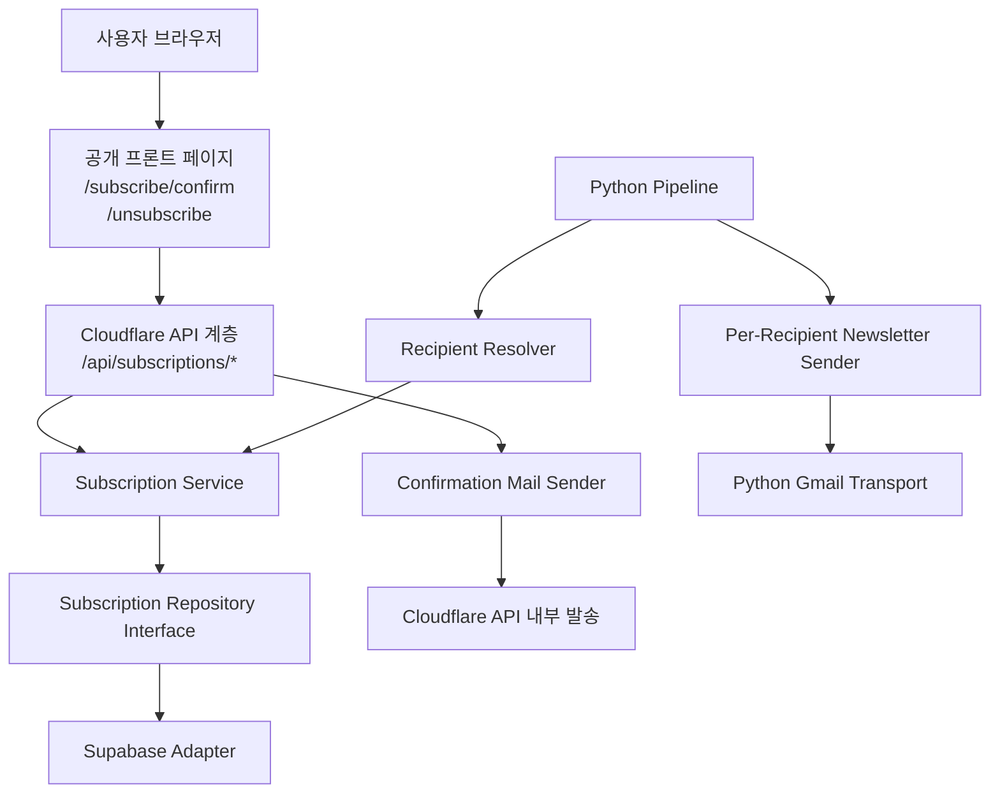

# Design Document: newsletter-subscriptions

## Overview

이 설계는 현재 환경변수 기반 newsletter 수신자 관리 구조를 저장소 기반 구독 시스템으로 전환하고, double opt-in 등록 및 실제 unsubscribe 처리까지 포함하는 전체 흐름을 정의한다. 구현은 세 계층으로 분리한다: Python 파이프라인의 발송 계층, Cloudflare API 계층, Supabase 저장소 adapter 계층.

핵심 목표는 두 가지다. 첫째, 운영자가 더 이상 `GMAIL_RECIPIENT`를 수동 수정하지 않아도 되도록 발송 대상의 source of truth를 구독 저장소로 이전한다. 둘째, 현재는 Supabase를 사용하되 상위 애플리케이션이 특정 저장소 구현에 종속되지 않도록 저장소 추상화를 두어 추후 서버 또는 다른 DB로 이전 가능하게 만든다.

## Architecture



### 계층별 책임

- 공개 프론트
  - 이메일 입력 폼, 확인 결과 페이지, 해지 결과 페이지를 제공한다.
  - 저장소에 직접 접근하지 않고 Cloudflare API만 호출한다.
  - 정적 export 구조를 유지하되, 동적 처리는 API 호출로 해결한다.

- Cloudflare API 계층
  - 구독 신청, 구독 확인, 구독 해지 요청을 처리한다.
  - 토큰 검증, 입력 검증, 응답 정규화, secrets 접근을 담당한다.
  - 저장소 구현 세부사항과 Gmail 자격증명을 브라우저로 노출하지 않는다.

- Subscription Service
  - 구독 lifecycle 규칙을 담당한다.
  - pending 생성, active 전환, unsubscribe 처리, active recipient 조회를 수행한다.
  - 애플리케이션이 사용하는 유일한 비즈니스 진입점이다.

- Subscription Repository Interface
  - 저장소 조회/변경 계약을 정의한다.
  - 구현체는 현재 Supabase adapter 하나로 시작한다.
  - 이후 DB 교체 시 Service 상단 코드는 유지된다.

- Gmail 전송 계층
  - confirmation 메일은 Cloudflare API 계층에서 직접 발송한다.
  - newsletter 메일은 Python 파이프라인에서 수신자별 개별 발송한다.
  - 두 흐름은 mail intent를 분리해 로깅한다.

### 기존 구조와의 연결

- newsletter 발송 진입점은 [pipeline.py:332](/Users/giwon/code/news/src/morning_brief/pipeline.py#L332) 의 `GmailSender(settings).send(...)`를 유지한다.
- 현재 수신자 해석은 [emailer.py:1962](/Users/giwon/code/news/src/morning_brief/emailer.py#L1962) 에서 `self.settings.gmail_recipient`를 읽고 있으므로, 이를 `RecipientResolver` 또는 repository 기반 조회로 대체한다.
- 현재 unsubscribe 링크는 [emailer.py:797](/Users/giwon/code/news/src/morning_brief/emailer.py#L797) 의 `mailto:` 생성 함수이므로, 토큰 기반 URL 생성기로 대체한다.
- 공개 프론트의 [unsubscribe/page.tsx:1](/Users/giwon/code/news/frontend/app/unsubscribe/page.tsx#L1) 는 placeholder 페이지이므로 실제 API 호출 결과를 반영하는 흐름으로 바뀐다.

## Components and Interfaces

### 1. Python 파이프라인 측 수신자 조회

#### 신규 컴포넌트

- `SubscriptionRecipientResolver`
- `SubscriptionRepository` 인터페이스
- `SupabaseSubscriptionRepository` 구현
- `SubscriptionRecord` / `ActiveRecipient` 모델

#### 제안 인터페이스

```python
@dataclass(frozen=True)
class ActiveRecipient:
    email: str
    subscriber_id: str
    newsletter: str


class SubscriptionRepository(Protocol):
    def list_active_recipients(self, newsletter: str) -> list[ActiveRecipient]: ...
```

#### 설계 결정

- 파이프라인은 더 이상 `gmail_recipient` 환경변수 문자열을 해석하지 않는다.
- 대신 저장소에서 `active` 구독자 목록을 조회한 뒤, 기존 Gmail 발송 빌더에 `recipients: list[str]`를 주입한다.
- 이유:
  - Requirement 1, 2 충족
  - 발송 계층 변경 범위를 최소화
  - Supabase 종속성을 emailer 내부에 직접 넣지 않기 위함

### 2. Subscription Service

#### 제안 인터페이스

```ts
type SubscriptionStatus = "pending" | "active" | "unsubscribed" | "bounced";

interface SubscriptionService {
  requestSubscription(input: { email: string; newsletter: "morning-brief"; baseUrl: string }): Promise<RequestSubscriptionResult>;
  confirmSubscription(input: { token: string }): Promise<ConfirmSubscriptionResult>;
  requestUnsubscribe(input: { token: string }): Promise<UnsubscribeResult>;
  getUnsubscribePageState(input: { token: string }): Promise<UnsubscribePageState>;
}
```

#### 설계 결정

- `pending`는 요구사항의 최종 상태 모델에는 없지만, double opt-in 구현을 위해 내부 lifecycle 상태로 필요하다.
- 외부 운영 상태 모델은 `active`, `unsubscribed`, `bounced`를 유지하고, pending은 “아직 활성화되지 않은 등록 의도”를 나타내는 내부 상태로 사용한다.
- 이유:
  - Requirement 3 구현을 단순화
  - 구독 의도와 발송 가능 상태를 분리
  - 추후 다른 저장소로 이전해도 lifecycle 규칙을 유지하기 쉬움

### 3. 토큰 발급 및 검증

#### 제안 모델

- 확인 토큰과 해지 토큰은 별도 테이블로 관리하거나, 공통 token 테이블에 `token_type`으로 구분한다.
- 토큰은 평문 저장 대신 해시 저장을 기본으로 한다.
- 링크에는 평문 토큰만 포함하고, 검증 시 해시 비교를 수행한다.

#### 제안 인터페이스

```ts
interface SubscriptionTokenRecord {
  id: string;
  subscriber_id: string;
  token_type: "confirm_subscription" | "unsubscribe";
  token_hash: string;
  expires_at: string;
  consumed_at: string | null;
}
```

#### 설계 결정

- 토큰을 구독자 레코드에 직접 박지 않고 별도 레코드로 관리한다.
- 이유:
  - 재발급, 만료, 소비 처리 추적이 명확함
  - replay 방지와 감사성 확보에 유리
  - Requirement 4, 9 대응

### 4. Cloudflare API 계층

#### 제안 엔드포인트

- `POST /api/subscriptions/request`
  - 구독 신청
- `POST /api/subscriptions/confirm`
  - 확인 토큰 처리
- `POST /api/subscriptions/unsubscribe`
  - 해지 토큰 처리
- `GET /api/subscriptions/unsubscribe?token=...`
  - 해지 페이지 초기 상태 조회
- `GET /api/subscriptions/confirm?token=...`
  - 확인 페이지 초기 상태 조회

#### 설계 결정

- 공개 페이지 URL과 실제 처리 API를 분리한다.
- 프론트 페이지는 `/subscribe/confirm`, `/unsubscribe`에 두고, 실제 mutation은 `/api/subscriptions/...`에서 수행한다.
- 이유:
  - Requirement 6 직접 대응
  - 정적 export 페이지와 동적 처리 API를 명확히 분리
  - Cloudflare Pages Functions 라우팅 구조와 잘 맞음

### 5. Frontend 페이지 흐름

#### `/unsubscribe`

- URL query에서 token을 읽는다.
- 로드 시 API에 token 상태를 조회한다.
- 유효한 토큰이면 “해지하기” 버튼을 노출한다.
- 버튼 클릭 시 `POST /api/subscriptions/unsubscribe` 호출 후 결과 상태를 렌더링한다.

#### `/subscribe/confirm`

- URL query에서 token을 읽는다.
- 로드 시 `POST /api/subscriptions/confirm` 또는 상태 조회 API를 호출한다.
- 성공, 실패, 만료, 이미 처리됨 상태를 사용자 친화적으로 보여준다.

#### 설계 결정

- 프론트는 저장소나 Gmail 구현을 알지 않는다.
- 이유:
  - Requirement 2, 6 충족
  - 추후 서버 이전 시 프론트 영향 최소화

### 6. Supabase Adapter

#### Python adapter

- 파이프라인에서 active recipients 조회용 읽기 전용 adapter

#### TypeScript adapter

- Cloudflare API에서 구독 신청, 확인, 해지 처리용 읽기-쓰기 adapter

#### 설계 결정

- 언어별 adapter를 분리하되, 저장소 계약 이름과 의미는 공유한다.
- 이유:
  - 현재 시스템은 Python 파이프라인 + TypeScript 프론트/Cloudflare로 나뉘어 있음
  - 한쪽 언어 구현을 다른 쪽에 억지로 재사용하려 하면 복잡성 증가
  - 저장소 contract만 맞추면 추후 서버 이전이 쉬움

### 7. Mail Delivery 분리 방식

#### 신규 또는 변경 컴포넌트

- `ConfirmationMailSender`
- `ConfirmationEmailBuilder`
- 기존 `GmailSender`의 per-recipient 발송 확장 또는 별도 `GmailTransport`

#### 설계 결정

- confirmation 메일은 Cloudflare API 계층에서 직접 발송한다.
- newsletter 메일은 Python 파이프라인에서 수신자별 개별 발송으로 전환한다.
- BCC 단건 발송은 수신자별 unsubscribe URL을 지원할 수 없으므로 제거한다.
- 이유:
  - Requirement 8 충족
  - 구독 신청 시 확인 메일을 동기적으로 처리할 수 있음
  - 수신자별 unsubscribe token 링크 생성이 가능해짐
  - 로깅 시 mail intent와 발송 단위를 분리하기 쉬움

### 8. 운영 및 개발 설정 경계

#### 런타임 설정

- Python 파이프라인
  - Supabase 읽기용 서버 측 비밀값이 필요하다.
  - newsletter 발송 시 active recipient 조회에 사용한다.
- Cloudflare API 계층
  - Supabase 읽기/쓰기용 서버 측 비밀값이 필요하다.
  - 구독 확인 메일 발송용 mail transport 관련 비밀값이 필요하다.
  - 모든 비밀값은 Cloudflare secrets 또는 bindings를 통해 주입한다.
- GitHub Actions
  - Python 파이프라인 실행에 필요한 Supabase 관련 비밀값을 GitHub Secrets로 주입한다.

#### 개발 편의 설정

- Supabase MCP 연결은 선택 사항이다.
- 목적은 Codex가 개발 중 스키마 확인, 테스트 데이터 조회, SQL 검토를 돕는 것이다.
- 애플리케이션 런타임은 MCP 없이도 동작해야 하며, MCP를 production dependency로 간주하지 않는다.

#### 설계 결정

- 런타임 설정과 개발용 MCP 연결을 분리해 문서화한다.
- 이유:
  - Requirement 2, 7의 저장소 독립성과 운영 명확성 보장
  - MCP 유무와 관계없이 앱이 배포 가능해야 함
  - tasks 단계에서 설정 작업과 코드 작업을 분리하기 쉬움

## Data Models

### 1. Subscription

```text
Subscription
- id: uuid
- email: text
- email_normalized: text
- newsletter: text                     # 1차는 "morning-brief" 고정
- status: text                        # pending | active | unsubscribed | bounced
- subscribed_at: timestamptz | null
- unsubscribed_at: timestamptz | null
- bounced_at: timestamptz | null
- status_reason: text | null
- created_at: timestamptz
- updated_at: timestamptz
```

### 2. SubscriptionToken

```text
SubscriptionToken
- id: uuid
- subscriber_id: uuid
- token_type: text                    # confirm_subscription | unsubscribe
- token_hash: text
- expires_at: timestamptz
- consumed_at: timestamptz | null
- created_at: timestamptz
```

### 3. MailEvent (선택적 운영 로그)

```text
MailEvent
- id: uuid
- subscriber_id: uuid | null
- email: text
- mail_type: text                     # newsletter | confirm_subscription
- status: text                        # queued | sent | failed
- provider: text                      # gmail
- error_code: text | null
- created_at: timestamptz
```

### 데이터 모델 결정 이유

- `newsletter` 컬럼은 현재 단일 상품이어도 유지한다.
  - 이유: 향후 확장 여지를 남기되 현재 모델을 복잡하게 만들지 않기 위해
- `email_normalized`를 별도 둔다.
  - 이유: 멱등 upsert 및 대소문자/공백 차이 제거
- `pending`는 Subscription 상태에 포함한다.
  - 이유: double opt-in의 중간 상태를 명시적으로 표현하기 위해
- `bounced`는 1차에서는 수동 갱신만 지원한다.
  - 이유: Gmail 기반에서는 bounce webhook 자동화가 어렵기 때문

## Operational Setup

### 1. Supabase 프로젝트 및 스키마

- 개발용 Supabase 프로젝트 또는 분리된 개발 환경을 먼저 준비한다.
- `subscriptions`, `subscription_tokens`를 기본 테이블로 생성한다.
- 필요 시 운영 감사용 `mail_events`를 추가한다.
- 저장소 contract는 테이블명과 필드명을 직접 상위 계층에 노출하지 않도록 adapter에서 캡슐화한다.

### 2. Python 파이프라인 런타임 설정

- Python 파이프라인은 GitHub Actions 또는 실행 환경에서 아래 서버 측 값을 사용한다.
  - `SUPABASE_URL`
  - `SUPABASE_SERVICE_ROLE_KEY`
  - `SUBSCRIPTION_NEWSLETTER_KEY` 또는 이에 준하는 내부 newsletter 식별값
- `GMAIL_RECIPIENT`는 제거 대상이며, migration 완료 후 정상 발송 경로에서는 사용하지 않는다.

### 3. Cloudflare API 런타임 설정

- Cloudflare Pages Functions 또는 Worker API는 아래 값을 secrets로 사용한다.
  - `SUPABASE_URL`
  - `SUPABASE_SERVICE_ROLE_KEY`
  - `PUBLIC_APP_BASE_URL`
  - confirmation 메일 발송용 transport 비밀값
- 브라우저에는 공개 base URL만 노출하고, 저장소 및 Gmail 자격증명은 노출하지 않는다.

### 3-1. Confirmation 메일 인증 방식 결정

- confirmation 메일은 Cloudflare API 런타임에서 직접 발송해야 한다.
- 따라서 인증 방식은 Cloudflare Functions 환경에서 실행 가능한 방식이어야 한다.
- 구현 착수 전 아래 중 하나를 확정한다.
  - Cloudflare에서 사용할 수 있는 Gmail API 인증 방식
  - Cloudflare 런타임에 맞는 별도 confirmation mail provider
- 이 결정은 운영 문서와 secrets 목록에 반드시 반영한다.

### 4. Gmail 공통 전송 설정

- confirmation 메일은 Cloudflare API 계층의 mail sender가 직접 보낸다.
- newsletter 메일은 Python 파이프라인에서 수신자별 개별 메시지로 보낸다.
- confirmation과 newsletter는 같은 제공자를 쓸 수 있지만, 구현 경계와 실패 처리는 분리한다.
- 운영 문서에는 두 메일 흐름의 실행 주체와 필요한 비밀값을 각각 명시한다.

### 5. GitHub Actions 설정

- newsletter 파이프라인은 GitHub Actions secrets를 통해 Supabase 읽기 비밀값을 주입받는다.
- 테스트 환경에서는 실제 production Supabase가 아닌 dev 환경 또는 mock contract를 사용한다.
- 배포 순서는 “Supabase schema -> Cloudflare secrets -> GitHub Secrets -> application deploy”를 기본 순서로 본다.

### 5-1. 라이브러리 및 런타임 의존성

- Python 구현에는 Supabase client 의존성이 추가된다.
- TypeScript 구현에는 Supabase JavaScript client 및 Cloudflare Functions 개발 보조 의존성이 추가될 수 있다.
- 의존성 추가는 requirements, tasks, 검증 명령에 함께 반영한다.

### 5-2. Cloudflare Functions 로컬/배포 검증

- `frontend/functions/` 경로 추가 후에는 로컬에서 `wrangler pages dev` 또는 이에 준하는 경로로 API를 검증해야 한다.
- Pages static export와 Functions가 함께 배포되는지 preview 배포 기준으로 확인해야 한다.
- 배포 스크립트와 문서에는 Functions 포함 여부를 검증하는 절차를 추가한다.

### 6. 선택적 MCP 개발 설정

- Codex 개발 편의를 위해 Supabase MCP를 연결할 수 있다.
- 이 연결은 개발자가 schema inspection, sample query, migration 검토에 사용하는 보조 수단이다.
- production runtime, CI, 배포 성공 여부는 MCP 연결에 의존하지 않는다.
- 문서에는 MCP를 “선택적 개발 도구”로만 기재한다.

## Correctness Properties

- Property 1
  - *For any* subscription set에 대해, 발송 대상 조회 결과는 status가 `active`인 이메일만 포함해야 한다.
  - Validates: Requirement 1, 5

- Property 2
  - *For any* 동일한 이메일이 여러 번 구독 신청되더라도, 최종 active 상태 구독 레코드는 newsletter 기준으로 중복 생성되지 않아야 한다.
  - Validates: Requirement 3

- Property 3
  - *For any* 만료되었거나 이미 소비된 토큰에 대해, confirm 또는 unsubscribe 동작은 상태 전이를 일으키지 않아야 한다.
  - Validates: Requirement 4, 9

- Property 4
  - *For any* unsubscribed 상태 구독자에 대해, 발송 대상 조회는 해당 이메일을 포함하지 않아야 한다.
  - Validates: Requirement 4, 5

- Property 5
  - *For any* 저장소 구현이 Supabase가 아니더라도, repository contract를 만족하면 구독 lifecycle 결과는 동일해야 한다.
  - Validates: Requirement 2, 7

## Error Handling

| 상황 | 처리 방식 |
|---|---|
| 구독 신청 이메일 형식 오류 | 400 반환, 사용자 친화적 메시지 표시 |
| 동일 이메일 재신청 | 멱등 성공 또는 재확인 메일 재발송 정책에 따라 처리 |
| 확인 토큰 만료 | active 전환 금지, 재신청 유도 |
| 해지 토큰 만료 | unsubscribe 전환 금지, 안전한 실패 페이지 표시 |
| Supabase 읽기 실패 | API는 5xx 반환, 파이프라인은 명시적 실패로 처리 |
| active 구독자 0명 | 파이프라인은 메일 발송 스킵 + 운영 로그 |
| 확인 메일 발송 실패 | pending 유지, active 전환 금지 |
| newsletter 개별 발송 중 일부 수신자 실패 | 해당 수신자 실패를 기록하고 정책에 따라 전체 실패 또는 부분 실패로 집계 |
| bounced 상태 수동 전환 누락 | 시스템은 active만 발송 대상으로 사용하고 운영자가 상태를 관리 |
| Cloudflare secret 누락 | API 초기화 실패로 처리하고 배포 또는 런타임 로그에 명시 |
| GitHub Actions secret 누락 | 파이프라인 시작 시 저장소 조회를 실패 처리하고 원인을 명시적으로 기록 |
| MCP 미설정 | 개발 편의 기능만 제한되고 애플리케이션 설계/실행에는 영향이 없어야 함 |

## Testing Strategy

### Python 테스트

- 대상
  - active recipient 조회
  - emailer의 recipient source 변경
  - unsubscribe URL 생성 변경
- 파일 후보
  - `tests/test_emailer.py`
  - `tests/test_pipeline_quality.py`
  - `tests/test_config.py`
  - 신규 `tests/test_subscriptions_repository.py`

### Frontend / Cloudflare 테스트

- 대상
  - 구독 신청 API
  - 확인 토큰 처리 API
  - 해지 토큰 처리 API
  - `/subscribe/confirm`, `/unsubscribe` 페이지 상태 분기
- 파일 후보
  - `frontend/tests/subscriptions-api.test.ts`
  - `frontend/tests/unsubscribe-page.test.ts`
  - `frontend/tests/confirm-page.test.ts`

### 핵심 테스트 시나리오

1. active recipient selection
- active, unsubscribed, bounced, pending 구독자 혼합 상태에서 active만 발송 대상으로 선택되는지 검증

2. double opt-in flow
- 이메일 제출 -> pending 저장 -> 확인 메일 생성 -> 유효 토큰 클릭 -> active 전환 검증

3. unsubscribe flow
- 유효한 unsubscribe 토큰으로 unsubscribed 전환 및 이후 발송 제외 검증

4. token replay and expiry
- 이미 사용됨, 만료됨, 잘못된 토큰이 상태 전이를 일으키지 않는지 검증

5. idempotent re-subscribe
- 동일 이메일 재신청 시 중복 active 레코드가 생기지 않는지 검증

6. repository abstraction integrity
- service 계층이 Supabase 구체 타입 없이 contract mock으로 검증 가능한지 확인

7. confirmation mail direct send
- confirmation 메일이 Cloudflare API 계층에서 직접 발송되고 실패 시 active 전환이 일어나지 않는지 검증

8. per-recipient newsletter delivery
- newsletter 메일이 수신자별 개별 메시지로 생성되고 unsubscribe URL이 각 수신자에 바인딩되는지 검증

9. operational setup validation
- Supabase schema, Cloudflare secrets, GitHub Secrets, runtime config가 문서화된 계약과 일치하는지 검증

10. MCP independence
- MCP 연결이 없어도 개발 테스트와 런타임 핵심 흐름이 유지되는지 확인

## 주요 설계 결정 요약

- 수신자 source는 환경변수에서 저장소로 완전 대체한다.
- 프론트는 Supabase에 직접 접근하지 않고 Cloudflare API만 호출한다.
- 저장소는 repository interface 뒤에 숨기고, 현재 구현만 Supabase adapter로 둔다.
- 구독 등록은 `pending -> active`의 double opt-in 흐름으로 처리한다.
- unsubscribe는 `mailto:` 대신 토큰 기반 실제 URL로 전환한다.
- `bounced`는 1차에서 스키마와 규칙만 지원하고 운영자가 수동 관리한다.
- confirmation 메일은 Cloudflare API가 직접 발송한다.
- newsletter는 BCC 단건 발송을 버리고 수신자별 개별 발송으로 전환한다.
- Supabase MCP는 선택적 개발 도구로만 취급하고 런타임 의존성으로 두지 않는다.
- 설정 작업은 Supabase, Cloudflare, GitHub Actions로 분리 문서화해 tasks에서 독립적으로 실행 가능하게 한다.
