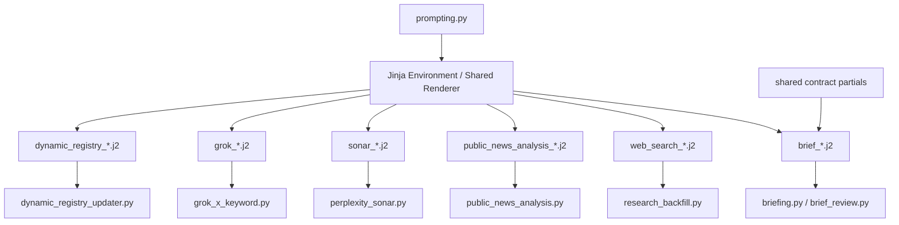

# Design Document: prompt-governance-unification

## Overview

이 설계는 `src/morning_brief/prompts`와 코드 상수로 흩어진 프롬프트 자산을 하나의 거버넌스 아래로 모으되, 현재 파이프라인의 호출 형태와 출력 계약은 유지하는 데 초점을 둔다. 핵심 접근은 `src/morning_brief/prompting.py`를 프롬프트 렌더 허브로 확장하고, Sonar와 일부 Grok 경로를 이 허브에 흡수하며, 브리프 공통 계약은 Jinja partial로 분리하는 것이다.

## Architecture



변경 범위:
- `/Users/giwon/code/news/src/morning_brief/prompting.py`
- `/Users/giwon/code/news/src/morning_brief/prompts/*.j2`
- `/Users/giwon/code/news/src/morning_brief/data/sources/perplexity_sonar.py`
- `/Users/giwon/code/news/src/morning_brief/data/sources/grok_x_keyword.py`
- `/Users/giwon/code/news/src/morning_brief/data/sources/dynamic_registry_updater.py`
- 테스트 파일 추가 또는 확장

### Design Decision 1: `prompting.py`를 단일 렌더 허브로 확장한다

- 이유: 현재 브리프/검수/재작성/웹검색/공개뉴스해설만 공용 렌더 경로를 사용하고 Sonar는 직접 로딩을 우회한다.
- 결정: 모든 템플릿 기반 프롬프트는 `prompting.py`에서 렌더링하도록 통합한다.
- 호환성: 호출부는 계속 `instructions, user_prompt` 또는 `system_prompt, user_prompt` 튜플을 받는다.

### Design Decision 2: Sonar 토픽 로딩은 동적 파일명 조합 대신 명시적 매핑으로 바꾼다

- 이유: `f"sonar_topic_{topic}.j2"` 패턴은 정적 분석상 미사용처럼 보여 운영 가시성이 떨어진다.
- 결정: 지원 토픽을 정적 매핑 테이블로 고정하고, 렌더는 `prompting.py` 함수가 수행한다.
- 호환성: 기존 지원 토픽 `macro`, `us_equity`, `ai_bigtech`, `bitcoin`만 허용한다.

### Design Decision 3: 브리프 핵심 계약은 partial include로 분리한다

- 이유: 생성·검수·재작성 프롬프트에 같은 규칙이 반복되어 드리프트 위험이 크다.
- 결정: 섹션 구조, BTC 규칙, 뉴스 한국어 의역, 쉬운 문체, 단정 표현 금지 같은 공통 규칙을 partial로 이동한다.
- 호환성: 각 프롬프트는 공통 partial을 include하고, 단계별 고유 규칙만 로컬에 남긴다.

### Design Decision 4: `public_news_analysis_input.j2`는 호출부 통합으로 단순화한다

- 이유: 현재는 `{{ items_json }}` 한 줄만 출력하므로 템플릿 분리 이점이 없다.
- 결정: `render_public_news_analysis_prompts()`는 instructions만 템플릿으로 렌더하고, input은 호출부에 전달받은 `items_json`을 그대로 반환한다.
- 호환성: `public_news_analysis.py`는 계속 `instructions, user_prompt` 인터페이스를 사용한다.

### Design Decision 5: 하드코딩 프롬프트 정책은 “장문 지시문은 템플릿, SDK 제약 설명은 코드 인접”으로 고정한다

- 이유: `prompts/`만 보면 전체 프롬프트 자산을 다 보는 것처럼 오해할 수 있다.
- 결정:
  - `grok_x_keyword.py` 장문 검색 프롬프트는 템플릿으로 이동한다.
  - `dynamic_registry_updater.py`의 system/user 프롬프트도 템플릿으로 이동한다.
  - SDK 제약, 캐시 정책, 그룹 순서 같은 실행 제약은 코드 인접 주석/상수로 남긴다.
- 호환성: 캐시 최적화에 필요한 message 순서와 conv-id는 유지한다.

## Components and Interfaces

### 1. Prompt asset registry in `prompting.py`

대상 파일:
- `/Users/giwon/code/news/src/morning_brief/prompting.py`

추가 인터페이스:

```python
from dataclasses import dataclass
from pathlib import Path

@dataclass(frozen=True)
class PromptAsset:
    name: str
    instructions_template: str | None = None
    input_template: str | None = None
    system_template: str | None = None
    versioned: bool = True

PROMPT_ASSETS: dict[str, PromptAsset]
SONAR_TOPIC_TEMPLATE_MAP: dict[str, str]

def render_prompt_pair(
    asset: PromptAsset,
    *,
    settings: Settings,
    context: dict[str, object],
) -> tuple[str, str]: ...

def render_sonar_topic_prompts(
    *,
    topic: str,
    settings: Settings,
    time_range: str,
) -> tuple[str, str]: ...

def render_sonar_context_prompts(
    *,
    articles: list[dict[str, str]],
    settings: Settings,
    time_range: str,
) -> tuple[str, str]: ...

def render_grok_keyword_prompt(
    *,
    group: str,
    lookback_hours: int,
    max_items: int,
    weekend_context: bool,
    settings: Settings,
) -> str: ...

def render_dynamic_registry_prompts(
    *,
    today_iso: str,
    settings: Settings,
) -> tuple[str, str]: ...
```

설계:
- `PromptAsset`는 instructions/input 또는 system/input 쌍을 설명한다.
- `PROMPT_ASSETS`는 정적 인벤토리 역할을 한다.
- `render_prompt_pair()`는 공통 Jinja 렌더와 `prompt_template_version` 주입을 담당한다.
- `render_sonar_topic_prompts()`는 토픽명을 파일명으로 조합하지 않고 `SONAR_TOPIC_TEMPLATE_MAP`을 통해 템플릿을 선택한다.

이유:
- Requirement 1, 2, 5 충족
- 테스트에서 “프롬프트 인벤토리 = 실제 사용 자산”을 직접 검증할 수 있다.

### 2. Shared contract partials for brief prompts

대상 파일:
- `/Users/giwon/code/news/src/morning_brief/prompts/brief_instructions.j2`
- `/Users/giwon/code/news/src/morning_brief/prompts/brief_input.j2`
- `/Users/giwon/code/news/src/morning_brief/prompts/brief_validator_instructions.j2`
- `/Users/giwon/code/news/src/morning_brief/prompts/brief_rewrite_instructions.j2`

추가 템플릿:

```text
src/morning_brief/prompts/_brief_contract_sections.j2
src/morning_brief/prompts/_brief_contract_content_rules.j2
src/morning_brief/prompts/_brief_contract_language_rules.j2
```

설계:
- `sections`: Section 0~6 구조, BTC 절대값 일관성, 섹터 매핑 구조
- `content_rules`: 뉴스 한국어 의역, 숫자 단위, 괴리 설명, 투자 권유 금지
- `language_rules`: 쉬운 한국어, 허용/금지 어미, 단정 표현 금지
- 생성/검수/재작성 프롬프트는 공통 partial을 include하고, 검수 JSON 스키마나 rewrite 최소수정 원칙처럼 단계 전용 규칙만 별도 파일에 둔다.

이유:
- Requirement 3 충족
- 프롬프트 품질보다 계약 일관성이 우선인 영역이다.

### 3. Sonar integration path

대상 파일:
- `/Users/giwon/code/news/src/morning_brief/data/sources/perplexity_sonar.py`

변경 인터페이스:

```python
def _render_topic_prompt(topic: str) -> tuple[str, str]: ...
def _render_context_prompt(articles: list[dict[str, str]]) -> tuple[str, str]: ...
```

설계:
- 기존 `_load_topic_prompt()`와 `_load_system_prompt()`는 제거하고 `prompting.py` 호출로 대체한다.
- `time_range`는 호출부에서 계산 후 템플릿 컨텍스트로 전달한다.
- 기사 목록은 Jinja loop로 렌더링한다. 현재의 문자열 치환 기반 article block 조립은 제거한다.

이유:
- Requirement 2 충족
- template versioning과 static inventory를 Sonar에도 적용할 수 있다.

### 4. Public news analysis input simplification

대상 파일:
- `/Users/giwon/code/news/src/morning_brief/prompting.py`
- `/Users/giwon/code/news/src/morning_brief/public_news_analysis.py`

변경 인터페이스:

```python
def render_public_news_analysis_prompts(
    *,
    items_json: str,
    settings: Settings,
) -> tuple[str, str]:
    ...
```

설계:
- 함수 시그니처는 유지한다.
- 내부적으로 `instructions`만 템플릿 렌더를 하고, `user_prompt`는 `items_json` 그대로 반환한다.
- `public_news_analysis_input.j2`는 삭제하거나, 유지해야 하면 deprecated 대상으로 표시한다.

이유:
- Requirement 4 충족
- 호출부 변경을 최소화한다.

### 5. Grok prompt centralization

대상 파일:
- `/Users/giwon/code/news/src/morning_brief/data/sources/grok_x_keyword.py`
- `/Users/giwon/code/news/src/morning_brief/data/sources/dynamic_registry_updater.py`

추가 템플릿:

```text
src/morning_brief/prompts/grok_keyword_macro_and_equity.j2
src/morning_brief/prompts/grok_keyword_ai_bigtech_primary.j2
src/morning_brief/prompts/grok_keyword_bitcoin_crypto.j2
src/morning_brief/prompts/dynamic_registry_system.j2
src/morning_brief/prompts/dynamic_registry_input.j2
```

설계:
- `grok_x_keyword.py`는 `GROUP_PROMPTS` 문자열 상수 대신 `GROUP_TEMPLATE_MAP`으로 바꾼다.
- `dynamic_registry_updater.py`는 고정 system prompt와 날짜 기반 user prompt를 템플릿으로 이동한다.
- `x-grok-conv-id`, `_SEARCH_GROUPS`, 그룹 순서, allowed handle slicing 같은 캐시/도구 제약은 코드에 남긴다.

이유:
- Requirement 5 충족
- “장문 지시문은 템플릿으로, 실행 제약은 코드로”라는 정책을 코드에 반영한다.

## Data Models

새 데이터 구조는 경량으로 유지한다.

```python
from dataclasses import dataclass

@dataclass(frozen=True)
class PromptAsset:
    name: str
    instructions_template: str | None = None
    input_template: str | None = None
    system_template: str | None = None
    versioned: bool = True

PromptAssetRegistry = dict[str, PromptAsset]

SonarTopicTemplateMap = dict[str, str]

GrokKeywordTemplateMap = dict[str, str]
```

필드 규칙:
- `instructions_template`: OpenAI Responses `instructions` 용 템플릿
- `input_template`: OpenAI Responses `input` 용 템플릿
- `system_template`: system role 메시지 템플릿
- `versioned=False`: 런타임 특성상 `prompt_template_version` 주입이 불필요한 예외에만 사용

이번 설계에서는 새로운 외부 JSON 스키마는 도입하지 않는다.

## Correctness Properties

- *For any* prompt asset declared in `PROMPT_ASSETS`, a corresponding runtime render path must exist in code or tests must fail.  
  _Requirements: 1.1, 1.4_

- *For any* Sonar topic in `{macro, us_equity, ai_bigtech, bitcoin}`, `render_sonar_topic_prompts()` must return one system prompt and one user prompt without direct string replacement in caller code.  
  _Requirements: 2.1, 2.3, 2.5, 2.6_

- *For any* change to shared brief contract partials, generated brief prompts, validator prompts, and rewrite prompts must reflect the same section structure and BTC absolute-price rule.  
  _Requirements: 3.1, 3.4, 3.5_

- *For any* public news analysis batch, the prompt path must continue to supply the current JSON schema-compatible input and output contract.  
  _Requirements: 4.2, 6.6_

- *For any* exception where a prompt remains as a code constant, the adjacent source file must identify the exception reason in code comments or explicit constant naming.  
  _Requirements: 5.3, 5.5_

- *For any* existing call site in `briefing.py`, `brief_review.py`, `research_backfill.py`, `public_news_analysis.py`, `perplexity_sonar.py`, `grok_x_keyword.py`, and `dynamic_registry_updater.py`, prompt refactoring must not change the expected tuple shape or break runtime invocation.  
  _Requirements: 6.1, 6.3_

## Error Handling

| 상황 | 처리 방식 |
| --- | --- |
| 템플릿 파일 누락 | `PromptTemplateError` 또는 기존 예외를 유지하고 호출부에서 현재 실패 처리 로직을 사용 |
| Sonar 토픽 키가 매핑에 없음 | 명시적 `PromptTemplateError` 또는 `ValueError`로 실패, 조용한 fallback 금지 |
| partial include 누락 | 렌더 단계에서 실패시켜 계약 불일치를 조기에 노출 |
| `items_json` 직접 반환 경로에서 빈 문자열 전달 | 호출부가 기존 JSON 생성 책임을 유지하므로 입력 검증 실패 시 현재 호출부 예외 처리 사용 |
| Grok 예외 유지 프롬프트가 템플릿 정책과 어긋남 | 테스트 또는 inventory 검증에서 실패시켜 정책 위반을 노출 |
| prompt version 주입이 예외 경로에 불필요 | `PromptAsset.versioned=False`로 명시하고 테스트에서 허용 예외로 검증 |

## Testing Strategy

### Unit tests

대상 파일:
- `/Users/giwon/code/news/tests/test_prompting.py` 또는 동등한 새 테스트 파일

추가 검증:
- `PROMPT_ASSETS`에 정의된 자산이 실제 렌더 가능함
- Sonar 토픽 매핑 4종이 모두 렌더됨
- public news analysis는 `items_json` passthrough를 유지함
- shared partial 변경이 생성/검수/재작성 프롬프트에 모두 반영됨

### Regression tests

기존 호출부 기준 회귀 검증:
- `/Users/giwon/code/news/src/morning_brief/briefing.py`
- `/Users/giwon/code/news/src/morning_brief/brief_review.py`
- `/Users/giwon/code/news/src/morning_brief/research_backfill.py`
- `/Users/giwon/code/news/src/morning_brief/public_news_analysis.py`
- `/Users/giwon/code/news/src/morning_brief/data/sources/perplexity_sonar.py`
- `/Users/giwon/code/news/src/morning_brief/data/sources/grok_x_keyword.py`
- `/Users/giwon/code/news/src/morning_brief/data/sources/dynamic_registry_updater.py`

검증 포인트:
- 반환 튜플 형태 유지
- JSON schema 이름과 필수 필드 유지
- 브리프 검수 JSON 필드 유지
- Sonar 토픽별 렌더 경로 유지

### Contract tests

정적/동적 자산 가시성 검증:
- `src/morning_brief/prompts` 안 파일 목록과 `PROMPT_ASSETS`/토픽 매핑 간 차이를 검사
- 허용 예외(코드 상수 유지)가 있으면 명시적 allowlist로 검증

### Verification commands

최소 검증:
```bash
make test
make lint
```

프롬프트 관련 좁은 범위 검증이 가능하면 우선:
```bash
pytest tests -k prompt
pytest tests -k sonar
pytest tests -k brief
```
