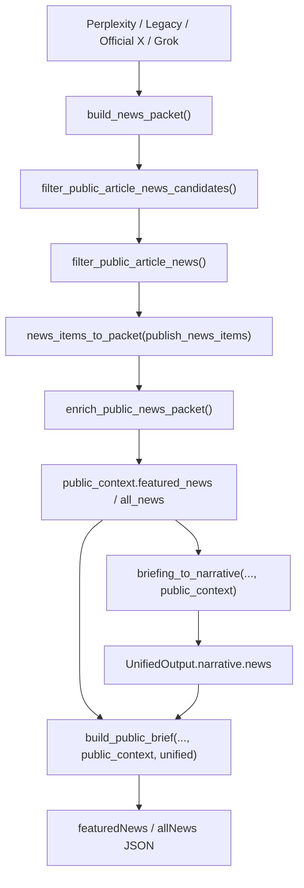

# Design Document: Public News Analysis Generation

## Overview

이 설계는 공개 기사형 뉴스가 최종 선택된 뒤, `summaryKo`와 `interpretation`에 해당하는 한국어 해설을 별도로 생성하는 단계를 추가한다. 핵심은 기존 뉴스 수집과 X 시그널 분리 구조는 유지하면서, `public_context`가 만들어지는 시점에 기사형 뉴스만 후처리로 enrich하여 `UnifiedOutput -> build_public_brief()` 경로 전체에서 같은 결과를 소비하게 만드는 것이다.

이번 변경은 프론트 계약을 바꾸지 않는다. 대신 공개 뉴스 내부 표현에만 `summary_ko`, `interpretation_ko` 같은 내부 필드를 추가하고, 최종 직렬화 단계에서 이를 우선 사용하도록 바꾼다.

## Architecture

현재 경로에서 문제는 `public_context["all_news"]`가 기사형 뉴스 선택까지는 되지만, 기사 카드용 한국어 해설 생성 단계가 없다는 점이다. 그래서 `public_site.py`는 기존 `summary`와 `why_it_matters`를 재사용해 `summaryKo`와 `interpretation`을 같은 값으로 만들고 있다.

새 구조는 `build_news_packet()` 안에서 공개 뉴스 후보를 고른 직후, `public_context`를 조립하기 전에 기사형 뉴스 packet에 후처리 생성 단계를 삽입한다.



### 변경 영향 범위

- `src/morning_brief/data/news.py`
- `src/morning_brief/public_site.py`
- `src/morning_brief/prompting.py`
- `src/morning_brief/config.py`
- `src/morning_brief/data/news_packet.py`
- 신규: `src/morning_brief/public_news_analysis.py`
- 신규 프롬프트:
  - `src/morning_brief/prompts/public_news_analysis_instructions.j2`
  - `src/morning_brief/prompts/public_news_analysis_input.j2`

Design Decision:
해설 생성은 `public_site.build_public_brief()` 안이 아니라 `build_news_packet()` 직후 `public_context` 조립 전에 수행한다.

이유:
- `UnifiedOutput.narrative.news`는 `public_context["all_news"]`를 우선 소비한다. `/Users/giwon/code/news/src/morning_brief/unified_output.py:525`
- 이 시점에 enrich하면 `unified` 경로와 `public_context` 경로 모두 같은 데이터를 보게 된다.
- 반대로 `public_site.py` 직렬화 직전에만 enrich하면 `unified` 경로가 낡은 뉴스 데이터를 계속 사용하게 된다.

Design Decision:
생성 결과는 `NewsItem` dataclass를 바꾸지 않고 packet dict에만 내부 필드로 추가한다.

이유:
- `NewsItem`은 수집/랭킹/백필 등 전체 뉴스 파이프라인 공용 모델이다. `/Users/giwon/code/news/src/morning_brief/models.py:18`
- 이번 기능은 공개 사이트용 후처리이므로 공용 모델까지 넓히면 영향 범위가 커진다.
- packet dict는 이미 public_context 내부 전용 표현이므로 국소 변경이 가능하다.

## Components and Interfaces

### 1. 공개 뉴스 해설 생성 모듈

신규 파일: `src/morning_brief/public_news_analysis.py`

```python
from dataclasses import dataclass
from typing import Any

@dataclass(frozen=True)
class PublicNewsAnalysisInput:
    id: str
    title: str
    url: str
    source: str
    topic: str | None
    published_at: str | None
    summary: str | None
    why_it_matters: str | None
    citations: list[str]

@dataclass(frozen=True)
class PublicNewsAnalysisOutput:
    id: str
    summary_ko: str
    interpretation_ko: str

@dataclass(frozen=True)
class PublicNewsAnalysisAudit:
    candidate_count: int
    requested_count: int
    success_count: int
    skipped_count: int
    failed_count: int
    status: str  # "ok" | "partial" | "failed" | "skipped"

def enrich_public_news_packet(
    *,
    items: list[dict[str, Any]],
    settings: Settings,
    observer: PipelineObserver | None = None,
) -> tuple[list[dict[str, Any]], PublicNewsAnalysisAudit]:
    ...
```

역할:
- 공개 기사형 뉴스 packet을 입력으로 받는다.
- 기사별 분석 입력을 정규화한다.
- OpenAI Responses API로 배치 생성한다.
- 결과를 `summary_ko`, `interpretation_ko`로 병합한다.
- 실패/부분 실패/placeholder를 audit에 기록한다.

Design Decision:
`enrich_public_news_packet()`은 입력/출력 모두 packet dict를 사용한다.

이유:
- `build_news_packet()`는 이미 `publish_news_items`를 `news_items_to_packet()`으로 직렬화한 뒤 `public_context`에 넣는다.
- 같은 표현을 쓰면 공용 dataclass 수정 없이 바로 적용할 수 있다.
- `packet_item_to_news_item()`은 새 필드를 무시하므로 기존 경로와 충돌하지 않는다. `/Users/giwon/code/news/src/morning_brief/data/news_packet.py:10`

### 2. OpenAI 호출 및 프롬프트 렌더링

변경 파일: `src/morning_brief/prompting.py`

추가 함수:

```python
PUBLIC_NEWS_ANALYSIS_INSTRUCTIONS_TEMPLATE = "public_news_analysis_instructions.j2"
PUBLIC_NEWS_ANALYSIS_INPUT_TEMPLATE = "public_news_analysis_input.j2"

def render_public_news_analysis_prompts(
    *,
    items_json: str,
    settings: Settings,
) -> tuple[str, str]:
    ...
```

프롬프트 입력은 기사별 최소 메타데이터만 전달한다.

예상 입력 예시:

```json
{
  "items": [
    {
      "id": "news-1",
      "title": "...",
      "source": "Reuters",
      "topic": "macro",
      "url": "https://...",
      "published_at": "2026-03-28T17:00:00+09:00",
      "summary": "...",
      "why_it_matters": "...",
      "citations": ["https://..."]
    }
  ]
}
```

예상 출력 스키마:

```json
{
  "items": [
    {
      "id": "news-1",
      "summary_ko": "...",
      "interpretation_ko": "..."
    }
  ]
}
```

Design Decision:
프롬프트는 기존처럼 Jinja 템플릿 파일로 분리한다.

이유:
- 브리프 생성/검증/웹서치와 동일한 패턴을 재사용할 수 있다. `/Users/giwon/code/news/src/morning_brief/prompting.py:99`
- 프롬프트 튜닝을 코드 로직 변경 없이 관리할 수 있다.
- 캐시 키 구성도 기존 `build_prompt_cache_key()`를 그대로 재사용할 수 있다.

### 3. 설정 추가

변경 파일: `src/morning_brief/config.py`

추가 필드:

```python
@dataclass(frozen=True)
class Settings:
    ...
    openai_public_news_analysis_enabled: bool
    openai_public_news_analysis_model: str
```

기본값:
- `openai_public_news_analysis_enabled`: `True`
- `openai_public_news_analysis_model`: `OPENAI_PUBLIC_TRANSLATION_MODEL` 또는 `OPENAI_MODEL` fallback

Design Decision:
분석 모델은 공개 번역 모델과 별도 설정으로 둔다.

이유:
- 번역과 기사 해설 생성은 토큰 사용량과 품질 요구가 다르다.
- 운영 중 비용/품질 이슈가 생겼을 때 독립적으로 조정할 수 있다.
- disabled 상태를 둘 수 있어 emergency rollback이 쉽다.

### 4. 공개 뉴스 선택 후 enrich 단계 삽입

변경 파일: `src/morning_brief/data/news.py`

현재 구조:

```python
public_ranked_items = _dedup_and_rank(...)
publish_news_items, publish_news_audit = filter_public_article_news(public_ranked_items)
public_context = {
    "featured_news": _news_items_to_packet(...),
    "all_news": _news_items_to_packet(...),
    ...
}
```

변경 후 구조:

```python
public_ranked_items = _dedup_and_rank(...)
publish_news_items, publish_news_audit = filter_public_article_news(public_ranked_items)

public_news_packet = _news_items_to_packet(publish_news_items)
public_news_packet, public_news_analysis_audit = enrich_public_news_packet(
    items=public_news_packet,
    settings=settings,
    observer=observer,
)

public_context = {
    "featured_news": public_news_packet[:PUBLIC_FEATURED_NEWS_ITEMS],
    "all_news": public_news_packet,
    ...
}
```

Design Decision:
생성 대상은 `filter_public_article_news()`를 통과한 기사형 뉴스만 사용한다.

이유:
- 구조적으로 X와 뉴스를 이미 분리했으므로, 생성 비용을 비기사형 후보에 쓰지 않아야 한다.
- placeholder/X 오염을 줄인 뒤의 최종 공개 후보만 해설하면 품질과 비용 효율이 가장 좋다.
- 공개 슬롯이 줄어들더라도 “품질 우선” 정책과 일치한다.

### 5. public_site 직렬화 우선순위 보정

변경 파일: `src/morning_brief/public_site.py`

현재 `_news_items_v2()`와 `_news_items()`는 `why_it_matters`와 `summary`만으로 `summaryKo`와 `interpretation`을 같은 값으로 채운다. `/Users/giwon/code/news/src/morning_brief/public_site.py:1077`, `/Users/giwon/code/news/src/morning_brief/public_site.py:1167`

변경 후 우선순위:

```python
interpretation_ko = _best_korean_text(
    item.get("interpretation_ko", ""),
    item.get("why_it_matters", ""),
    item.get("summary", ""),
)

summary_ko = _best_korean_text(
    item.get("summary_ko", ""),
    item.get("summary", ""),
    item.get("why_it_matters", ""),
)
```

최종 직렬화:

```python
{
    "interpretation": interpretation_ko,
    "summaryKo": summary_ko,
}
```

또한 `allNews`도 `featuredNews`와 동일하게 최종 display filter를 거친 결과만 노출한다.

변경 전:
- `featuredNews`: filtered
- `allNews`: unfiltered

변경 후:
- `display_news = _filter_public_news_for_display(all_news)`
- `featuredNews = display_news[:limit]`
- `allNews = display_news`

Design Decision:
최종 방어선은 `public_site.py`에 남긴다.

이유:
- upstream 생성이 실패해도 placeholder가 공개 JSON으로 새는 것을 막을 수 있다.
- `unified` 경로와 비-`unified` 경로 모두 같은 최종 검증 규칙을 공유할 수 있다.
- `featuredNews`만 막고 `allNews`에 placeholder가 남는 불일치를 제거한다.

## Data Models

### 내부 packet 확장 필드

`news_items_to_packet()`이 만드는 public news packet dict에 아래 선택 필드를 추가한다.

```python
type PublicNewsPacketItem = TypedDict(
    "PublicNewsPacketItem",
    {
        "title": str,
        "url": str,
        "source": str,
        "published_at": str | None,
        "domain": str | None,
        "source_tier": int | None,
        "preferred_source": bool,
        "age_hours": float | None,
        "topic": str | None,
        "provider": str | None,
        "summary": str | None,
        "why_it_matters": str | None,
        "citations": list[str],
        "official_source": bool,
        "summary_ko": str | None,
        "interpretation_ko": str | None,
    },
    total=False,
)
```

규칙:
- `summary_ko`, `interpretation_ko`는 공개 뉴스 enrich 단계에서만 채운다.
- 기존 packet 소비자는 이 필드를 몰라도 동작해야 한다.
- `packet_item_to_news_item()`은 이 필드를 무시한다.

### 분석 audit 모델

```python
@dataclass(frozen=True)
class PublicNewsAnalysisAudit:
    candidate_count: int
    requested_count: int
    success_count: int
    skipped_count: int
    failed_count: int
    status: str
```

상태 값:
- `ok`: 모든 배치 성공
- `partial`: 일부만 성공
- `failed`: 요청했지만 전부 실패
- `skipped`: disabled / no_api_key / no_items

## Correctness Properties

1. *For any* `filter_public_article_news()`를 통과한 기사형 뉴스 packet 집합에 대해, `enrich_public_news_packet()`은 입력 순서를 보존하면서 최대 동일 개수의 packet을 반환해야 한다.  
   _Requirements: 1, 7, 9_

2. *For any* 생성 성공 항목에 대해, 최종 `build_public_brief()` 출력의 `allNews[*].summaryKo`와 `allNews[*].interpretation`은 빈 문자열이 아니어야 한다.  
   _Requirements: 3, 4, 6_

3. *For any* 생성 실패 또는 placeholder 결과에 대해, `build_public_brief()`는 해당 항목을 `featuredNews`와 `allNews`의 공개 결과에서 제외하거나 축소된 집합으로 유지해야 한다.  
   _Requirements: 5, 7_

4. *For any* X 기반 항목에 대해, `featuredNews/allNews` 생성 경로는 해당 항목을 다시 포함하지 않아야 하며, `featuredXSignals/allXSignals` 경로는 기존대로 유지되어야 한다.  
   _Requirements: 1, 7, 8_

5. *For any* `UnifiedOutput -> build_public_brief()` 경로에 대해, enriched `summary_ko`와 `interpretation_ko`가 있으면 최종 공개 JSON은 이를 우선 사용해야 한다.  
   _Requirements: 6, 10_

6. *For any* `openai_public_news_analysis_enabled=False` 또는 API key 없음 상태에 대해, 시스템은 파이프라인을 중단하지 않고 기존 기사형 뉴스와 최종 display filter만으로 공개 결과를 생성해야 한다.  
   _Requirements: 5, 8, 10_

## Error Handling

| 상황 | 처리 방식 |
| --- | --- |
| 공개 기사형 뉴스가 0건 | 해설 생성 스킵, `status="skipped"` 기록 |
| `OPENAI_API_KEY` 없음 | 생성 스킵, 경고 로그 남기고 기존 기사 packet 유지 |
| `openai_public_news_analysis_enabled=False` | 생성 스킵, 기존 공개 뉴스 경로 유지 |
| OpenAI 요청 예외 | 해당 배치만 실패 처리, 나머지 배치 계속 진행 |
| JSON schema 파싱 실패 | 해당 배치 실패 처리, 경고 로그 기록 |
| 출력에 `id` 누락 | 해당 결과 무시 |
| 출력에 `summary_ko` 또는 `interpretation_ko` 누락 | 해당 항목은 enrich 미적용 |
| 출력이 placeholder / 과도한 반복 | 해당 항목은 enrich 미적용 |
| 생성 실패 후 원본 기사도 표시 기준 미달 | `public_site` 최종 filter에서 제외 |
| 일부 배치만 성공 | 성공 항목만 반영, audit는 `partial` |
| 전부 실패 | 기존 기사 packet 유지, 최종 공개 단계에서 유효 기사만 남김 |

## Testing Strategy

### 1. 단위 테스트: 생성 모듈

신규 테스트 파일:
- `tests/test_public_news_analysis.py`

검증 항목:
- 정상 응답 병합
- 일부 항목 누락 응답 처리
- placeholder 출력 제거
- disabled / no_api_key skip
- batch partial failure 처리

### 2. 통합 테스트: 뉴스 패킷 조립

기존 파일:
- `tests/test_news_quality.py`

추가 검증:
- `build_news_packet()`이 공개 기사형 뉴스 packet에 `summary_ko`, `interpretation_ko`를 채우는지
- X 기반 항목이 enrich 대상에 포함되지 않는지
- 이메일용 `email_ranked_items` 경로는 그대로 유지되는지

### 3. 통합 테스트: public JSON 직렬화

기존 파일:
- `tests/test_public_site.py`

추가 검증:
- `_news_items_v2()`와 `_news_items()`가 생성된 `summary_ko`, `interpretation_ko`를 우선 사용
- `featuredNews`와 `allNews` 모두 최종 filter를 거치는지
- `UnifiedOutput -> build_public_brief()` 경로에서 enrich 결과가 반영되는지
- 생성 실패 시 축소된 기사 개수로 유지되는지

### 4. 회귀 테스트

기존 파일:
- `tests/test_research_backfill.py`

검증 항목:
- research_backfill 경로가 새 공개 뉴스 분석 단계를 호출하지 않는지
- publish filter / X 시그널 selection의 기존 규칙이 유지되는지

### 5. 검증 명령

권장 검증 순서:

```bash
cd /Users/giwon/code/news
uv run pytest tests/test_public_news_analysis.py tests/test_news_quality.py tests/test_public_site.py tests/test_research_backfill.py -q
uv run ruff check src/morning_brief/public_news_analysis.py src/morning_brief/data/news.py src/morning_brief/public_site.py src/morning_brief/prompting.py src/morning_brief/config.py tests/test_public_news_analysis.py tests/test_news_quality.py tests/test_public_site.py tests/test_research_backfill.py
```
