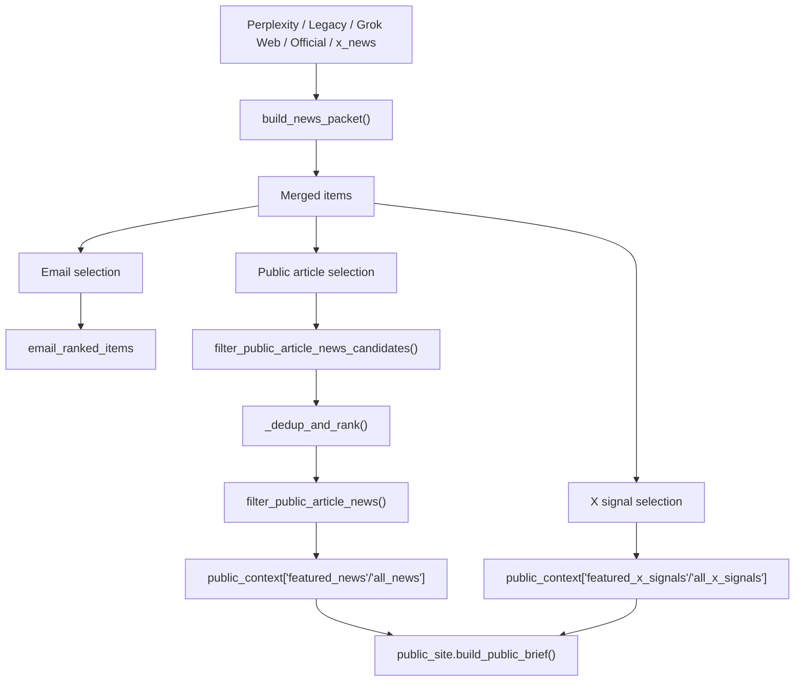

# Design Document: Public News Article Selection

## Overview

이 버그픽스의 목표는 공개 브리프의 `featuredNews/allNews`가 기사형 뉴스보다 X 기반 항목을 우선 포함하는 문제를 해결하고, `summaryKo`/`interpretation`에 `"해당 없음"` 같은 placeholder가 들어가 뉴스 카드가 비어 보이는 현상을 방지하는 것이다.

근본 원인은 두 가지다.

1. `build_news_packet()`가 `x_news`를 일반 뉴스 후보군에 합친 뒤, 공개 뉴스 선택에서도 같은 후보군을 그대로 사용한다.
2. 공개 직렬화 단계가 placeholder 한국어 문구를 유효한 해설 텍스트로 받아들일 수 있다.

설계 방향은 `공개 뉴스 선택 정책`을 별도 계층으로 명확히 분리하는 것이다. 이메일용 뉴스 선택, X 시그널 선택, 공개 JSON 계약은 유지하고, 공개 뉴스에 한해서만 기사형 뉴스와 의미 있는 해설을 더 엄격하게 요구한다. 기사형 뉴스가 부족한 날에는 X 항목으로 슬롯을 메우지 않고, 축소된 개수의 기사형 뉴스만 노출한다.

## Architecture

### 현재 구조

- `src/morning_brief/data/news.py`는 Perplexity, legacy 뉴스, Grok web, official signals, `x_news`를 하나의 `items` 후보군으로 병합한다.
- 같은 모듈에서 `filter_publish_news_candidates()`와 `filter_publish_news()`를 거쳐 `public_context["featured_news"]`, `public_context["all_news"]`를 만든다.
- `src/morning_brief/public_site.py`는 `public_context["all_news"]` 또는 `UnifiedOutput.narrative.news`를 사용해 `featuredNews/allNews` JSON을 만든다.
- `src/morning_brief/data/sources/grok_x_keyword.py`는 X 시그널을 `XSignal`과 `NewsItem` 두 형태로 모두 생산할 수 있다.

### 목표 구조

- `items` 병합 구조 자체는 유지한다.
- 다만 공개 뉴스 직렬화 직전, `공개 기사형 뉴스 전용 필터`를 별도 적용한다.
- 이 필터는 `@handle` 기반 source, `x.com/twitter.com` URL, 의미 없는 `why_it_matters/summary`를 공개 뉴스 후보에서 제외한다.
- X 기반 항목은 `featuredXSignals/allXSignals` 경로로만 계속 노출되도록 둔다.
- `public_site.py`의 `_best_korean_text()`와 `_filter_public_news_for_display()`는 마지막 방어선으로 유지하되, 정책 판단의 주체는 `news_selection.py`로 이동한다.

### 계층 다이어그램



### 변경 영향 범위

- 핵심 변경
  - `/Users/giwon/code/news/src/morning_brief/data/news_selection.py`
  - `/Users/giwon/code/news/src/morning_brief/data/news.py`
- 방어선 유지 및 소폭 보강
  - `/Users/giwon/code/news/src/morning_brief/public_site.py`
- 테스트 변경
  - `/Users/giwon/code/news/tests/test_news_quality.py`
  - `/Users/giwon/code/news/tests/test_public_site.py`

Design Decision:
공개 뉴스 정책은 `public_site.py`가 아니라 `news_selection.py`에 둔다.
이유: 정책이 직렬화 단계가 아니라 선택 단계에서 적용되어야 `public_context` 자체가 깨끗해지고, source count와 후보군 감사 정보도 실제 공개 품질을 반영할 수 있기 때문이다.

Design Decision:
기존 `filter_publish_news()`를 직접 바꾸지 않고, 공개 뉴스 전용 필터를 별도로 추가한다.
이유: 현재 `filter_publish_news()`는 이메일, 연구 백필, 공개 선택이 모두 참조할 수 있어 의미를 과도하게 바꾸면 회귀 위험이 크다. 공개 사이트 품질 문제만 국소적으로 해결하는 편이 안전하다.

## Components and Interfaces

### 1. 공개 기사형 뉴스 전용 필터 추가

위치:
- `/Users/giwon/code/news/src/morning_brief/data/news_selection.py`

제안 인터페이스:

```python
def filter_public_article_news_candidates(
    items: list[NewsItem],
) -> tuple[list[NewsItem], dict[str, Any]]:
    ...


def filter_public_article_news(
    items: list[NewsItem],
    *,
    min_items: int = 0,
) -> tuple[list[NewsItem], dict[str, Any]]:
    ...
```

내부 보조 함수:

```python
def _is_x_handle_source(item: NewsItem) -> bool:
    ...


def _is_x_domain_url(url: str) -> bool:
    ...


def _has_meaningful_public_interpretation(item: NewsItem) -> bool:
    ...
```

판정 규칙:
- `item.source`가 `@`로 시작하면 제외
- `item.url` 도메인이 `x.com`, `twitter.com`, `www.x.com`, `www.twitter.com`이면 제외
- `why_it_matters` 또는 `summary`가 비어 있거나 placeholder면 제외
- 기존 `filter_publish_news()`의 품질 규칙(placeholder title, blocked domain, duplicate interpretation 등)은 계속 적용

Design Decision:
X 기반 항목 판정은 provider 이름이 아니라 `source`와 `url` 기준으로 한다.
이유: 현재 X성 항목은 `grok_x_keyword`뿐 아니라 향후 다른 공급자에서도 들어올 수 있다. provider명을 하드코딩하는 것보다 사용자에게 노출되는 실제 source/url 형태를 기준으로 판정하는 편이 더 견고하다.

Design Decision:
placeholder 해설 판정은 `public_site._MEANINGLESS_KO`를 직접 참조하지 않고 `news_selection.py` 안에 독립 규칙으로 둔다.
이유: 선택 계층이 직렬화 계층에 의존하면 순환 참조와 정책 중복이 생긴다. 동일 의미의 placeholder 목록을 선택 계층에 독립적으로 유지하는 편이 모듈 경계를 지키기 쉽다.

### 2. 공개 뉴스 선택 경로 교체

위치:
- `/Users/giwon/code/news/src/morning_brief/data/news.py`

현재 흐름:

```python
public_candidate_items, publish_candidate_audit = filter_publish_news_candidates(items)
public_ranked_items = _dedup_and_rank(public_candidate_items, max_items=PUBLIC_ALL_NEWS_ITEMS)
publish_news_items, publish_news_audit = filter_publish_news(public_ranked_items)
```

목표 흐름:

```python
public_candidate_items, publish_candidate_audit = filter_public_article_news_candidates(items)
public_ranked_items = _dedup_and_rank(public_candidate_items, max_items=PUBLIC_ALL_NEWS_ITEMS)
publish_news_items, publish_news_audit = filter_public_article_news(public_ranked_items)
```

유지되는 부분:
- `email_ranked_items = _dedup_and_rank(items, max_items=settings.max_news_items)`는 그대로 유지
- `publish_signals`, `featured_publish_signals` 경로도 그대로 유지
- `public_context` 필드 이름과 구조는 그대로 유지

Design Decision:
공개 뉴스용 후보군만 교체하고, `items` 병합 자체는 유지한다.
이유: X 기반 항목은 여전히 이메일이나 내부 품질 판단에 참고될 수 있고, `featuredXSignals/allXSignals` 생성에도 필요하다. 수집 단계를 바꾸지 않고 공개 노출 단계만 정교화하는 것이 변경 범위를 최소화한다.

Design Decision:
기사형 뉴스가 부족해도 X성 항목으로 `featured_news`를 채우지 않는다.
이유: 이번 버그의 핵심은 슬롯 수를 채우기 위해 뉴스와 X 시그널의 경계가 무너진 데 있다. 공개 뉴스 품질을 우선하고, 부족한 경우 적은 개수를 노출하는 편이 기대 동작에 맞다.

Design Decision:
공개 기사형 뉴스 필터의 기본 `min_items`는 `0`으로 둔다.
이유: 기존 `MIN_NEWS_ITEMS` 규칙을 그대로 적용하면 기사형 뉴스가 1~2개만 남은 날에도 결과가 전부 비워질 수 있다. 이번 버그픽스의 목표는 기사형 뉴스만 남기되 개수는 축소 허용하는 것이다.

### 3. 공개 직렬화 단계의 방어선 유지

위치:
- `/Users/giwon/code/news/src/morning_brief/public_site.py`

유지 인터페이스:

```python
def _best_korean_text(*candidates: str) -> str | None:
    ...


def _filter_public_news_for_display(items: list[dict[str, Any]]) -> list[dict[str, Any]]:
    ...
```

역할:
- 선택 계층을 통과한 항목에서 한국어 텍스트를 다시 정규화한다.
- 번역/치환 과정에서 다시 placeholder가 생기면 마지막 단계에서 제거한다.
- 다만 기사형/X성 판단은 여기서 하지 않는다.

Design Decision:
`public_site.py`는 최종 방어선으로만 유지하고, source/url 기반 정책 판단은 넣지 않는다.
이유: 공개 직렬화 함수는 이미 `UnifiedOutput` 경로와 `public_context` 경로를 함께 다루고 있다. 정책까지 넣으면 두 경로의 분기와 번역 로직이 더 복잡해진다.

Design Decision:
회귀 테스트는 `public_context`뿐 아니라 `UnifiedOutput -> build_public_brief()` 통합 경로를 반드시 포함한다.
이유: 실제 운영 경로는 `pipeline.py`에서 생성한 `UnifiedOutput`이 `public_context["all_news"]`를 `unified.narrative.news`로 다시 감싸고, `build_public_brief()`가 이를 우선 소비한다. 공개 뉴스 선택이 이 경로까지 반영돼야 실제 사용자 출력이 바뀐다.

### 4. 감사 정보(audit) 유지

위치:
- `/Users/giwon/code/news/src/morning_brief/data/news.py`
- `/Users/giwon/code/news/src/morning_brief/data/news_selection.py`

추가 reason 예시:
- `x_handle_source`
- `x_domain_url`
- `missing_public_interpretation`
- `placeholder_public_interpretation`

기존 audit 구조:

```python
{
    "candidate_count": int,
    "kept_count": int,
    "below_minimum": bool,
    "dropped": dict[str, int],
}
```

이 구조는 유지하고, `dropped` reason만 확장한다.

Design Decision:
감사 구조를 새로 만들지 않고 기존 `dropped` reason만 확장한다.
이유: 기존 observer/logging 경로와 테스트가 이미 이 구조를 기대하고 있어, reason 코드 확장만으로도 충분한 관찰 가능성을 얻을 수 있다.

## Data Models

### 외부 계약

변경 없음:

```python
public_context = {
    "featured_news": list[dict],
    "all_news": list[dict],
    "featured_x_signals": list[dict],
    "all_x_signals": list[dict],
    "source_counts": dict[str, int],
}
```

`build_public_brief()` 출력 계약도 유지한다.

```python
{
    "featuredNews": list[dict],
    "allNews": list[dict],
    "featuredXSignals": list[dict],
    "allXSignals": list[dict],
}
```

### 내부 모델

새 내부 규칙만 추가한다.

```python
type PublicArticleAudit = dict[str, Any]

# dropped reason 예시
{
    "x_handle_source": int,
    "x_domain_url": int,
    "missing_public_interpretation": int,
    "placeholder_public_interpretation": int,
}
```

### 데이터 모델 원칙

- 공개 JSON 필드명과 shape는 바꾸지 않는다.
- 뉴스/X 시그널의 경계는 선택 단계에서만 강화한다.
- 기사형 뉴스가 부족하면 공개 뉴스 개수는 줄 수 있다.
- X 기반 항목은 삭제하지 않고 `featuredXSignals/allXSignals` 경로에 계속 남긴다.

## Correctness Properties

1. *For any* `NewsItem` whose `source` starts with `@`, `filter_public_article_news_candidates()`는 그 항목을 공개 뉴스 후보에 포함하지 않아야 한다.  
   _Requirements: Expected Behavior 1, 2_

2. *For any* `NewsItem` whose URL domain is `x.com` or `twitter.com`, `filter_public_article_news_candidates()`는 그 항목을 공개 뉴스 후보에 포함하지 않아야 한다.  
   _Requirements: Expected Behavior 2_

3. *For any* `NewsItem` whose `why_it_matters` and `summary` are empty or placeholder, `filter_public_article_news()`는 그 항목을 공개 뉴스 결과에 포함하지 않아야 한다.  
   _Requirements: Expected Behavior 3_

4. *For any* article-style `NewsItem` with valid title, preferred article URL, and meaningful interpretation text, 공개 뉴스 선택 경로는 기존과 동일하게 그 항목을 `featured_news/all_news` 후보로 유지할 수 있어야 한다.  
   _Requirements: Unchanged Behavior 1_

5. *For any* filtered public news list with fewer than the legacy minimum count, 공개 브리프는 결과를 비우지 않고 축소된 기사형 뉴스 목록을 유지할 수 있어야 한다.  
   _Requirements: Expected Behavior 4, 5_

6. *For any* `XSignal` that passes `filter_publish_x_signals()`, 공개 브리프는 계속 `featuredXSignals/allXSignals`를 생성해야 한다.  
   _Requirements: Expected Behavior 6, Unchanged Behavior 2_

7. *For any* successful public brief build through the `UnifiedOutput -> build_public_brief()` path, 출력 JSON은 필터링된 기사형 뉴스와 기존 `featuredNews/allNews/featuredXSignals/allXSignals` 필드 구조를 유지해야 한다.  
   _Requirements: Unchanged Behavior 3_

## Error Handling

| 상황 | 처리 방식 |
| --- | --- |
| 공개 뉴스 후보가 모두 X성 항목인 경우 | `featured_news/all_news`를 빈 목록으로 유지하고, X 시그널은 별도 섹션으로 제공 |
| 기사형 뉴스가 기존 최소 기준보다 적은 경우 | 결과를 전부 비우지 않고 축소된 기사형 뉴스 목록을 유지하며, X성 항목으로 슬롯을 채우지 않음 |
| `why_it_matters`/`summary`가 placeholder인 경우 | 공개 뉴스 후보에서 드롭하고 audit reason 기록 |
| `public_site.py` 번역/치환 뒤에도 해설이 무의미한 경우 | `_filter_public_news_for_display()`에서 마지막으로 제거 |
| X 시그널은 정상인데 기사형 뉴스가 부족한 경우 | `featuredXSignals/allXSignals`는 정상 유지, 뉴스 섹션만 축소 |

## Testing Strategy

### 1. 버그 재현 테스트

위치:
- `/Users/giwon/code/news/tests/test_news_quality.py`
- `/Users/giwon/code/news/tests/test_public_site.py`

추가 검증:
- `@handle` source와 `x.com` URL을 가진 `NewsItem`이 현재 공개 뉴스 후보에 포함될 수 있음을 재현
- `why_it_matters="해당 없음"` 또는 `summary="해당 없음"`인 항목이 현재 공개 뉴스로 남는 사례를 재현

### 2. 수정 검증 테스트

위치:
- `/Users/giwon/code/news/tests/test_news_quality.py`

추가 검증:
- `filter_public_article_news_candidates()`가 `@handle` source를 제외하는지
- `filter_public_article_news_candidates()`가 `x.com/twitter.com` URL을 제외하는지
- `filter_public_article_news()`가 placeholder interpretation을 제외하는지
- 기사형 뉴스는 그대로 통과하는지
- audit `dropped` reason이 기대 코드로 누적되는지

### 3. 공개 직렬화 회귀 테스트

위치:
- `/Users/giwon/code/news/tests/test_public_site.py`

추가 검증:
- `build_public_brief()`가 기사형 뉴스만 `featuredNews/allNews`에 포함하는지
- `featuredXSignals/allXSignals`는 계속 생성되는지
- `UnifiedOutput -> build_public_brief()` 경로에서도 같은 필터링 결과가 유지되는지
- 뉴스가 부족해도 JSON 필드 계약은 유지되는지
- placeholder 한국어가 `summaryKo/interpretation`로 다시 노출되지 않는지

### 4. 회귀 방지 테스트

위치:
- `/Users/giwon/code/news/tests/test_research_backfill.py`

검증 목표:
- 연구/백필 경로가 기존 `filter_publish_news_candidates()` 의미를 계속 사용해도 깨지지 않는지
- 공개 뉴스 전용 필터 추가가 비공개/내부 품질 경로에 의도치 않은 영향을 주지 않는지

### 5. 권장 실행 명령

```bash
cd /Users/giwon/code/news
pytest /Users/giwon/code/news/tests/test_news_quality.py -q
pytest /Users/giwon/code/news/tests/test_public_site.py -q
pytest /Users/giwon/code/news/tests/test_research_backfill.py -q
```
