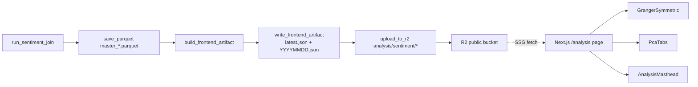

# Design Document: Sentiment Insight Visualization

## Overview

본 설계는 이미 `data/sentiment_join/master_{YYYYMMDD}.parquet`의 메타(`sentiment_join_stats` JSON)에 존재하는 Granger·PCA 결과를 **프론트 전용 JSON 아티팩트로 추출·축소**해 R2에 정적 업로드하고, Next.js 15 App Router SSG 페이지로 렌더링한다. 백엔드 통계 로직은 수정하지 않으며, **추출·저장·프론트 소비 3개 레이어만** 새로 추가한다.

- **대상 사용자**: 데이터 엔지니어·파워유저. 메인 네비게이션에는 노출하지 않고 `/analysis` 직링크로만 접근한다.
- **미학 방향**: 기존 브리핑의 검정 배경·noise·Instrument Serif/Inter/JetBrains Mono 조합을 계승하되, 분석 페이지는 "중앙 축(axis)을 전면에 드러내는 비대칭 그리드" 컨셉으로 차별화한다. Granger 섹션의 **중앙축 대칭 그래프**가 디퍼런시에이터 — 지표명이 중앙선에 배치되고 좌(→BTC)·우(←BTC)로 막대가 갈라져, "어느 쪽이 먼저인가"라는 질문 자체가 레이아웃이 된다.
- **변경 범위**: Python 신규 모듈 1개(`analysis/sentiment_join/frontend_artifact.py`) + `pipeline.py` 하단 호출부 삽입 + R2 업로드 2회 추가. 프론트는 신규 페이지 1개, 신규 라이브러리 1개, 신규 컴포넌트 3~4개, `schema/analysis.types.ts` 신규 파일 1개.
- **기존 호환성**: Master Parquet 포맷 불변, 기존 R2 key 네임스페이스(`briefs/`, `curated/`, `sentiment_join/`) 불변, 기존 브리핑 페이지 불변, `BottomTabBar`/`SiteHeader` 불변.

## Architecture



**배치 위치 결정**:
- Python 추출 모듈 → `src/morning_brief/analysis/sentiment_join/frontend_artifact.py`. sentiment_join 범주에 국한된 로직이므로 같은 패키지 내에 둔다. 기존 `storage.py`는 저장 유틸, 신규 모듈은 데이터 변환으로 역할을 분리한다.
- 프론트 라우트 → `frontend/app/analysis/page.tsx`. 기존 `/archive`, `/subscribe`와 같은 최상위 레벨. 네비게이션 노출은 **하지 않는다** (데이터 엔지니어 대상, 직링크 접근).

## Components and Interfaces

### 1. Python: `frontend_artifact.py` (신규)

```python
# src/morning_brief/analysis/sentiment_join/frontend_artifact.py
def build_frontend_artifact(
    *,
    stats_metadata_bytes: bytes,   # pipeline이 이미 만든 sentiment_join_stats
    reference_date: str,            # YYYY-MM-DD
) -> dict[str, Any]: ...

def write_frontend_artifact(
    output_dir: Path,
    artifact: dict[str, Any],
    run_date: str,                  # YYYYMMDD
) -> tuple[Path, Path]:
    """latest.json과 {YYYYMMDD}.json 두 파일 경로를 반환한다."""

def should_skip_artifact(artifact: dict[str, Any]) -> bool:
    """full / core 양쪽 pca.qualityStatus가 모두 critical이거나
    granger.executed=false이고 양쪽 pca가 비정상이면 True."""
```

**설계 결정**:
- **입력은 이미 직렬화된 bytes** — `pipeline.py`가 `build_stats_metadata_payload()`로 만들어 parquet에 저장한 것과 **완전히 동일한 페이로드를 재파싱**해서 사용. 이유: parquet에 저장된 진실과 프론트가 읽는 진실이 **반드시 일치**하도록 소스 오브 트루스를 단일화.
- **신규 필드를 계산하지 않는다** — 원본 필드 필터링 + 이름 camelCase 변환 + 두 개의 **유도 필드만** 계산한다: (a) `direction`(순·역방향 라벨), (b) `optimalLag`(페어별 q-value 최소 lag).
- **"critical일 때 덮어쓰지 않음"은 pipeline.py의 호출 분기로 처리** — artifact 모듈은 순수 함수, 부수효과는 `write_frontend_artifact`와 pipeline의 호출 순서로만 제어.

### 2. Python: `pipeline.py` 연결 지점 (1곳만)

`pipeline.py:625` `save_parquet(...)` 호출 직후, 기존 `upload_to_r2(path, f"sentiment_join/{path.name}", ...)` 호출 직전에 다음 로직 삽입:

```python
from .frontend_artifact import (
    build_frontend_artifact,
    should_skip_artifact,
    write_frontend_artifact,
)

artifact = build_frontend_artifact(
    stats_metadata_bytes=stats_metadata,
    reference_date=today.strftime("%Y-%m-%d"),
)
if not should_skip_artifact(artifact):
    latest_path, dated_path = write_frontend_artifact(
        settings.output_dir, artifact, run_date
    )
    for local_path, r2_key in (
        (latest_path, "analysis/sentiment/latest.json"),
        (dated_path, f"analysis/sentiment/{run_date}.json"),
    ):
        upload_to_r2(
            local_path,
            r2_key,
            r2_s3_endpoint=settings.r2_s3_endpoint,
            r2_access_key_id=settings.r2_access_key_id,
            r2_secret_access_key=settings.r2_secret_access_key,
            r2_public_bucket=settings.r2_public_bucket,
        )
```

**설계 결정**:
- **Skip 조건 (Req 1-4 대응)**: `should_skip_artifact`는 full·core **둘 다 `qualityStatus == "critical"`**일 때만 True. 한쪽이라도 ok·degraded면 저장한다 (Req 4-4가 '한쪽만 표시'를 허용하므로).
- **R2 key 네임스페이스 = `analysis/sentiment/`**. 기존 `sentiment_join/{master_*.parquet}` 네임스페이스와 명확히 구분해, 같은 도메인(sentiment)이지만 **프론트 소비용**임을 경로만으로 드러낸다.
- `upload_to_r2`는 이미 실패 시 WARNING 로깅만 하고 비파괴적이므로 그대로 재사용.
- 호출부는 **예외를 삼키지 않는다** — pipeline 최상위 `try/except`에서 처리되며, artifact 생성 실패가 파이프라인 전체 실패로 이어지지 않도록 기존 에러 전파 구조 그대로 사용.

### 3. JSON 아티팩트 스키마 (Req 1-2 이행)

```json
{
  "generatedAtUtc": "2026-04-21T08:05:13+00:00",
  "referenceDate": "2026-04-21",
  "runId": "sentiment-join-20260421",
  "granger": {
    "executed": true,
    "correction": { "method": "fdr_bh", "nTests": 63 },
    "results": [
      {
        "predictor": "news_sentiment_mean",
        "target": "fng_value",
        "direction": "forward",
        "lag": 1,
        "pvalue": 0.0031,
        "pvalueAdjusted": 0.041,
        "significant": true,
        "optimalLag": true
      }
    ]
  },
  "pca": {
    "full": {
      "status": "ok",
      "selectedFeatures": ["news_sentiment_mean_lag1", "fng_value_lag1", "funding_rate_lag1"],
      "nComponents": 1,
      "explainedVariance": 0.802,
      "loadings": {
        "news_sentiment_mean_lag1": 0.528,
        "fng_value_lag1": -0.342,
        "funding_rate_lag1": 0.215
      },
      "excludedFeatures": [
        { "feature": "volume_change_pct_lag1", "reason": "vif>10" }
      ],
      "coverageRatio": 0.91,
      "qualityStatus": "ok",
      "qualityReasons": []
    },
    "core": { "...": "동일 스키마" }
  }
}
```

**설계 결정**:
- **camelCase** 네이밍 — 기존 `schema/brief.types.ts`의 컨벤션과 일치시킨다.
- **`direction`** 은 `statistical_tests.py`의 `GRANGER_PAIRS_REVERSE` 상수를 **import**해 매칭. 리터럴을 복제하지 않는다.
- **`optimalLag`** 은 같은 `(predictor, target, direction)` 그룹에서 `pvalueAdjusted`가 최소인 lag 1개에만 `true`. 동률일 경우 작은 lag 우선.
- 원본 메타의 `walk_forward`, `correlations`, `backtest`, `adf`, `structured_sources`, `exclusion_counts`, `outlier_*` 등은 **포함하지 않는다** (Req 1-3).

### 4. Frontend: `schema/analysis.types.ts` (신규 파일)

`brief.types.ts`에 섞지 않고 신규 파일로 분리한다. 이유:
- 브리핑 데이터 계약과 독립적으로 버전 진화 가능
- Req 5-5("기존 필드 변경 금지")를 물리적으로 보장

```typescript
// schema/analysis.types.ts
export type GrangerDirection = "forward" | "reverse";

export type GrangerResult = {
  predictor: string;
  target: string;
  direction: GrangerDirection;
  lag: 1 | 2 | 3;
  pvalue: number;
  pvalueAdjusted: number;
  significant: boolean;
  optimalLag: boolean;
};

export type PcaIndex = {
  status: string;            // "ok" | "insufficient_features" | "insufficient_features_after_vif" | ...
  selectedFeatures: string[];
  nComponents: number;
  explainedVariance: number;
  loadings: Record<string, number>;
  excludedFeatures: Array<{ feature: string; reason: string }>;
  coverageRatio: number;
  qualityStatus: "ok" | "degraded" | "critical";
  qualityReasons: string[];
};

export type SentimentInsightArtifact = {
  generatedAtUtc: string;
  referenceDate: string;     // YYYY-MM-DD
  runId: string;
  granger: {
    executed: boolean;
    correction: { method: string; nTests: number };
    results: GrangerResult[];
  };
  pca: { full: PcaIndex; core: PcaIndex };
};
```

### 5. Frontend: `frontend/lib/analysis.ts` + `frontend/lib/analysis-schema.ts` (신규)

`lib/r2.ts`의 구조를 따라 분석 아티팩트 전용 fetcher를 분리한다. 이유:
- 브리핑과 라이프사이클이 다름 (브리핑 `index.json` 의존성 없음)
- 실패 시 페이지에서 명시적 에러 UI를 띄워야 하므로 throw 정책을 라이브러리가 수행

```typescript
// frontend/lib/analysis.ts
import { cache } from "react";

const ANALYSIS_LATEST_KEY = "analysis/sentiment/latest.json";

export const fetchSentimentInsight = cache(
  async (): Promise<SentimentInsightArtifact> => { ... }
);
```

**설계 결정**:
- **Fixture 모드 지원** — `BRIEF_DATA_SOURCE=fixture`일 때 `frontend/fixtures/sentiment-insight.json`을 읽는다. 기존 `npm run dev:fixture` 컨벤션과 일치.
- **파서는 수기 타입가드** (`lib/analysis-schema.ts`) — `lib/r2.ts`가 Zod 없이 수기 파싱을 쓰고 있어 일관성을 지킨다.
- `fetchSentimentInsight`는 실패 시 **throw**. 페이지가 `try/catch`로 잡아 빈 상태 UI 렌더.

### 6. Frontend: `frontend/app/analysis/page.tsx` (신규 SSG 페이지)

```tsx
export const dynamic = "force-static";

export default async function AnalysisPage() {
  let artifact: SentimentInsightArtifact | null = null;
  let error: Error | null = null;
  try {
    artifact = await fetchSentimentInsight();
  } catch (e) {
    error = e instanceof Error ? e : new Error(String(e));
  }

  if (!artifact) {
    return <AnalysisUnavailable reason={error?.message ?? "unknown"} />;
  }

  const stale = isStaleReferenceDate(artifact.referenceDate, /* nowKst */);

  return (
    <main>
      <SiteHeader currentDate={artifact.referenceDate} historyEntries={[]} />
      <AnalysisMasthead
        referenceDate={artifact.referenceDate}
        generatedAtUtc={artifact.generatedAtUtc}
        nTests={artifact.granger.correction.nTests}
        staleWarning={stale}
      />
      <GrangerSymmetric
        results={artifact.granger.results}
        executed={artifact.granger.executed}
        correction={artifact.granger.correction}
      />
      <PcaTabs full={artifact.pca.full} core={artifact.pca.core} />
    </main>
  );
}
```

**설계 결정**:
- **SSG** (`force-static`). 신선도 경고는 **렌더 시점의 `Date.now()`** 를 기준으로 서버가 계산한 결과를 prop으로 내려보낸다. 빌드 직후부터 2일이 지나면 자연스럽게 경고 표시.
- **ErrorBoundary 없이 try/catch** — 분석 페이지는 브리핑과 달리 비핵심 경로이므로, 실패 시 명시적 빈 상태 UI가 더 적합.
- **`BottomTabBar`·`SiteHeader`는 수정하지 않는다** — `SiteHeader`는 포함하되 `historyEntries=[]`로 전달해 히스토리 드롭다운은 비활성.

### 7. Component: `GrangerSymmetric` (Req 2 전체 이행)

**레이아웃 (중앙축 대칭 브루탈)**

```
          forward (→BTC / →지표)     │ 대상 지표         │     reverse (BTC→지표)
 ─────────────────────────────────────┼───────────────────┼─────────────────────────
 ◼◼◼◼◼  news_sentiment_mean  lag=1   │ fng_value         │
 ◼◼◼    news_sentiment_mean  lag=1   │ etf_net_inflow…   │
                                     │ btc_long_short…   │ ◼◼   lag=1
                                     │ funding_rate      │ ◼◼◼  lag=2
```

- **행 = 대상 지표명**. 중앙 세로축에 지표명 배치. 같은 지표에 순·역 모두 있으면 좌우 양쪽에 막대.
- **막대 길이** = `-log10(pvalueAdjusted)`. 최대치는 전체 결과에서의 95 percentile로 정규화.
- **막대 시각 인코딩** (Req 2-6):
  - `significant === true` → 진한 포그라운드 색, 불투명도 1
  - `significant === false` → 포그라운드의 18% 불투명도 + 1px stroke만
- **기본 표시는 `optimalLag === true`인 lag 1개** (Req 2-5). 막대 hover/click 시 같은 페어의 lag 1/2/3을 같은 행에 수직 스택으로 드러냄. 다른 행은 `opacity: 0.35`로 디밍.
- **정렬**: 페어별 `optimalLag`의 `pvalueAdjusted` 오름차순. 상위에 가장 강한 관계.
- **"검정 미수행" 행** (Req 2-8): 공식 페어 목록과 `results` diff로 누락된 페어를 계산해 맨 아래 구분선 아래에 회색 텍스트로 표시. 공식 페어 목록은 프론트에 하드코딩하지 않고 **아티팩트에 포함된 `correction.nTests`를 상한으로만** 활용하며, 누락 판정은 results 배열 기반의 상대적 계산으로 한다.
- **안내 문구** (Req 2-9): 섹션 우상단 "Granger causality ≠ causation" — JetBrains Mono, 0.7rem, 소문자.

**모션**:
- `@keyframes axisDraw` — 중앙 수직축이 `scaleY 0 → 1` (0.6s ease-out)
- 막대는 `animation-delay: calc(var(--row-index) * 0.03s)` staggered reveal
- hover 대상 외 행: `opacity 0.35`, 0.2s transition

### 8. Component: `PcaTabs` (Req 3 전체 이행)

- **탭 2개**: `FULL` (기본 선택) / `CORE`. JetBrains Mono 대문자, underline 애니메이션.
- **본문**: 수평 막대 차트.
  - Y축 = 변수명, X축 = loading (중앙 0에서 좌우 대칭).
  - 양수 = 밝은 포그라운드, 음수 = 반대편 + 연한 보색.
  - 변수명 우측에 loading 값 고정폭 mono 숫자.
- **메타 스트립**: `explainedVariance`·`nComponents`·`coverageRatio`·`qualityStatus` 4개 pill.
  - `qualityStatus === "degraded"` → pill 색 변경 + `qualityReasons` expand 토글 (Req 3-6).
- **`excludedFeatures` 섹션**: 비어있지 않으면 하단에 "VIF 제거 변수" 테이블 (Req 3-5).
- **`status !== "ok"`** → 차트 자리에 `<EmptyState reason={status} />` 렌더 (Req 3-7).

### 9. Component: `AnalysisMasthead`

- 좌측: Instrument Serif italic 페이지 제목.
- 우측: JetBrains Mono 모노 블록 `REFERENCE {date} / GENERATED {hhmm UTC} / N_TESTS {n} / FDR q<0.10`.
- `staleWarning === true`면 상단에 얇은 가로 띠 "본 분석은 2일 이상 경과한 데이터에 기반합니다" (Req 4-2).

### 10. Component: `AnalysisUnavailable`

- `fetchSentimentInsight`가 throw했을 때의 빈 상태 (Req 4-3).
- 중앙 정렬된 짧은 문구 + `reason` 1줄 (mono, 0.8rem). 재시도 링크는 없음 (SSG).

## Data Models

백엔드는 Python dict/JSON, 프론트는 `schema/analysis.types.ts`의 타입. 둘 다 **Master Parquet 메타의 부분집합**이며 신규 계산 필드는 `direction`과 `optimalLag` 두 개뿐이다.

| 필드 | 소스 | 변환 |
|------|------|------|
| `granger.results[].direction` | `statistical_tests.GRANGER_PAIRS_REVERSE` 상수 | 신규 모듈에서 매칭 |
| `granger.results[].optimalLag` | 같은 (predictor, target, direction)의 3개 lag 중 `pvalueAdjusted` 최솟값 | 신규 모듈에서 계산 |
| 그 외 모든 필드 | `sentiment_join_stats` 원본 | 단순 rename (snake → camel) |

**기준일 판정 (Req 4-2)**:
- `isStaleReferenceDate(referenceDate: string, now: Date)` — KST 기준 날짜 차이 계산. 2일 이상 경과 시 true.
- 서버 SSG 렌더 시점에 계산 → 클라이언트 hydration 간 mismatch 없음.

## Error Handling

| 상황 | 처리 방식 | 관련 Req |
|------|----------|---------|
| `granger_executed == false` | artifact는 생성하되 `granger.executed=false`, `results=[]` 저장. 프론트 GrangerSymmetric 자리에 "Granger 검정 미수행" 안내 | 4-4, 2-8 |
| `pca.full` 또는 `pca.core` 중 하나만 `status != "ok"` | 해당 탭만 `<EmptyState>`. 반대쪽 정상 렌더 | 3-7, 4-4 |
| 둘 다 `qualityStatus == "critical"` | `should_skip_artifact` → 파일을 **쓰지 않음** → R2 latest.json 그대로 → 프론트는 구버전 렌더 | 1-4 |
| R2 업로드 실패 | 기존 `upload_to_r2` 정책에 맞춰 WARNING만, 파이프라인 성공 처리 | — |
| 프론트 fetch 실패 | page가 `AnalysisUnavailable` 렌더, 상태코드 200 유지 (SSG) | 4-3 |
| 기준일 2일 이상 경과 | masthead에 띠 표시 | 4-2 |
| 공식 페어인데 `results`에 없음 | 프론트가 diff로 "검정 미수행" 행 생성 | 2-8 |
| 페어에 lag 1/2/3 중 일부만 있음 | GrangerSymmetric이 기본 표시로는 `optimalLag`만 사용하므로 문제 없음. 인터랙션 확장 시에도 있는 lag만 렌더 | 2-4 |

## Testing Strategy

| 파일 | 프레임워크 | 대상 |
|------|-----------|------|
| `tests/analysis/test_frontend_artifact.py` | pytest | `build_frontend_artifact`: direction 매핑, optimalLag 선정(동률 tie-break 포함), 필드 화이트리스트(불허 키 누락 검증), critical skip 판정 |
| `tests/analysis/test_frontend_artifact_pipeline.py` | pytest | pipeline 통합: skip 조건에서 파일이 쓰이지 않음 / 정상 조건에서 두 파일 경로 반환 |
| `frontend/tests/analysis-schema.test.ts` | node test runner | 수기 파서의 타입 가드, 잘못된 payload에서 throw |
| `frontend/tests/analysis-stale.test.ts` | node test runner | `isStaleReferenceDate` 경계값 (1일 59분, 2일 0분, 2일 1분) |
| `frontend/qa/analysis.spec.ts` | Playwright (`npm run qa:playwright`) | fixture로 페이지 렌더, 탭 전환, 막대 hover 시 lag 1/2/3 노출, stale 배너 표시 |

커버리지 목표: 신규 Python 모듈 100%, 프론트 파서 100%, 페이지 렌더 스냅샷 1개.

## Correctness Properties

- For any 유효한 `sentiment_join_stats` payload, `build_frontend_artifact`가 돌려주는 dict의 키 집합은 스키마 화이트리스트의 **부분집합**이다 (유도 필드 `direction`, `optimalLag` 허용). — Req 1-3 검증.
- For any `(predictor, target, direction)` 그룹에서 `optimalLag=true`인 원소는 **정확히 0개 또는 1개**다.
- For any `pca.full`, `loadings`의 키 집합은 `selectedFeatures`와 **정확히 일치**한다.
- For any 정상 artifact, `should_skip_artifact` 는 `pca.full.qualityStatus` 와 `pca.core.qualityStatus` 가 **둘 다 "critical"** 인 경우에만 True 를 반환한다.
