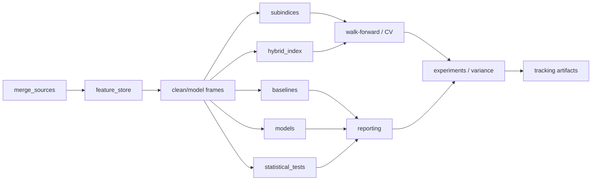

# Design Document: Sentiment-Join Advanced Features

## Overview

이 설계는 `sentiment-join-outlier-rework`에서 정리된 outlier policy, multi-horizon target, walk-forward, variance report 기반 위에 연구 기능을 확장한다. 기존 `merge_sources`/`compute_hybrid_indices`/`walk_forward_validate`/`bootstrap_ci`/`run_anova` 경로는 유지하고, 그 위에 sub-index 분리, supervised model, lineage, feature store, tracking, sample size 검증을 얹는다.

핵심 목표는 "더 많은 모델"이 아니라, 같은 데이터셋에서 **서로 다른 해석 축을 비교 가능한 형태로 분리**하는 것이다. 그래서 새 기능은 모두 raw/clean/model 레이어와 fold-level 실험 단위를 공유하도록 설계한다.

## Architecture



- `merge_sources`는 현재처럼 날짜 축을 기준으로 원천 데이터를 결합한다.
- `feature_store`는 결합 결과를 `raw -> clean -> model`로 나누고, outlier 규칙 변경 시 재계산 범위를 분리한다.
- `subindices`는 `sentiment`, `positioning`, `flow`, `vol`을 독립 PCA 축으로 계산한다.
- `models`와 `baselines`는 동일한 fold splitter와 동일한 target 컬럼을 사용한다.
- `statistical_tests`는 정상성, Granger, transfer entropy/CCM, purged walk-forward를 담당한다.
- `experiments`와 `variance`는 fold-level 결과를 모아 비교/승격 판단에 사용한다.

## Components and Interfaces

### 1. `subindices.py`

새 모듈은 4개 서브 인덱스를 명시적으로 정의한다.

```python
@dataclass(frozen=True)
class SubIndexSpec:
    name: str
    features: list[str]
    scaler_kind: ScalerKind = "standard"
    pca_components: int | None = None

def compute_subindices(df: pd.DataFrame, specs: list[SubIndexSpec]) -> pd.DataFrame
```

설계 결정:
- 서브 인덱스를 별도 모듈로 분리한다. 이유는 full/core hybrid index와 다른 feature grouping, interaction feature, 설명 축이 서로 달라서 한 함수 안에 넣으면 실험 조합이 흐려지기 때문이다.
- 각 서브 인덱스는 feature selection, scaling, PCA를 독립 수행한다. 이유는 `sentiment`와 `flow`의 공선성 구조가 다르고, 하나의 PCA 공간으로 묶으면 해석력이 떨어지기 때문이다.
- `funding * lsr`, `sentiment * vix` 같은 interaction feature는 원본 컬럼에서 직접 만든다. 이유는 비선형 신호를 별도 모델 없이도 first-order feature로 관찰하기 위해서다.

### 2. `models.py`

새 모듈은 supervised wrapper만 제공하고, 학습/예측 인터페이스를 통일한다.

```python
class L1LogisticModel:
    def fit(self, X: pd.DataFrame, y: pd.Series) -> "L1LogisticModel"
    def predict_proba(self, X: pd.DataFrame) -> pd.Series

class ElasticNetRegressorModel:
    def fit(self, X: pd.DataFrame, y: pd.Series) -> "ElasticNetRegressorModel"
    def predict(self, X: pd.DataFrame) -> pd.Series

class LightGBMModel:
    def fit(self, X: pd.DataFrame, y: pd.Series) -> "LightGBMModel"
    def predict(self, X: pd.DataFrame) -> pd.Series

def time_series_cv_split(df: pd.DataFrame, *, n_splits: int, embargo_days: int) -> list[tuple[np.ndarray, np.ndarray]]
```

설계 결정:
- 모델별로 wrapper를 둔다. 이유는 시계열 CV, 결측 처리, feature importance 추출, 예측 스케일을 공통화해야 비교가 가능하기 때문이다.
- `TimeSeriesSplit` 계열 splitter를 공통 사용한다. 이유는 random split이 누출을 만들 수 있고, walk-forward와 결과 해석을 맞추기 위해서다.
- SHAP은 `LightGBMModel` 결과 해석용으로 붙이되, 실패 시 학습 경로를 깨지 않도록 한다. 이유는 SHAP이 필수 추론 경로가 아니라 해석 보조이기 때문이다.

### 3. `statistical_tests.py`

기존 Granger와 walk-forward는 유지하되, 다음 인터페이스를 추가한다.

```python
def stationarity_check(series: pd.Series) -> dict[str, Any]

class TransferEntropy:
    def fit(self, df: pd.DataFrame, predictor: str, target: str) -> list[dict[str, Any]]

def walk_forward_validate(..., purged_kfold: bool = False, expanding_window: bool = False, ...)
```

설계 결정:
- 정상성 검정은 ADF 중심으로 노출하되, 현재처럼 KPSS 결합 결과를 내부 판정에 유지할 수 있게 한다. 이유는 bounded series와 추세성 series를 모두 다루기 때문이다.
- transfer entropy/CCM은 Granger의 보조 지표로 분리한다. 이유는 Granger가 선형/조건부 선행 구조를, entropy/CCM은 비선형 의존을 보완하기 때문이다.
- purged K-fold는 embargo를 horizon에 종속시킨다. 이유는 forward target이 길수록 label overlap 위험이 커지기 때문이다.
- expanding window는 옵션으로 둔다. 이유는 regime shift가 강한 구간에서는 고정 window보다 누적 학습이 더 안정적일 수 있기 때문이다.

### 4. `baselines.py`

베이스라인은 예측 모델이 아니라 비교 기준이다.

```python
def always_up(df: pd.DataFrame) -> pd.Series
def fng_contrarian(df: pd.DataFrame) -> pd.Series
def btc_momo_20d(df: pd.DataFrame) -> pd.Series
def vol_regime(df: pd.DataFrame) -> pd.Series
def evaluate_baseline(df: pd.DataFrame, signal: pd.Series, *, return_col: str) -> dict[str, float]
```

설계 결정:
- baseline을 독립 모듈로 둔다. 이유는 모델 실험과 동일한 splitter를 쓰더라도 전략 정의가 서로 다르기 때문이다.
- hit rate와 sharpe는 공통 평가 유틸로 계산한다. 이유는 baseline/model을 같은 metric contract로 비교하기 위해서다.

### 5. `feature_store.py`

feature store는 계산 비용을 줄이는 것이 아니라 **의미 레이어를 분리**하는 역할이다.

```python
@dataclass(frozen=True)
class FeatureStoreBundle:
    raw: pd.DataFrame
    clean: pd.DataFrame
    model: pd.DataFrame
    manifest: dict[str, Any]

def build_feature_store(df: pd.DataFrame, *, cache_key: str | None = None) -> FeatureStoreBundle
```

설계 결정:
- `raw`는 merge 직후의 원본 컬럼을 보존한다. 이유는 lineage와 회귀 분석의 기준점이 필요하기 때문이다.
- `clean`은 outlier policy와 quality gate가 반영된 레이어다. 이유는 이상치 규칙 변경의 영향을 독립적으로 비교하기 위해서다.
- `model`은 lag, target, sub-index, baseline 입력만 남긴 얇은 레이어다. 이유는 모델/validation 코드가 스키마에 덜 의존하게 하기 위해서다.
- 캐시는 `cache_key`와 규칙 버전이 함께 바뀔 때만 무효화한다. 이유는 outlier 규칙 변경 시 잘못된 재사용을 막기 위해서다.

### 6. `join.py` / `pipeline.py`

기존 조인 경로는 유지하되 lineage 메타데이터를 더 풍부하게 기록한다.

```python
def merge_sources(..., *, record_source_lineage: bool = True) -> pd.DataFrame
```

설계 결정:
- `funding_source`, `oi_source`, `lsr_source` 같은 source 컬럼을 별도 보존한다. 이유는 백필/실시간/대체 소스가 섞여도 결과 해석이 가능해야 하기 때문이다.
- `backfill_manifest.json`은 per-column provenance와 quality status를 기록한다. 이유는 later audit에서 어떤 입력이 어디서 왔는지 재구성해야 하기 때문이다.

### 7. `experiments.py` / tracking

기존 `ExperimentSpec`, `ExperimentRunner`는 유지하고, tracking payload만 확장한다.

```python
@dataclass(frozen=True)
class ExperimentArtifact:
    run_id: str
    spec: dict[str, Any]
    metrics: dict[str, Any]
    lineage: dict[str, Any]
```

설계 결정:
- 트래킹은 JSON 우선으로 둔다. 이유는 MLflow가 있더라도 로컬 재현성과 테스트 단순성이 더 중요하기 때문이다.
- `run_id`는 시간+git sha 기반으로 유지한다. 이유는 fold artifact와 spec snapshot을 안정적으로 연결하기 위해서다.

## Data Models

### Sub-index 입력

| 필드 | 타입 | 기본값 | 설명 |
|---|---|---:|---|
| `name` | `str` | - | 서브 인덱스 이름 |
| `features` | `list[str]` | - | PCA 입력 피처 |
| `scaler_kind` | `Literal["standard","robust"]` | `"standard"` | 스케일러 선택 |
| `pca_components` | `int \| None` | `None` | PCA 축 수 제한 |

### Feature store bundle

| 필드 | 타입 | 기본값 | 설명 |
|---|---|---:|---|
| `raw` | `pd.DataFrame` | - | merge 직후 레이어 |
| `clean` | `pd.DataFrame` | - | outlier/quality 반영 레이어 |
| `model` | `pd.DataFrame` | - | 학습/평가 입력 레이어 |
| `manifest` | `dict[str, Any]` | - | 규칙 버전, source lineage, cache key |

### Experiment artifact

| 필드 | 타입 | 기본값 | 설명 |
|---|---|---:|---|
| `run_id` | `str` | - | 실행 식별자 |
| `spec` | `dict[str, Any]` | - | cell config |
| `metrics` | `dict[str, Any]` | - | fold / aggregate metric |
| `lineage` | `dict[str, Any]` | - | source 및 cache provenance |

### Tracking / lineage JSON

```json
{
  "run_id": "20260420-1230-acde123",
  "spec": {
    "index": "subindex",
    "model": "lightgbm",
    "horizon": 7
  },
  "lineage": {
    "funding_source": "binance",
    "oi_source": "gold_history",
    "rules_version": "outlier_policy_v1"
  }
}
```

## Correctness Properties

*For any* 입력 DataFrame이 `merge_sources`를 통과하고 필요한 컬럼이 존재하면, `feature_store`의 `raw` 레이어는 원본 행 수와 날짜 정렬을 보존해야 한다. _Requirements: R6, R7_

*For any* sub-index specification에서 feature들이 모두 유효하고 최소 행 수를 만족하면, `compute_subindices`는 각 서브 인덱스에 대해 동일한 입력 순서를 가진 score series를 반환해야 한다. _Requirements: R1_

*For any* horizon `h > 1`에 대해, `walk_forward_validate`는 embargo가 `max(h, 5)` 이상인 fold split만 사용해야 한다. _Requirements: R4_

*For any* baseline signal과 model signal이 같은 `return_col`을 참조하면, 평가 유틸은 hit rate와 sharpe를 동일한 계산 규칙으로 산출해야 한다. _Requirements: R5, R2_

*For any* stationarity check가 non-stationary를 반환하면, Granger는 해당 pair를 실행하지 않아야 한다. _Requirements: R3_

*For any* experiment run이 같은 `spec`과 같은 입력 데이터로 두 번 실행되면, tracking artifact의 fold-level metrics는 동일해야 한다. _Requirements: R8, R6_

*For any* bootstrap CI 계산이 가능한 fold 집합이면, CI 하한은 평균보다 크지 않고 상한은 평균보다 작지 않아야 한다. _Requirements: R9_

## Error Handling

| 상황 | 처리 방식 |
|---|---|
| sub-index feature가 전부 NaN | 해당 sub-index를 `degraded` 상태로 마킹하고 score를 NaN으로 유지 |
| LightGBM 또는 SHAP import 실패 | 모델 학습 경로는 실패시키지 않고, 해당 모델만 skip 또는 degraded 처리 |
| purged split 후 유효 fold가 없음 | `None` 또는 빈 결과를 반환하고 WARNING 로그 남김 |
| baseline 입력 컬럼 누락 | 해당 baseline은 skip하되 run 전체는 중단하지 않음 |
| lineage source 정보 누락 | manifest에 `"unknown"`을 기록하고 quality warning 남김 |
| feature store cache key 충돌 | 규칙 버전/스키마 버전이 다르면 cache 무효화 |
| sample size가 power threshold 미만 | report에서 `research_only` 또는 보수적 결론으로 표시 |

## Testing Strategy

- `tests/analysis/test_sentiment_join/test_subindices.py`
  - 4개 서브 인덱스 shape, interaction feature, NaN 전파 확인
- `tests/analysis/test_sentiment_join/test_models.py`
  - L1 Logistic / Elastic-Net / LightGBM wrapper fit/predict contract
- `tests/analysis/test_sentiment_join/test_statistical_tests.py`
  - stationarity, transfer entropy, purged embargo, expanding window 검증
- `tests/analysis/test_sentiment_join/test_feature_store.py`
  - raw/clean/model 레이어 분리와 cache invalidation 검증
- `tests/analysis/test_sentiment_join/test_join.py`
  - lineage/source 컬럼과 backfill manifest용 metadata 검증
- `tests/analysis/test_sentiment_join/test_baselines.py`
  - always_up / fng_contrarian / btc_momo_20d / vol_regime 결과 검증
- `tests/test_experiment_tracking.py`
  - JSON tracking artifact, run_id 재현성, spec snapshot 검증
- `tests/test_validation.py`
  - bootstrap CI와 power analysis 결과 검증

커버리지 목표는 새 모듈의 핵심 분기와 실패 경로를 포함하는 것이다. 기존 `test_statistical_tests.py`, `test_variance_decomposition.py`, `test_pipeline.py`는 회귀 방지용으로 유지하고, 새 설계는 그 위에 얹히는 확장으로 본다.
