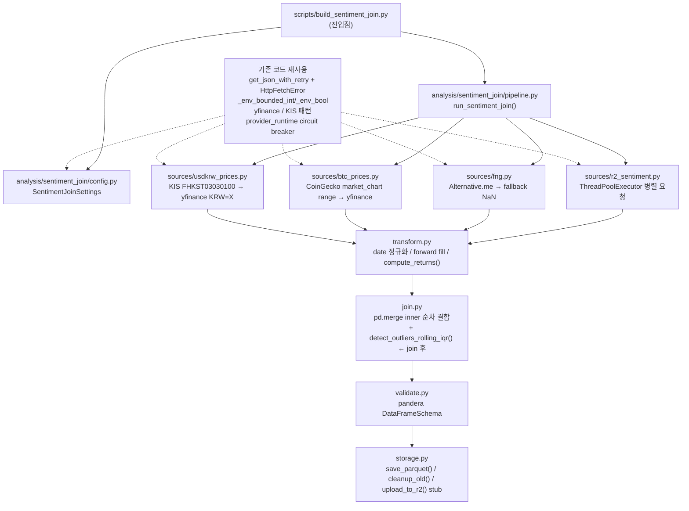

# Design Document: Sentiment Time Join

## Overview

기존 모닝 브리핑 파이프라인(`pipeline.py`)과 완전히 독립된 분석용 배치 파이프라인을 신규 모듈 `src/morning_brief/analysis/sentiment_join/`로 구현한다. R2 뉴스 감성 점수(FinBERT), Alternative.me FNG, BTC 일별 수익률, USD/KRW 수익률을 날짜 키로 inner join하여 Parquet 파일로 저장한다. 기존 `get_json_with_retry`, KIS/yfinance fallback 패턴, env var 파싱 헬퍼를 재사용하고, 새로 pandera 스키마 검증과 롤링 IQR 이상값 탐지를 추가한다.

---

## Architecture



> **이상값 탐지 위치:** `detect_outliers_rolling_iqr()`는 `join.py` 내 `merge_sources()` 완료 후 마스터 DataFrame에서 수행한다. `btc_return`·`usdkrw_return`이 join 전에는 별개 DataFrame에 있어 OR 연산이 불가능하기 때문이다. transform.py는 날짜 정규화·forward fill·수익률 계산만 담당한다.

**변경 영향 범위:** `src/morning_brief/analysis/` 신규 디렉토리만 추가. `pipeline.py`, `main.py`, `config.py`, `public_site.py` 무수정.

---

## Components and Interfaces

### `analysis/sentiment_join/config.py`

```python
from dataclasses import dataclass
from pathlib import Path

@dataclass(frozen=True)
class SentimentJoinSettings:
    lookback_days: int           # SENTIMENT_JOIN_LOOKBACK_DAYS, default=180, [30, 730]
    output_dir: Path             # SENTIMENT_JOIN_OUTPUT_DIR, default="data/sentiment_join"
    r2_public_bucket: str        # R2_PUBLIC_BUCKET (기존 env 재사용)
    r2_max_concurrency: int      # SENTIMENT_JOIN_R2_MAX_CONCURRENCY, default=10
    retain_days: int             # SENTIMENT_JOIN_RETAIN_DAYS, default=30 (0=미삭제)
    kis_app_key: str             # KIS_APP_KEY (기존 env 재사용)
    kis_app_secret: str          # KIS_APP_SECRET (기존 env 재사용)

def load_sentiment_join_settings() -> SentimentJoinSettings: ...
```

**설계 결정:** 기존 `Settings`를 import하지 않고 필요한 env var만 독립적으로 읽는다. 이유: `Settings`는 OpenAI/SES 등 불필요한 의존성을 포함하며, 이 파이프라인의 독립성을 보장하기 위함이다.

---

### `analysis/sentiment_join/sources/r2_sentiment.py`

```python
from concurrent.futures import ThreadPoolExecutor

def fetch_r2_sentiment(
    dates: list[str],           # ["YYYY-MM-DD", ...]
    r2_public_bucket: str,
    max_concurrency: int = 10,
) -> pd.DataFrame:
    """날짜 리스트를 받아 병렬로 R2 brief JSON 조회.

    Returns DataFrame[date, news_sentiment_mean, news_sentiment_std, n_articles].
    개별 날짜 실패 → NaN 행, 전체 실패 → 전 컬럼 NaN DataFrame.
    """
```

**설계 결정:** `asyncio` 대신 `ThreadPoolExecutor` 사용. 이유: 기존 `get_json_with_retry`가 동기 함수이므로 asyncio wrapping 없이 재사용 가능하며, 180회 HTTP 요청 병렬화에 충분하다.

> **Thread-safety 주의:** `get_json_with_retry`는 내부적으로 `provider_runtime`의 circuit breaker 상태(provider별 실패 카운터)를 공유한다. `ThreadPoolExecutor`에서 동일 provider(`r2`)를 병렬 호출할 때 circuit breaker 상태가 경합 없이 갱신되는지 확인이 필요하다. 테스트에서는 `conftest.py`의 `reset_provider_runtime_state()` fixture를 반드시 적용해야 한다.

**R2 JSON 접근 경로:** `https://{r2_public_bucket}/briefs/{YYYY-MM-DD}.json` → `meta.newsSentiment.{mean, std, count}` + `meta.sentimentStatus`

**기존 코드 연결:**
- `_compute_sentiment_aggregate` (public_site.py:510) 가 저장하는 `count` 필드 → `n_articles`
- `sentimentStatus == "skipped"` → mean/std/n_articles = NaN (Req 2.3)

---

### `analysis/sentiment_join/sources/fng.py`

```python
def fetch_fng(lookback_days: int) -> pd.DataFrame:
    """Alternative.me FNG historical 수집.

    Returns DataFrame[date, fng_value].
    실패 시 전 컬럼 NaN DataFrame 반환, WARNING 로그.
    """
```

**설계 결정:** `get_json_with_retry` 재사용 (`DEFAULT_RETRIES=3`, `DEFAULT_BACKOFF=1.2`). `404` 재시도 없음, `429/5xx/timeout` 지수 백오프 3회 — 기존 프로젝트 정책 준수(CLAUDE.md).

> **FNG `value` 타입 변환:** Alternative.me 응답의 `value` 필드는 `"75"` 형태의 **string**으로 수신된다. `fng_value` 컬럼 저장 전 `int()` 변환 필요. 변환 실패 시 해당 날짜를 NaN으로 처리한다.

---

### `analysis/sentiment_join/sources/btc_prices.py`

```python
def fetch_btc_returns(
    start_date: str,    # lookback 시작일 -1일 (수익률 계산용)
    end_date: str,
) -> pd.DataFrame:
    """CoinGecko market_chart → yfinance BTC-USD fallback.

    Returns DataFrame[date, btc_log_return, btc_return].
    두 소스 모두 실패 시 NaN DataFrame.
    """
```

**CoinGecko 신규 endpoint:** `GET /api/v3/coins/bitcoin/market_chart/range?vs_currency=usd&from={unix_start}&to={unix_end}` → **단일 요청**으로 전체 lookback 범위 수집. `prices` 배열 `[[timestamp_ms, price], ...]` 반환. 날짜별 반복 호출이 아님 — rate limit 소비 최소화.

기존 `coingecko.py`는 현재 가격(`simple/price`)만 사용하므로 신규 함수 추가. 기존 함수 수정 없음.

**수익률 계산:**
```python
# 0 또는 음수 가격 방어 — yfinance 오류 데이터에서 ln(0/x) = -inf 방지
close = df["close"].where(df["close"] > 0)
df["btc_log_return"] = np.log(close / close.shift(1))   # -inf 대신 NaN
df["btc_return"] = close.pct_change()
```

**설계 결정:** 로그 수익률(`ln(P_t/P_{t-1}`)을 1차 컬럼으로, 단순 수익률을 보조 컬럼으로 병렬 저장. 이유: Granger 인과성 검정은 정상성 시계열을 요구하며, 로그 수익률이 단순 수익률보다 정상성 확보에 유리하다. 단순 수익률은 직관적 해석 및 이상값 임계값 시각화에 활용된다.

> **forward fill → return=0 편향:** 가격에 forward fill 적용 후 수익률을 계산하면 fill된 날의 return이 0이 된다. 이는 '가격 변화 없음'으로 해석되어 Granger 검정에서 실제 결측(NaN)보다 보수적인 결과를 만든다. fill 적용 날짜는 `is_filled` 컬럼으로 별도 표시하지 않으나, Downstream 분석 시 forward fill 구간을 필터링할 수 있도록 `ffill_days` Parquet 메타데이터에 기록한다.

---

### `analysis/sentiment_join/sources/usdkrw_prices.py`

```python
def fetch_usdkrw_returns(
    start_date: str,
    end_date: str,
    kis_app_key: str,
    kis_app_secret: str,
) -> pd.DataFrame:
    """KIS FHKST03030100 TR → yfinance KRW=X fallback.

    Returns DataFrame[date, usdkrw_log_return, usdkrw_return].
    """
```

**KIS 연동 패턴:** 기존 `market.py:_fetch_fx_rate_point()` 패턴 참고. `kis_app_key` 없으면 즉시 yfinance로 전환.

**설계 결정:** `btc_prices.py`와 동일한 수익률 계산 함수 `_compute_returns(df)` 공통 유틸로 분리 (`transform.py`에 위치). 코드 중복 제거.

---

### `analysis/sentiment_join/transform.py`

```python
def normalize_dates(df: pd.DataFrame, date_col: str = "date") -> pd.DataFrame:
    """타임존 포함 → UTC 변환 후 YYYY-MM-DD string 통일."""

def forward_fill_prices(df: pd.DataFrame, cols: list[str], max_periods: int = 2) -> pd.DataFrame:
    """결측치 forward fill, 최대 2일. 초과 결측은 NaN 유지."""

def compute_returns(df: pd.DataFrame, price_col: str) -> pd.DataFrame:
    """log_return, simple_return 컬럼 추가.
    price_col 값이 0 이하인 경우 NaN 처리 후 계산 (ln(0) 방어).
    """
```

> **이상값 탐지 제거:** `detect_outliers_rolling_iqr()`는 `transform.py`에서 제거하고 `join.py`로 이동. join 후 마스터 DataFrame에서만 `btc_return`·`usdkrw_return`이 동일 행에 존재하므로 OR 기반 `is_outlier` 플래그 생성이 가능하다.

**설계 결정:** 기존 `data_quality.py`의 이상값 탐지(고정 임계값)를 재사용하지 않는다. 이유: 해당 모듈은 브리핑 품질 판정용(`ok/degraded/critical`)이며, BTC/FX 수익률 분포의 컬럼별 동적 임계값이 필요하다. 고정 0.5 임계값은 BTC 일간 변동성을 정상 범주로 오처리할 수 있다.

---

### `analysis/sentiment_join/join.py`

```python
def detect_outliers_rolling_iqr(
    df: pd.DataFrame,
    cols: list[str],          # ["btc_return", "usdkrw_return"]
    window: int = 30,
    iqr_multiplier: float = 3.0,
    min_periods: int = 15,    # cold start: window 미만 구간 최소 샘플 수
) -> pd.DataFrame:
    """join 후 마스터 DataFrame에서 롤링 IQR 기반 이상값 탐지.

    |value - rolling_median| > iqr_multiplier × rolling_IQR → is_outlier=True.
    cold start(초기 min_periods 미만) 구간: IQR=NaN → is_outlier=False 처리.
    WARNING 로그: event=outlier.detected | date | column | value | threshold
    """

def merge_sources(
    sentiment_df: pd.DataFrame,
    fng_df: pd.DataFrame,
    btc_df: pd.DataFrame,
    usdkrw_df: pd.DataFrame,
) -> pd.DataFrame:
    """순차 inner join: sentiment → fng → btc → usdkrw.

    1. news_sentiment_mean NaN 행을 join 전 dropna로 제거
       WARNING: event=rows.dropped | reason=no_sentiment | count
    2. pd.merge(on='date', how='inner') 순차 실행
    3. detect_outliers_rolling_iqr() 호출 → is_outlier 컬럼 추가
    4. 행수 < 30 → WARNING: event=join.insufficient_rows
    5. INFO: event=join.complete | rows | date_range | sources_used | outlier_count | dropped_no_sentiment
    """
```

> **cold start 처리:** rolling window 30일 중 초기 `min_periods=15` 미만 구간은 IQR 신뢰도가 낮다. 이 구간은 `is_outlier=False`로 보수적 처리한다. `min_periods`는 `window // 2`로 설정하여 최소 절반 이상의 데이터가 있을 때만 이상값 판정을 수행한다.

---

### `analysis/sentiment_join/validate.py`

```python
import pandera as pa
import pandas as pd

MASTER_SCHEMA = pa.DataFrameSchema({
    "date": pa.Column(str, pa.Check.str_matches(r"^\d{4}-\d{2}-\d{2}$"), unique=True),
    "news_sentiment_mean": pa.Column(float, pa.Check.between(-1.0, 1.0), nullable=False),
    "news_sentiment_std": pa.Column(float, pa.Check.ge(0), nullable=True),
    # pd.Int64Dtype()은 pandera에서 "Int64"(대문자) string으로 지정해야 인식됨
    "n_articles": pa.Column("Int64", pa.Check.ge(0), nullable=True),
    "fng_value": pa.Column("Int64", pa.Check.between(0, 100), nullable=True),
    "btc_log_return": pa.Column(float, nullable=True),
    "btc_return": pa.Column(float, nullable=True),
    "usdkrw_log_return": pa.Column(float, nullable=True),
    "usdkrw_return": pa.Column(float, nullable=True),
    "is_outlier": pa.Column(bool, nullable=False),
})

def validate_master(df: pd.DataFrame) -> None:
    """스키마 검증 실패 시 SchemaError raise → 파이프라인 ERROR 종료."""
```

**설계 결정:** pandera를 선택한 이유: pandas DataFrame 스키마 검증에 특화되어 있고, nullable/범위/형식 체크를 선언적으로 표현할 수 있다. Great Expectations보다 경량이며 별도 서버 없이 동작한다.

---

### `analysis/sentiment_join/storage.py`

```python
def save_parquet(df: pd.DataFrame, output_dir: Path, run_date: str) -> Path:
    """master_{YYYYMMDD}.parquet을 snappy 압축으로 저장.

    동일 날짜 파일 존재 시 덮어씀(idempotency).
    output_dir 없으면 자동 생성.
    ffill_days 수를 Parquet custom metadata에 기록 (forward fill 구간 추적).
    """

def cleanup_old_files(output_dir: Path, retain_days: int) -> None:
    """retain_days 초과 Parquet 파일 삭제. retain_days=0이면 무동작."""

def upload_to_r2(
    local_path: Path,
    r2_key: str,
    *,
    r2_s3_endpoint: str,
    r2_access_key_id: str,
    r2_secret_access_key: str,
    r2_public_bucket: str,
) -> None:
    """stub — 현재 버전에서 no-op. 향후 boto3 S3 업로드로 확장.

    접속 정보를 파라미터로 받아 두어 확장 시 시그니처 변경 불필요.
    현재는 함수 본체가 `return` 한 줄이다.
    """
```

---

### `analysis/sentiment_join/pipeline.py`

```python
def run_sentiment_join(settings: SentimentJoinSettings) -> int:
    """전체 오케스트레이션. 반환값: 종료 코드 (0=성공, 1=실패).

    단계:
    1. 날짜 범위 계산 (today - lookback_days ~ today)
    2. 4개 소스 병렬/순차 수집
    3. transform (date 정규화 → forward fill → 이상값 탐지)
    4. inner join
    5. pandera 검증
    6. Parquet 저장 + 파일 정리
    7. R2 upload stub 호출
    """
```

---

### `scripts/build_sentiment_join.py`

```python
#!/usr/bin/env python3
"""Sentiment Time Join 파이프라인 진입점.

Usage:
    python scripts/build_sentiment_join.py
    SENTIMENT_JOIN_LOOKBACK_DAYS=90 python scripts/build_sentiment_join.py
"""
import sys
from morning_brief.analysis.sentiment_join.config import load_sentiment_join_settings
from morning_brief.analysis.sentiment_join.pipeline import run_sentiment_join

if __name__ == "__main__":
    settings = load_sentiment_join_settings()
    sys.exit(run_sentiment_join(settings))
```

---

## Data Models

### Master DataFrame 스키마

| 컬럼 | pandas dtype | nullable | 범위 | 산출 로직 |
|------|-------------|----------|------|-----------|
| `date` | `object` (str) | No | YYYY-MM-DD | join 키 |
| `news_sentiment_mean` | `float64` | No* | -1.0~1.0 | R2 `meta.newsSentiment.mean` |
| `news_sentiment_std` | `float64` | Yes | ≥0 | R2 `meta.newsSentiment.std` |
| `n_articles` | `Int64`† | Yes | ≥0 | R2 `meta.newsSentiment.count` |
| `fng_value` | `Int64`† | Yes | 0~100 | Alternative.me |
| `btc_log_return` | `float64` | Yes | — | `ln(close_t/close_{t-1})` |
| `btc_return` | `float64` | Yes | — | `(close_t-close_{t-1})/close_{t-1}` |
| `usdkrw_log_return` | `float64` | Yes | — | `ln(close_t/close_{t-1})` |
| `usdkrw_return` | `float64` | Yes | — | `(close_t-close_{t-1})/close_{t-1}` |
| `is_outlier` | `bool` | No | — | 롤링 IQR, default=False |

*inner join 후 NaN 행 제거로 non-null 보장  
†nullable integer (`pd.Int64Dtype()`) — NaN과 정수를 함께 표현

### R2 Brief JSON 의존 필드

```json
{
  "meta": {
    "sentimentStatus": "ok",
    "newsSentiment": {
      "mean": -0.1234,
      "std": 0.3456,
      "count": 8
    }
  }
}
```

`_compute_sentiment_aggregate()` (public_site.py:510)가 이미 `count` 필드를 저장하므로 R2 파싱만 추가하면 된다.

---

## Correctness Properties

- *For any* `dates` 리스트에서 특정 날짜의 R2 요청이 실패하더라도, `fetch_r2_sentiment()`는 해당 날짜를 NaN 행으로 포함한 DataFrame을 반환하고, 나머지 날짜를 정상 수집해야 한다 (Req 2.2)

- *For any* 가격 시계열에서 연속 결측이 2일 이하이면 `forward_fill_prices()`는 결측을 채우고, 3일 이상이면 NaN을 유지해야 한다 (Req 6.2)

- *For any* `btc_return` 또는 `usdkrw_return` 컬럼에서 `|value - rolling_median| > 3 × rolling_IQR`인 행은 `is_outlier=True`로, 그렇지 않은 행은 `is_outlier=False`로 표시되어야 한다 (Req 6.3)

- *For any* 동일 `run_date`에 대해 `save_parquet()`을 두 번 호출하면 출력 디렉토리에 동일 이름 파일이 1개만 존재해야 한다 (Req 9.1)

- *For any* 4개 소스 중 일부만 실패하더라도, `run_sentiment_join()`은 정상 소스의 컬럼은 채워진 Parquet을 저장하고 0이 아닌 종료 코드는 반환하지 않아야 한다 (Req 12.1)

- *For any* `news_sentiment_mean` 값이 NaN인 행은 `merge_sources()` 결과에 포함되지 않아야 한다 (Req 6.4)

---

## Error Handling

| 상황 | 처리 방식 |
|------|-----------|
| 개별 R2 날짜 요청 404 | NaN 행으로 처리, 재시도 없음 |
| 개별 R2 날짜 요청 429/5xx/timeout | 지수 백오프 3회 재시도, 실패 시 NaN |
| R2 전체 접근 실패 | `WARNING` 로그, sentiment 컬럼 전체 NaN, 파이프라인 계속 |
| Alternative.me 실패 | `WARNING` 로그, fng_value 전체 NaN, 계속 |
| CoinGecko 실패 → yfinance 시도 | `WARNING` 로그(`event=fallback.used`) |
| CoinGecko + yfinance 모두 실패 | btc 컬럼 전체 NaN, 계속 |
| KIS 실패 → yfinance 시도 | `WARNING` 로그(`event=fallback.used`) |
| KIS + yfinance 모두 실패 | usdkrw 컬럼 전체 NaN, 계속 |
| 모든 소스 실패 | `ERROR` 로그, Parquet 미저장, 종료 코드 1 |
| pandera 스키마 검증 실패 | `ERROR` 로그, Parquet 미저장, 종료 코드 1 |
| `SENTIMENT_JOIN_LOOKBACK_DAYS` 범위 위반 | `ValueError` raise, 즉시 종료 |
| 결합 후 행수 < 30 | `WARNING` 로그, 파이프라인 계속 |

---

## Downstream Analysis Notes

이 파이프라인의 출력 Parquet은 후속 통계 분석의 입력 데이터셋이다. 파이프라인 자체는 분석을 수행하지 않으며, 다음 분석은 별도 노트북/스크립트에서 수행한다:

- **ADF Test (정상성 검정):** `btc_log_return`, `usdkrw_log_return`, `news_sentiment_mean` 컬럼에 대해 `statsmodels.tsa.stattools.adfuller` 적용. 비정상 시계열은 차분(differencing)으로 변환 후 Granger 검정 투입. 로그 수익률은 단순 수익률보다 정상성 확보에 유리하여 ADF 통과 가능성이 높다.
- **최소 유효 샘플 경고:** Granger 인과성 검정의 통계적 신뢰도를 위해 **60행 이상** 권장. Req 7.3의 30행 미만 WARNING은 파이프라인 운영 기준이며, 분석 기준은 별도로 60행 미만 시 Downstream 분석 노트북에서 경고를 발생시켜야 한다.
- **Walk-forward Validation:** 데이터 누출 방지를 위해 시계열 기준 train/test split. `sklearn.model_selection.TimeSeriesSplit` 또는 수동 lookback window 분리. forward fill 구간(`ffill_days` Parquet 메타데이터)은 validation window 경계에서 제외한다.
- **Granger 인과성 검정:** `statsmodels.tsa.stattools.grangercausalitytests` — `news_sentiment_mean → btc_log_return`, `news_sentiment_mean → fng_value` 방향 검정. `is_outlier=True` 행은 분석 전 필터링 권장.
- **감성 신뢰도 가중치:** `n_articles`를 가중치로 사용한 weighted Granger 검정 또는 weighted regression. `n_articles`가 NaN인 날은 가중치 1.0 (동등 취급) 또는 제외 처리.

---

## Testing Strategy

**테스트 위치:** `tests/analysis/test_sentiment_join/`

**프레임워크:** pytest + hypothesis (property-based) + pandera

```
tests/analysis/test_sentiment_join/
├── test_config.py           # 환경변수 파싱, 범위 검증
├── test_r2_sentiment.py     # ThreadPool 병렬 요청, 부분 실패 처리
├── test_fng.py              # API 응답 파싱, 날짜 변환, fallback
├── test_btc_prices.py       # market_chart 파싱, 수익률 계산, yfinance fallback
├── test_usdkrw_prices.py    # KIS fallback, 수익률 계산
├── test_transform.py        # forward fill 경계, rolling IQR property-based
├── test_join.py             # inner join 결과, NaN 행 제거, 로그 이벤트
├── test_validate.py         # pandera 통과/실패 케이스
├── test_storage.py          # idempotency, 파일 cleanup, stub 확인
└── test_pipeline.py         # 통합: 소스 mock → 파이프라인 완주 / 전체 실패
```

**핵심 테스트 케이스:**

```python
# property-based: forward fill 경계
@given(
    prices=st.lists(st.one_of(st.floats(min_value=0.1), st.none()), min_size=5),
    gap=st.integers(min_value=1, max_value=5),
)
def test_forward_fill_respects_max_periods(prices, gap): ...

# idempotency
def test_save_parquet_overwrites_same_date(tmp_path):
    df = make_sample_df()
    save_parquet(df, tmp_path, "20260410")
    save_parquet(df, tmp_path, "20260410")
    assert len(list(tmp_path.glob("*.parquet"))) == 1

# 파이프라인 독립성
def test_pipeline_does_not_import_main_pipeline():
    import importlib
    mod = importlib.import_module("morning_brief.analysis.sentiment_join.pipeline")
    source = inspect.getsource(mod)
    assert "from morning_brief.pipeline" not in source
    assert "import pipeline" not in source
```

**의존성 추가:** `pandera` → **신규 `requirements-analysis.txt`** 로 분리. `requirements-ml.txt`는 FinBERT(torch/transformers) 전용이며, pandera는 데이터 검증 용도로 성격이 다르다. CI에서 `requirements-analysis.txt`를 별도 install 단계로 추가한다.

**테스트 fixture:** `tests/conftest.py`의 `reset_provider_runtime_state()` autouse fixture가 `provider_runtime` circuit breaker 상태를 초기화한다. `test_r2_sentiment.py`의 ThreadPool 테스트에서도 이 fixture가 적용되도록 `tests/analysis/conftest.py`에 동일 설정이 필요하다.
